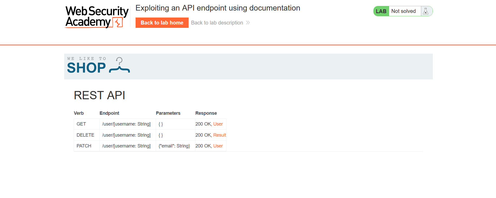
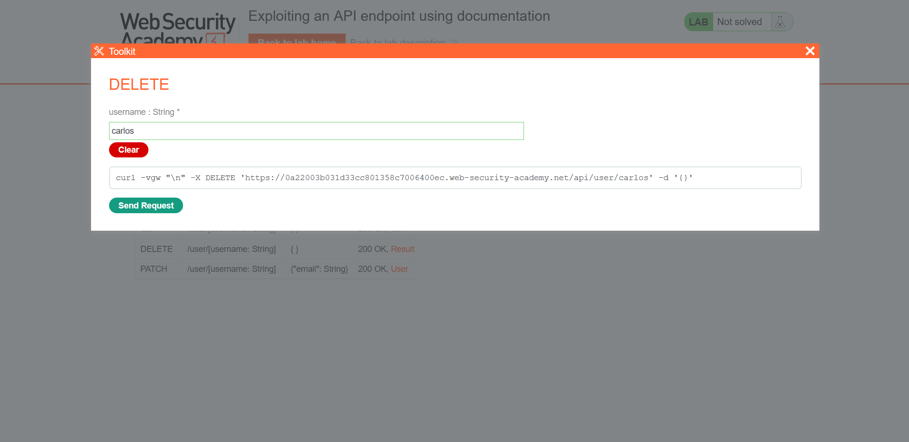
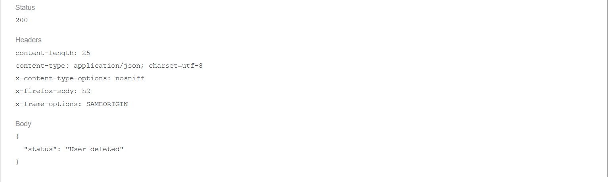

## Metadata

- **Difficulty:** Apprentice
- **Category:** API testing
- **Lab URL:** [Lab: Exploiting an API endpoint using documentation](https://portswigger.net/web-security/api-testing/lab-exploiting-api-endpoint-using-documentation)
- **Date Solved:** 29/9/2026
## Vulnerability Summary

The app exposes interactive API documentation at `/api` to standard users, revealing hidden administrative endpoints. Additionally, the user deletion endpoint (`DELETE /api/user/{username}`) lacks proper authorization controls, allowing any authenticated low-privileged user to delete arbitrary accounts, leading to unauthorized account deletion (BOLA/IDOR).
## Reconnaissance

- Logging in with the credentials `wiener:peter` at the `/login` endpoint, we are taken to the `/my-account` endpoint. Here, we can change the account's email address.
- Changing the email address to a normal value `a@gmail.com` yields a `PATCH /api/user/wiener` request with the body:
```json
{
	"email":"a@gmail.com"
}
```
- Try modifying the request line to `PATCH /api/user/carlos` with the same request body and sending it results in a `400 Bad Request` HTTP response that reads:
```json
{
	"type":"ClientError",
	"code":401,
	"error":"Forbidden"
}
```
- Deleting the request body and sending a `PATCH /api` request results in a `302 Found`. Following the redirection yields a `GET /api` request that exposes the interactive API documentation of the app:

## Exploitation Steps

1. Navigate to the `/api` endpoint (`GET /api`).
2. Click on the `DELETE` endpoint, then after supplying the `carlos` string as the `username` parameter, send the request:

3. Observe that the request results in a `200 OK` that reads:
```
{
	"status":"User deleted"
}
```

Lab is solved.
## Payload Used

Request:
```
DELETE /api/user/carlos HTTP/2
Host: [lab-id].web-security-academy.net
Cookie: session=[token]
...

{
}
```
This is a simple request to the `/api` endpoint to delete user `carlos`. The route path parameter `carlos` drives the database object lookup and deletion logic without matching the active's session identity (`wiener`).
## Root Cause

The app fails to implement any validation mechanism (e.g., only authenticated admin-role users allowed) regarding sensitive endpoint `DELETE` - a *Broken Function Level Authorization* (BFLA) and *Broken Object Level Authorization* (BOLA) vulnerability. Combined with the information disclosure vulnerability exposing the interactive, internal API documentation, an attacker (or any low-privileged user) can delete any arbitrary user with a valid session.
## Remediation

- Verify server-side that the requesting subject has the required permissions to invoke the `DELETE /api/user/{username}` method.
	- If the delete functionality is administrative, restrict access strictly to users with administrative role.
	- If the delete functionality permits self-deletion, ensure the target `username` matches the identity bound to the authenticated session context (`current_user.username == username`).
- Restrict access to API schema/documentation interfaces in production environments via network-level controls (internal VPN only) or role-based authentication. Ensure documentation is generated per role so that administrative endpoints are not documented in client-facing schemas.