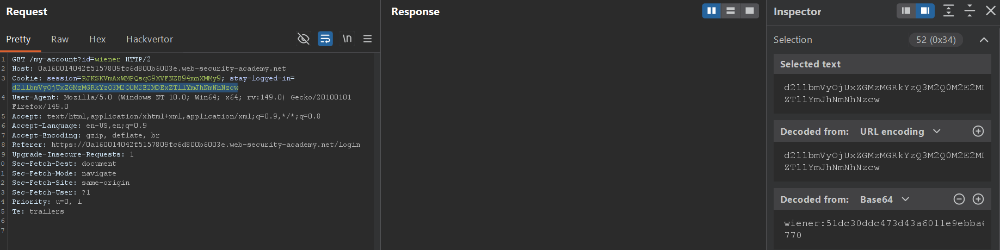
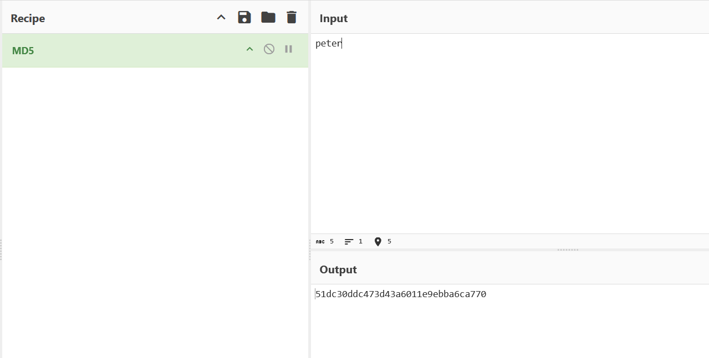
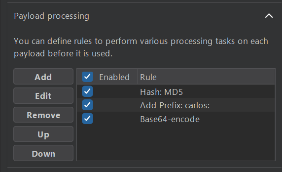

## Metadata

- **Difficulty:** Practitioner
- **Category:** Authentication
- **Lab URL:** [Lab: Brute-forcing a stay-logged-in cookie](https://portswigger.net/web-security/authentication/other-mechanisms/lab-brute-forcing-a-stay-logged-in-cookie)
- **Date Solved:** 17/4/2026
## Vulnerability Summary

The app issues persistent authentication cookies that bypass the primary login flow. Yet, the way the app generates this cookie is predictable, even more so when we have access to the login credentials of a legitimate account. This cookie also does not have any defense mechanisms against brute force attacks, making it easily exploitable. 
## Reconnaissance

- Logging in with the credentials `wiener - peter` and ticking the checkbox "Stay logged in" takes us to the address `url/my-account?id=wiener`. Refreshing this page while intercepting this request with Burp Suite proxy, there's a `stay-logged-in` field with a value that, when viewing with **Inspector**, reveals it's `Base64` encoded. The value is in the form of `wiener:string`(see picture below). Using [Cyberchef](https://gchq.github.io/CyberChef/), we can confirm that this string is in fact our password `peter`, hashed with `MD5`. This reveals the way the app generates these `stay-logged-in` cookie values, allowing us to try brute forcing it for other accounts with the same pattern.
 
## Exploitation Steps

1. Log in with the credentials `wiener - peter` while ticking the checkbox "Stay logged in". This will take us to the address `url/my-account?id=wiener`. Refreshing this page while intercepting this request with Burp Suite proxy. Send the request to Burp Suite **Intruder**.
2. In **Intruder**, select the payload position to be the value of the `stay-logged-in` cookie. 
3. On the **Payload** tab located at the outer right of the screen, paste the list of **candidate passwords** (provided by the lab) onto the **Payload configuration** settings. Scroll down a bit, where you will see the **Payload processing** settings. We will mimic the cookie generating pattern learned above by adding rules to process our payloads (passwords) before they are used. First, we need to hash the password using the `MD5` algorithm. Then, we need to add a prefix of the account's username that we want to access (which is `carlos:`). Finally, we want to encode the entire string using `Base64`. The rules added should be in that exact order (see picture below).

4. On the same column as **Payload**, click **Settings**. As we are looking for the correct password, we need to find a response that contains elements exclusive to when an account is logged in. Logging in with our account, we can see that one of those elements are the existence of the text `Your username is:`. On the **Grep - Match** section, clear all the default matches, then add this exact expression to it. This will help us locate the successful attack easier.
5. After doing all of the aforementioned things, start a **Sniper Attack**. After the attack's done, sort the column `Your username is:` in descending order, as it will be labeled 1 for matching responses. You will find exactly 1 response with this property. This is the correct password for the account `carlos`. Simply click on this row, right click on the HTTP request, then select "Open response in browser". You should see that you're logged in as `carlos`. Lab is solved!
## Payload Used

`Base64(carlos:MD5($password$))`
- [Candidate password list](../candidatepasswords.txt), provided by PortSwigger.
- [Cyberchef](https://gchq.github.io/CyberChef/), for testing different hash algorithms.
## Root Cause

The app's "remember me" mechanism relies on a deterministic, predictable token rather than a secure, server-side session identifier. Specifically, this cookie is generated using static attributes (`username`) and a weakly hashed version of the user's password using a weak hash function (`MD5`). Because the token generation formula is exposed and requires no server-side secrets, anyone with knowledge of the mechanism and a candidate password list can forge valid authentication cookies entirely offline. Furthermore, this cookie value has no implemented defense mechanisms against brute force attacks, making this even more trivially exploitable.
## Remediation

- Generate cryptographically secure random tokens upon successful login when "Stay logged in" option is selected instead of including static, predictable elements like username and password, even hashed versions of them. Store the hashed (with a strong algorithm like SHA-256) token in the database correctly mapped to the `UserId`. This token should also have a specific expiration timestamp along with other destroy policies like when the user logs out or changes their password.
- Implement Cookie Security flags: `Secure`, `HttpOnly`, `SameSite`, etc. to prevent client-side tampering and extraction.
