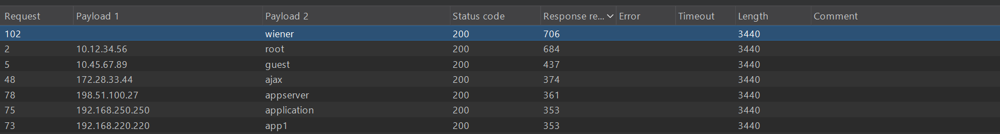

## Metadata

- **Difficulty:** Practitioner 
- **Category:** Authentication
- **Lab URL:** [Lab: Username enumeration via response timing](https://portswigger.net/web-security/authentication/password-based/lab-username-enumeration-via-response-timing)
- **Date Solved:** 16/4/2026
## Vulnerability Summary

The vulnerability is **CWE-208: Observable Timing Discrepancy**. Specifically, the app response time differs when a valid username is inputted versus when an invalid one does. This delta is amplified when enumerated with a long password. Though brute force rate limiting defense mechanism is implemented through IP blocking, using a bunch of random IP addresses with the HTTP header `X-Forwarded-For` easily bypasses this.
## Reconnaissance

- After a few attempts of credentials enumeration, the app rate limits us `You have made too many incorrect login attempts. Please try again in 30 minute(s).` However, adding the `X-Forwarded-For` HTTP header using a random IP address bypasses this mechanism. We can still bruteforce the username, then the password.
## Exploitation Steps

1. Go to `url/login`, and type in random username and password values to send a login request. Intercept this request with Burp Suite proxy and send it to Burp Suite **Intruder**.
2. First, we need the same amount of random IPv4 IP addresses as the number of our candidate usernames + our valid username given by the lab to use for our `X-Forwarded-For` header, which is a total of 102 addresses. Just ask a LLM to generate them for you. Set the first payload position to be the value of the `X-Forwarded-For` header. Set the second payload position to be the value of the `username` field. On the **Payload configuration** settings, paste the **candidate usernames** list provided by the lab's description. Set the value of the `password` field to be exceptionally long - we need to observe a clear difference in response time between the 2 responses with valid usernames (one of them is ours, one we are finding) versus invalid usernames. After doing all these things, perform a **Pitchfork Attack**. 
3. Sort the **Response received** column in descending order. You'll see exactly 2 responses that have a considerable larger **Response received** value, 1 of them is our username `wiener`. The other one is the valid username we're looking for.

4. The job now is easy. Change the value of the `username` field to the the valid username you just got, keep this fixed. Now we need to find the password for this username. Set payload position to be the value of the `password` field, paste the list of **candidate passwords** (also provided by the lab) onto the **Payload configuration** settings, then start a **Pitchfork Attack** again (DO keep the payload position and list of IP addresses we used earlier). After the attack's done, sort the responses by their length in **ascending** order. You should see that there's exactly 1 response that is significantly shorter in length from the others. When you check the details of this response, you should see that the status code is `302 Found`, indicating a redirection. Using the obtained username and this password to log in, you should success. Lab is solved!
## Payload Used

[Candidate username list](../candidateusernames.txt)
[Candidate password list](../candidatepasswords.txt)
These lists are provided by PortSwigger.
## Root Cause

The app response time differs when a valid username is inputted versus when an invalid one does, leaking information. Coupled with the weak rate limiting implementation of IP blocking, the vulnerability is exploitable through adding a `X-Forwarded-Header` and brute forcing.
## Remediation

Implement a Defense in Depth (DiD) approach to authentication that specifically addresses timing side-channels and spoofable request headers:

* **Mitigate Timing Discrepancies (Constant-Time Execution):** The application must process authentication requests in a uniform amount of time, regardless of whether the username exists. If an invalid username is submitted, the backend must still perform a computationally equivalent dummy operation (e.g., executing the password hashing algorithm against a dummy hash) before returning the response. This eliminates the time delta used for enumeration.
* **Secure IP Tracking for Rate Limiting:** Stop trusting user-controllable headers like `X-Forwarded-For` for security controls. Rate limiting and IP blocking must rely on the actual network-layer source IP (from the TCP connection). If the application sits behind a load balancer or reverse proxy, configure the proxy to strip client-supplied `X-Forwarded-For` headers and securely append the true client IP, ensuring the application only trusts headers originating from the proxy itself.
* **Account-Based Lockout (Defense in Depth):** In addition to IP-based rate limiting, implement account-level lockouts (e.g., locking a specific username after 5 failed attempts). This prevents brute-forcing the password even if the attacker successfully enumerates a valid username and bypasses IP controls.
* **Generic Error Messages:** Ensure the application returns identical, generic error messages (e.g., "Invalid username or password") for all failed login attempts to prevent basic logic-based enumeration.