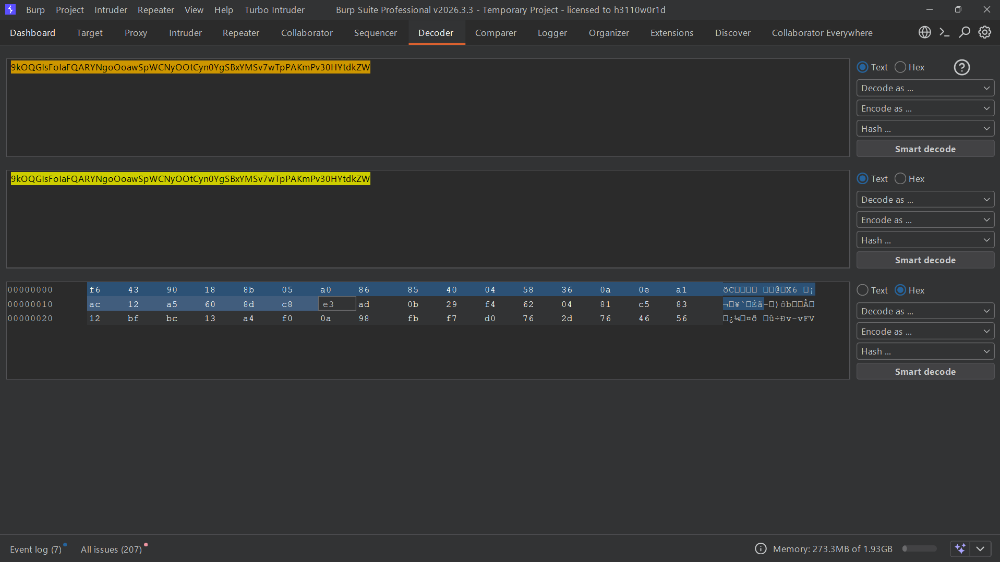

## Metadata

- **Difficulty:** Practitioner
- **Category:** Business logic vulnerabilities
- **Lab URL:** [Lab: Authentication bypass via encryption oracle](https://portswigger.net/web-security/logic-flaws/examples/lab-logic-flaws-authentication-bypass-via-encryption-oracle)
- **Date Solved:** 16/9/2026
## Vulnerability Summary

The app contains a logic flaw that exposes an encryption oracle to users. Moreover, we have access to both the encryption and decryption function, making this a *Chosen Ciphertext Attack (CCA)*. We can therefore decrypt our own `stay-logged-in` cookie, infer the format for the `administrator`'s `stay-logged-in` cookie, then craft a valid one. Combined with the authentication flaw that allows us gain access to any arbitrary account as long as you have it's `stay-logged-in` cookie without knowing the credentials, this crafted cookie is adequate to gain access to the `administrator`'s account, which have the privileges the delete users.
## Reconnaissance

- Logging in with the credentials `wiener - peter` and the `Stay logged in` box ticked, we are taken to the `/my-account?id=wiener` endpoint. There's a email change form that we can use with the request: `POST /my-account/change-email`.
- Try going to the `/admin` endpoint directly results in a `401 Unauthorized` HTTP response that reads `Admin interface only available if logged in as an administrator`.
- Regarding the `POST /my-account/change-email` request, if we submit an invalid email address (`aaa`), it returns a `302 Found` with a `notification` parameter in the `Set-Cookie` header. Performing the `GET /my-account` then, we see that the `notification` parameter with the same value is appended into the `Cookie` header of the request. The response reads: `Invalid email address: aaa`.
- Try submitting a different invalid email, we see the same behavior again but the value of the `notification` parameter is changed. Maybe this value has something to do with the submitted email address? 
- Pasting the `stay-logged-in` cookie value into this `notification` header in the `GET /my-account` request, we get a response that reads:
```html
<header class="notification-header">
	wiener:[value]                    
</header>
```
So this `notification` parameter can used to decrypt cookie values. We will refer to the `GET /my-account` request as the *decrypt* request, and the `POST /my-account/change-email` request as the *encrypt* request from now on.

- Pasting this same `wiener:[value]` into the `email` parameter in the body of the *encrypt* request, we get a different value compared to our `stay-logged-in` cookie in the `notification` parameter. Pasting this value into the `notification` parameter in the `Cookie` header of the *decrypt* request, we get this in the response:
```
Invalid email address: wiener:[value]
```
The string `Invalid email address: `was automatically appended. We can probably infer that the `stay-logged-in` cookie value for `administator` is `administrator:value`, but we have to get rid of the automatically appended string first to forge one.

- From our valid `stay-logged-in` cookie, we see some URL-encoded characters:
```
b4L7%2bkAwiZrwRqu6HBic%2b5M0b3NJQbgAGPjTZHW8ngE%3d
```
Try URL-decoding this string will give us:
```
b4L7+kAwiZrwRqu6HBic+5M0b3NJQbgAGPjTZHW8ngE=
```
`=` at the end, so this was probably encoded with base64? When base64-decoded, it becomes exactly 32 bytes, which is probably intended.
Therefore, in order to get a valid `administrator` cookie, we are going to put the encrypted, encoded, `Invalid email address: administrator:[value]`, through the same process:
1. URL-decode the string
2. base64-decode the string
3. Delete the first 23 bytes (corresponding to the string `Invalid email address: `)
4. Retry
We can do so by using the **Decoder** tab in Burp:

After selecting and deleting the first 23 bytes, we will reverse the decoding process: base64-encode > URL-encode (only the special characters, not all).

- Testing this new value with the `decrypt` request, we get a `500 Internal Server Error` HTTP response that reads: `Input length must be multiple of 16 when decrypting with padded cipher`. This means that the underlying encryption mechanism is block cipher, and the block size is 16. Since we deleted 23 bytes (congruent to 7 modulo 16), we have to add 7 bytes to this value. But we cannot do so to the encrypted ciphertext directly. Therefore, we are going to append 9 bytes onto the *plaintext*, then delete 32 bytes instead of 23.
## Exploitation Steps

1. Navigate to the `/login` endpoint and login with the credentials (`wiener - peter`), with the `Stay logged in` box ticked.
2. Intercept the `POST /my-account/change-email`, and send it to Repeater. You can name this request *encrypt* for convenient.
3. Intercept the `GET /my-account` request after 1 successful (`200 OK`) `POST /my-account/change-email`, and send it to Repeater. You can name this request *decrypt* for convenient.
4. In the *decrypt* request, copy the value of the `stay-logged-in` cookie, paste it into the `notification` parameter of the `Cookie` header, and send the request. Observe that in the response, there's a part that reads:
```html
<header class="notification-header">
    wiener:[token]                   
</header>
```
Make a note of this token.
5. In the *encrypt* request, modify the `email` parameter in the request body to this value (the token is the one you saved in the previous step):
```
AAAAAAAAAadministrator:[token]
```
The exact appended string is not fixed. Just make sure it's 9-character long. Send the request. Make a note of the value in the `notification` parameter in the `302 Found` response.
6. For sanity testing, you can use the *decrypt* request to test if the value we noted in step 5 decrypts to the intended value, which should be:
```html
Invalid email address: AAAAAAAAAadministrator:[token]
```
7. Send the token in step 5 to Decoder. URL-decode it, then base64-decode it. Select the option to show the result in `hex` format. Observe that after 2 decoding step, the token is exactly 64 bytes.
8. Delete the first 32 bytes. Then, reverse the process in step 7: base64-encode the value, then **manually** URL-encode the special characters (`/, =, +`).
9. Use the *decrypt* request to test the value. It should decrypt to only `administrator:[token]`.
10. Logout of `wiener`'s account.
11. Intercept the request to the `/admin` endpoint and send it to Repeater. Here, append the cookie value we just finished crafting in step 9 to the `stay-logged-in` parameter in the request's `Cookie` header (which, after logging out, should be blank). You should receive a `200 OK` HTTP response that reads:
```html
<section>
    <h1>
	    Users
    </h1>
    <div>
        <span>
	        wiener - 
        </span>
        <a href="/admin/delete?username=wiener">
	        Delete
	    </a>
    </div>
    <div>
        <span>
	        carlos - 
		</span>
        <a href="/admin/delete?username=carlos">
	        Delete
	    </a>
    </div>
</section>
```
12. Modify the request line to `GET /admin/delete?username=carlos`. You should receive a `302 Found`, signifying a redirection. When you follow the redirection, the response should read `User deleted successfully`, and lab is solved.
## Payload Used

`Invalid email address: AAAAAAAAAadministrator:[token]`, encoded and byte-manipulated as specify in the **Exploitation Steps**.
The payload works because the app's authentication mechanism is flawed, as we only need a valid `stay-logged-in` cookie to gain access to any arbitrary account without knowing its credentials. And since the app's encryption oracle is leaked, we were able to forge a valid one for the `administrator` account.
## Root Cause

1. The encryption oracle is exposed to the user because the `notification` parameter in the `Cookie` header were reflected. Moreover, we have access to both the encryption and decryption function, allowing us to perform a *Chosen Ciphertext Attack*, adequate to crack the app's weak block cipher mode (ECB) without salt or IV.
2. The authentication mechanism is flawed. The attacker only needs a valid `stay-logged-in` cookie value to gain access to any arbitrary account, bypassing the credentials-inputting process. Combined with the exposed encryption oracle logic flaw, the format of this `stay-logged-in` cookie can be inferred and forged.
## Remediation

- **Use Authenticated Encryption and secure modes:** The core flaw is a lack of ciphertext integrity validation. Implement an authenticated encryption mode such as AES-GCM or ChaCha20-Poly1305. Alternatively, append a strong Message Authentication Code (MAC) like HMAC-SHA256 to the ciphertext. If the ciphertext is tampered with (e.g., blocks deleted), the MAC validation will fail before decryption is attempted, preventing chosen-ciphertext attacks. Avoid using insecure mode of operation like ECB.
- **Context-Specific Keys:** Do not reuse the same cryptographic keys and algorithms across different application contexts. The email `notification` feature and the `stay-logged-in` authentication feature must use distinct, separate keys. This guarantees that an oracle in one feature cannot be used to forge tokens for another.
- **Sanitize Oracle Output:** Do not reflect verbose cryptographic errors (like padding exceptions) or raw decrypted payloads back to the user, as this facilitates oracle attacks.