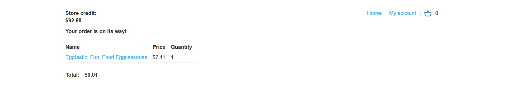
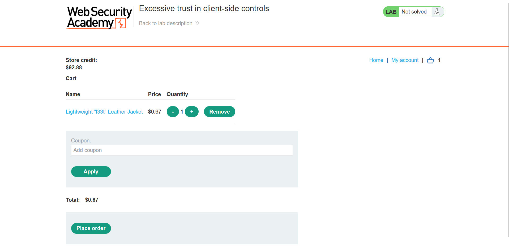

## Metadata

- **Difficulty:** Apprentice
- **Category:** Business logic vulnerabilities
- **Lab URL:** [Lab: Excessive trust in client-side controls](https://portswigger.net/web-security/logic-flaws/examples/lab-logic-flaws-excessive-trust-in-client-side-controls)
- **Date Solved:** 11/9/2026
## Vulnerability Summary

The app does not adequately validate user input in one of the steps in the workflow of buying an item, allowing us to buy any item for any price (user-supplied).
## Reconnaissance

- Logging in with the credentials `wiener - peter`, we see that we have `$100.00` store credit, while the item we have to buy, `Lightweight "l33t" Leather Jacket`, costs `$1337.00`. This means that to buy this item, we have to either: 1. modify the item price, or 2. modify our store credit value.
The purchasing workflow of an item is as follows:
1. We click on "View details" of the item (`GET /product?productId=17`)
2. On the item's page (`/product?productId=17`), we add it to cart (`POST /cart`)
3. We go to cart (`GET /cart`) to place an order (`POST /cart/checkout`). This checkout request will result in a `303 See Other` HTTP Response, which:
	- If we have enough store credit to buy the item, results in a `GET /cart/order-confirmation?order-confirmed=true`. The item is bought successfully, and its price is deducted from our store credits.
	- Else, `GET /cart?err=INSUFFICIENT_FUNDS` is encountered. The request reads `Not enough store credit for this purchase`.
Out of these steps, only the latter request of the **second** one (`POST /cart`) contains a modifiable `price` parameter in the body:
```
productId=17&redir=PRODUCT&quantity=1&price=711
```
Modify the `price` parameter to `1` allows us to buy the item with the price of `$0.01` instead of `$7.11` ( the extra `$7.11` was when I tried to buy proceed through the purchasing workflow as normal):

## Exploitation Steps

1. Log into your account (`wiener - peter`).
2. Click on "View details" of `Lightweight "l33t" Leather Jacket` (`GET /product?productId=1`).
3. Intercept the "Add to cart" request (`POST /cart`), send it to Repeater, then **drop** it.
4. Modify the `price` parameter to any value under your current store credits so that you can buy it. For example, 67 (`$0.67`). Then send the request, which should resulting in a `302 Found` HTTP Response.
```
productId=1&redir=PRODUCT&quantity=1&price=67
```
5. Go on the website, where you can see that you can buy he intended item at the price you have set. Simply "Place order", and lab is solved. 

## Payload Used

`productId=1&redir=PRODUCT&quantity=1&price=67`
The app implicitly trusts user-supplied input without server-side validation. This allows us to buy items at any price we want.
## Root Cause

The  app relies on the client to provide authoritative business logic data. Instead of using the submitted `productId` to look up the correct item price from a trusted server-side data store, the server blindly accepts the user-supplied `price` parameter in the `POST /cart` request and uses it to calculate the final checkout total.
## Remediation

- The app should not accept a `price` parameter in the `POST /cart` request. The client should only be permitted to submit the `productId` and `quantity`.
- When processing a cart addition or checkout request, the server must extract the `productId`, query the backend database (or another trusted server-side data store) for that specific item, and retrieve its authoritative price.
- All transaction totals and account balance deductions must be calculated server-side using the trusted database values, ensuring the user cannot manipulate the final cost.