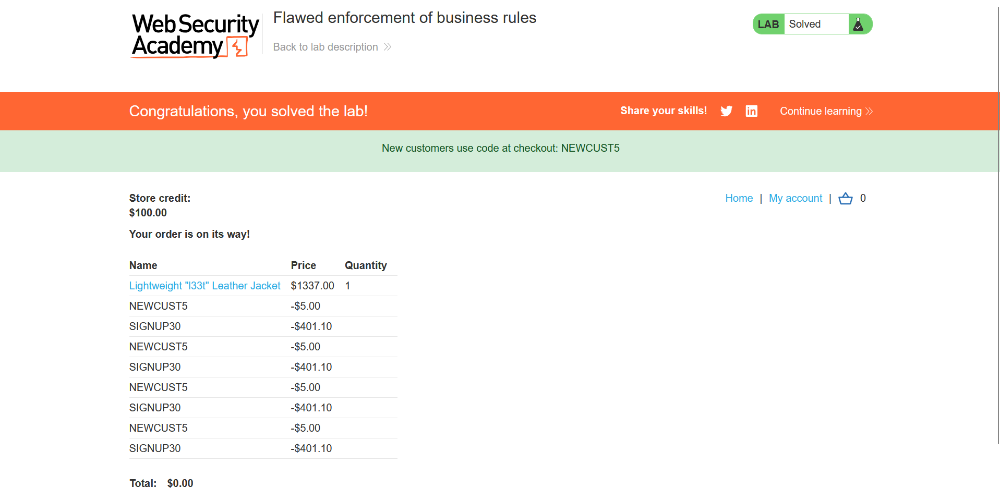

## Metadata

- **Difficulty:** Apprentice
- **Category:** Business logic vulnerabilities
- **Lab URL:** [Lab: Flawed enforcement of business rules](https://portswigger.net/web-security/logic-flaws/examples/lab-logic-flaws-flawed-enforcement-of-business-rules)
- **Date Solved:** 16/9/2026
## Vulnerability Summary

The app contains a business logic flaw in it coupon code validation mechanism. While the system prevents the consecutive reuse of the same discount code, it fails to maintain a persistent historical state of all codes applied to the current cart. By alternating between two distinct valid coupon codes, an attacker can bypass the intended usage limits, repeatedly stack discounts, and reduce the order total to zero, allowing the purchase of  any arbitrary item for free. 
## Reconnaissance

Logging in with the credentials `wiener - peter`, the account is provided with `$100.00` in store credit. The target item `Lightweight "l33t" Leather Jacket`, costs `$1337.00`.
The purchasing workflow of an item is as follows:
1. We click on "View details" of the item (`GET /product?productId=10`)
2. On the item's page (`/product?productId=10`), we add it to cart (`POST /cart`)
3. We go to cart (`GET /cart`) to place an order (`POST /cart/checkout`). This checkout request will result in a `303 See Other` HTTP Response, which:
	- If we have enough store credit to buy the item, results in a `GET /cart/order-confirmation?order-confirmed=true`. The item is bought successfully, and its price is deducted from our store credits.
	- Else, `GET /cart?err=INSUFFICIENT_FUNDS` is encountered. The request reads `Not enough store credit for this purchase`.
	We can also, optionally, use coupon code (`POST /cart/coupon`) for price reduction.
	
Analysis of the app reveals two distinct discount codes:
-  `NEWCUST5`: Advertised via a banner, providing a `$5.00` discount.
-  `SIGNUP30`: Delivered upon signing up for the app's newsletter, providing a `30%` discount on the base item price.

The promotional code workflow operates via `POST /cart/coupon`. Submitting the same coupon twice consecutively (e.g., `NEWCUST5` followed by `NEWCUST5`) results in an enforcement block, returning a "Coupon already applied" error (`GET /cart?couponError=COUPON_ALREADY_APPLIED&coupon=NEWCUST5`). However, submitting `NEWCUST5` followed by `SIGNUP30` succeeds. Re-applying `NEWCUST5` immediately after `SIGNUP30` also succeeds. This indicates that the backend only evaluates the newly submitted coupon against the immediately preceding coupon.

Additionally, the `SIGNUP30` discount calculates its reduction based on the static base price of the jacket (`$1337.00`) rather than the dynamically reducing subtotal, accelerating the depletion of the cart total.
## Exploitation Steps

1. Log into the app using `wiener - peter`.
2. Navigate to the product page for the `Lightweight "l33t" Leather Jacket` and add it to the cart (`POST /cart`).
3. Navigate to the cart interface (`GET /cart`).
4. Apply the `NEWCUST5` coupon, then apply the `SIGNUP30` coupon. Alternate between the 2 coupons until the price of the item reaches `$0.00`.
5. Alternate applying `NEWCUST5` and `SIGNUP30`. Because each pair removes `$406.10` from the total, applying this sequence four times will drop the aggregate cost to `$0.00` or below.
6. Place the order (`POST /cart/checkout`). You will be able to buy the item for free, and lab is solved. 

## Payload Used

Alternating `POST /cart/coupon` requests with the following body parameters:
- `csrf=<token>&coupon=NEWCUST5`
- `csrf=<token>&coupon=SIGNUP30`
(or just do so manually on the website).
This succeeds because the app's state management logic is flawed. The backend validation only compares the incoming `coupon` parameter against the last stored coupon string in the session. By changing the input between two valid states, the duplication rule is never triggered, allowing infinite stacking of the discounts.
## Root Cause

The app implements a flawed validation mechanism that only tracks the most recently applied coupon code. It fails to maintain a server-side array of all discount codes tied to the current cart. Consequently, the business rule designed to restrict coupon usage is enforced against the immediate previous state rather than the complete transaction history.
## Remediation

- Maintain a server-side list tracking all unique coupon codes applied to a specific cart session.
- During the `POST /cart/coupon` operation, iterate through this list to ensure the newly submitted coupon has not been used at any point during the current transaction.
- Implement a strict, globally enforced upper-bound limit on the quantity of promotional codes allowed per order (e.g., maximum of one discount code).
- Calculate percentage-based discounts dynamically against the current running subtotal, rather than the static base price of the item.