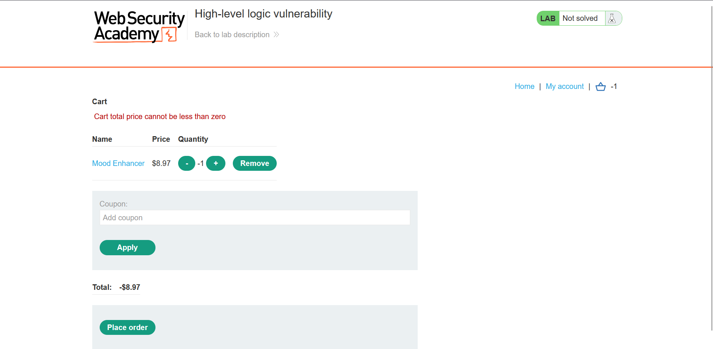
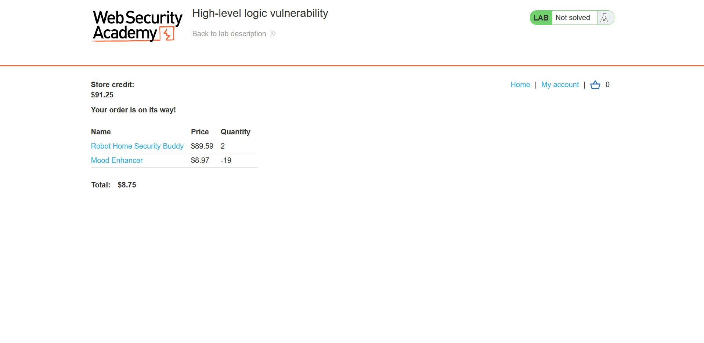
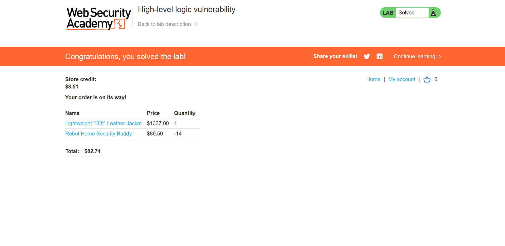

## Metadata

- **Difficulty:** Apprentice
- **Category:** Business logic vulnerabilities
- **Lab URL:** [Lab: High-level logic vulnerability](https://portswigger.net/web-security/logic-flaws/examples/lab-logic-flaws-high-level)
- **Date Solved:** 11/9/2026
## Vulnerability Summary

The app does not adequately validate user input in one of the steps in the workflow of buying an item, allowing us to input negative values in the `quantity` parameter of items, effectively allowing us to buy any item at any price, as long as the total checkout value is larger than 0.
## Reconnaissance

- Logging in with the credentials `wiener - peter`, we see that we have `$100.00` store credit, while the item we have to buy, `Lightweight "l33t" Leather Jacket`, costs `$1337.00`. This means that to be able to buy this item, we have to either: 1. modify the item price, 2. modify our store credit value, or something else.
The purchasing workflow of an item is as follows:
1. We click on "View details" of the item (`GET /product?productId=10`)
2. On the item's page (`/product?productId=10`), we add it to cart (`POST /cart`)
3. We go to cart (`GET /cart`) to place an order (`POST /cart/checkout`). This checkout request will result in a `303 See Other` HTTP Response, which:
	- If we have enough store credit to buy the item, results in a `GET /cart/order-confirmation?order-confirmed=true`. The item is bought successfully, and its price is deducted from our store credits.
	- Else, `GET /cart?err=INSUFFICIENT_FUNDS` is encountered. The request reads `Not enough store credit for this purchase`.
Out of these steps, only the latter request of the **second** one (`POST /cart`) contains a modifiable `quantity` parameter in the body:
```
productId=17&redir=PRODUCT&quantity=1&price=711
```
When interacting with the item on the website, we cannot bring the quantity to add the item to cart lower than 0. However, we are able to do so when the request is intercepted with a proxy. Modify the `quantity` parameter to `-1` allows us to buy the item with the price of `-8.97$` instead of `$8.97`. However, checking out results in a `GET /cart?err=NEGATIVE_TOTAL` request that reads `Cart total price cannot be less than zero`:

- We can buy any item at any price, as long as the cart total price is more than 0. Here, I bought 2 items worth `$179.18` for `$8.75` by supplementing the cart with another item with its `quantity` parameter of `-19` to lower down the price:

## Exploitation Steps

1. Log into your account (`wiener - peter`).
2. Click on "View details" of `Lightweight "l33t" Leather Jacket` (`GET /product?productId=1`). Add 1 of this item to cart.
3. Find another item, preferably the second highest priced one (so that the price cancelling out process can be done faster). Add 1 of it to cart. Intercept this request. 
4. Here, you can either 
	- Modify the `quantity` parameter of the other item in the intercepted request to make it negative to cancel out the price of the `Lightweight "l33t" Leather Jacket`:
	```
	productId=12&redir=PRODUCT&quantity=-14
	```
	- Or clicking the minus symbol of the other item on the website (be fast when it's 1, do not wait for it to turn 0 - it will be automatically removed from the cart). This achieves the same results.
	The final cart total price must be higher than 0, and lower than your budget (so that you can buy the jacket, duh)
5. Proceed to checkout with "Place order". Lab is solved.

## Payload Used

`productId=12&redir=PRODUCT&quantity=-14` (note that you can use any product (or combination of products) with any quantity to cancel out the price of the jacket we have to buy).
The app implicitly trusts user-supplied input without server-side validation. This allows us to buy items at any price we want.
## Root Cause

The application relies exclusively on client-side HTML/UI constraints to prevent users from adding negative quantities to their cart. It fails to implement corresponding server-side validation on the `quantity` parameter when processing the `POST /cart` request. Because the backend calculates the total cost by multiplying the item price by the user-supplied quantity as signed integers, supplying a negative quantity results in a negative cost, which is then subtracted from the overall cart total.
## Remediation

- Validate the `quantity` parameter on the backend to ensure it is strictly a positive integer (e.g., `quantity > 0`) before updating the cart.
- Reject any requests containing malformed, zero, or negative quantities with an appropriate HTTP error status (e.g., `400 Bad Request`).
- Never trust client-side validation as a security control; it must only be used for user experience enhancements.