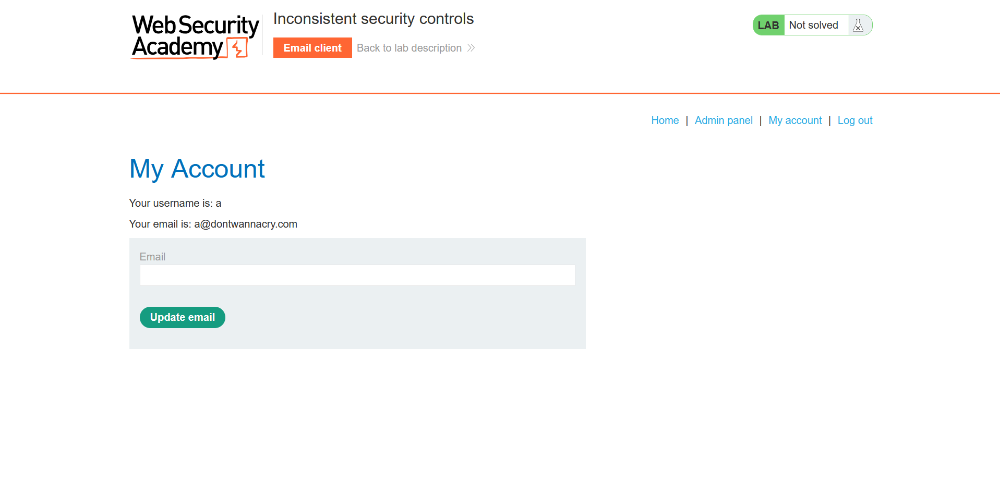

## Metadata

- **Difficulty:** Apprentice
- **Category:** Business logic vulnerabilities
- **Lab URL:** [Lab: Inconsistent security controls](https://portswigger.net/web-security/logic-flaws/examples/lab-logic-flaws-inconsistent-security-controls)
- **Date Solved:** 15/9/2026
## Vulnerability Summary

The app implements strict email verification during the initial user registration process but fails to enforce this same validation when a user updates their email address later. This inconsistent security control allows an attacker to change their verified email to a privileged domain (`@dontwannacry.com`), granting them unauthorized access to the administrator panel and its privileges, which includes deleting other users' accounts.
## Reconnaissance

- The lab description states that administrative functionalities are only available to company employees.
- The registration page (`/register`) contains a client side note: "If you work for DontWannaCry, please use your @dontwannacry.com email address". When we visit the `/admin` endpoint, there's a note that says: "Admin interface only available if logged in as a DontWannaCry user". These information is sufficient to confirm that we need to have an email address with the `@dontwannacry.com` address to gain administrative functionalities.
- We have access to a dedicated exploit server to serve as an email client for registration.
- The account creation workflow operates as follows:
    1. We register an account via `POST /register`, using the assigned exploit server email address.
    2. We click the verification link sent to our email client via `GET /register?token=...` to activate the account.
    3. We log in to the application via `POST /login`.
- Once authenticated, the `/my-account` page provides a form to update the email address (`POST /my-account/change-email`). 
- Changing the email to an arbitrary `@dontwannacry.com` address is processed immediately, with no further verification. The `Admin panel` tab also pops up, and we have been granted administrative privileges.

## Exploitation Steps

1. Access the provided email client and note the assigned `@exploit-lab-id.exploit-server.net` email address.
2. Navigate to the registration page (`GET /register`) and create a new user using this email address.
3. Return to the email client, intercept the verification email, and visit the activation link to finalize account creation.
4. Log into the application using the newly registered credentials.
5. Navigate to the account profile page and update your email address to `a@dontwannacry.com` via the provided form. Observe that the app accepts the new email immediately, and you are granted administrative functionalities through the `Admin panel` tab. 
6. Navigate to `/admin` and delete the user `carlos` (`GET /admin/delete?username=carlos`). Lab is solved.
## Payload Used

`email=a@dontwannacry.com`

The initial registration flow enforces strict email client verification. However, the email update functionality implicitly trusts user-supplied input without server-side verification. By changing our email to the target domain, we satisfy the application's flawed, string-matching authorization check.
## Root Cause

Inconsistent application of security controls across different user workflows. The developer correctly implemented email verification for initial account creation but completely didn't do so to the email update function. Furthermore, the app trusts and relies on user-supplied input (the email domain string) rather than a robust server-side state mechanism to determine administrative privileges.
## Remediation

- Implement a consistent email verification process: any updates to an email address must require the user to click a verification link sent to the *new* email address before the database or session is updated.
- Ensure authorization checks rely on secure, server-side Role-Based Access Control (RBAC) mechanisms (e.g., an `is_admin` boolean or `role_id` tied to the user's database record) instead of string-evaluating the domain suffix of an email address.