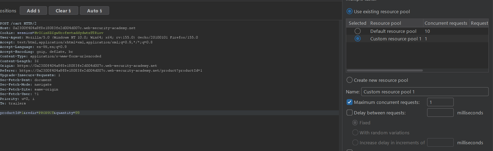
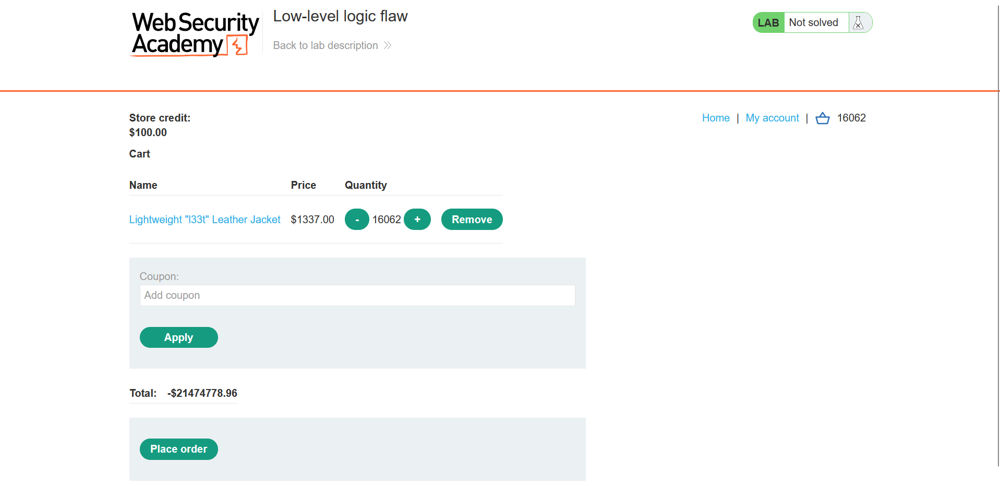
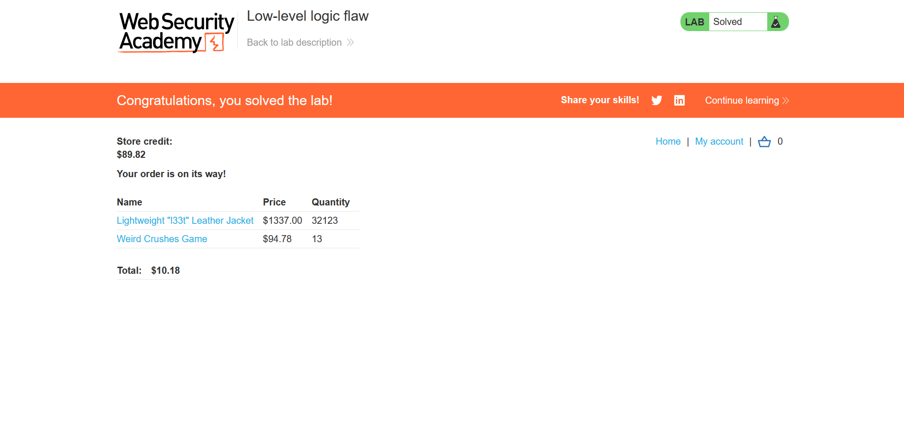

## Metadata

- **Difficulty:** Practitioner
- **Category:** Business logic vulnerabilities
- **Lab URL:** [Lab: Low-level logic flaw](https://portswigger.net/web-security/logic-flaws/examples/lab-logic-flaws-low-level)
- **Date Solved:** 12/9/2026
## Vulnerability Summary

The app fails to properly handle maximum mathematical bounds during the checkout process, leading to an integer overflow vulnerability. When calculating the total price of items in the cart, the backend processes the item price multiplied by the user-supplied quantity using a 32-bit signed integer. By systematically supplying a large total quantity, an attacker can overflow the integer's maximum threshold, causing the cart's total price to wrap around into a negative value. This allows the attacker to manipulate the total cost and purchase items that far exceed their authorized account balance.
## Reconnaissance

Logging in with the credentials `wiener - peter`, we see that we have `$100.00` store credit, while the item we have to buy, `Lightweight "l33t" Leather Jacket`, costs `$1337.00`. This means that to be able to buy this item, we have to either: 1. modify the item price, 2. modify our store credit value, or something else.
The purchasing workflow of an item is as follows:
1. We click on "View details" of the item (`GET /product?productId=10`)
2. On the item's page (`/product?productId=10`), we add it to cart (`POST /cart`)
3. We go to cart (`GET /cart`) to place an order (`POST /cart/checkout`). This checkout request will result in a `303 See Other` HTTP Response, which:
	- If we have enough store credit to buy the item, results in a `GET /cart/order-confirmation?order-confirmed=true`. The item is bought successfully, and its price is deducted from our store credits.
	- Else, `GET /cart?err=INSUFFICIENT_FUNDS` is encountered. The request reads `Not enough store credit for this purchase`.
Out of these steps, only the latter request of the **second** one (`POST /cart`) contains a modifiable `quantity` parameter in the body:
```
productId=1&redir=PRODUCT&quantity=1
```
The maximum value of quantity you can add in one request is 99, enforced client-side:
```html
<form id=addToCartForm action=/cart 
method=POST> <input required type=hidden name=productId value=1> 
<input required type=hidden name=redir value=PRODUCT> 
<input required type=number min=0 max=99 name=quantity value=1> 
<button type=submit class=button>Add to cart</button> 
</form>
```
However, it appears that there's no upper bound implemented on the value of quantity of each item. And since the lab's name is low-level, I thought it had something to do with how the backend code works. So I kept adding items, using Burp Intruder. Do note that you have to set the maximum concurrent requests to 1 for a more accurate price adding, like so: 

Since we are sending the exact same request every time, configure the payload type to be `Null payloads`. 
My instinct was correct. At a value of 16062 in quantity of the `Lightweight "l33t" Leather Jacket`, an integer overflow error on the total price of items occurred, and cart's total price overflowed into a negative value:

The backend processes the total cart price using a 32-bit signed integer. Keep adding more items makes this value closer to 0.
The path now is clear: exclusively using `Lightweight "l33t" Leather Jacket`, we will try to get the total as close to 0 as possible while staying negative. Then, we will add another item with adequate quantity so that the total is lower than `$100` and higher than 0.
## Exploitation Steps

1. Log into your account (`wiener - peter`).
2. Click on "View details" of `Lightweight "l33t" Leather Jacket` (`GET /product?productId=1`).
3. Intercept the "Add to cart" request (`POST /cart`), send it to Repeater, then **drop** it.
4. Send this request to Burp Intruder to automate the addition of items to the cart. Set the payload position to a null payload to simply repeat the request.
5. Set the `quantity` parameter in the request body to 99.
6. In Intruder settings, configure a Resource Pool with **Maximum concurrent requests set to 1**. This is critical to prevent race conditions and ensure the backend calculates the incremental price additions near-correctly (it will still differ a little, but the deviation is small enough that you can manually increase/decrease the quantity later).
7. To push the negative price as close to zero as possible, the optimal aggregate quantity is 32,123. So configure the attack to generate **324** payloads, then start the attack.
8. Once the cart reaches 32,123 jackets, the total price will reflect a negative value, `-$1221.96`.

9. Add a different, cheaper item to the cart in a calculated quantity to offset the negative total. The final cart price must balance out to be greater than `$0.00` but strictly lower than your `$100.00` budget.
10. Navigate to the cart and place the order (`POST /cart/checkout`). Lab is solved!

## Payload Used

`productId=1&redir=PRODUCT&quantity=99` (Repeated via Intruder Null Payloads)

This payload works because although the app evaluates individual request constraints (`<input required type=number min=0 max=99 name=quantity value=1>`), it blindly aggregates the cart values in the backend. Since the price is evaluated in cents, `$1337.00` is handled as `133,700`. When the accumulated quantity hits 16,062, the subtotal (`2,147,489,400` exceeds the 32-bit signed integer upper bound of 2,147,483,647. At a quantity of 32,123, the mathematical wrap-around stabilizes the negative total to a manageable deficit.
## Root Cause

The backend application stores the cart's aggregate cost in a 32-bit signed integer and blindly trusts the resulting calculation. It fails to implement safeguards against numeric overflow when multiplying large user-accumulated quantities by high item prices. Because the total cost wraps around into negative space, the system interprets the negative integer as a valid cart state with no validation.
## Remediation

- Migrate financial calculations to wider data types that do not easily overflow, such as 64-bit integers (`long`) or dedicated standard libraries for arbitrary-precision arithmetic (e.g., `BigInteger` or `BigDecimal`).
- Implement strict, server-side upper-bound limits on the total quantity of items a single cart can hold, not just limits on individual requests.
- Enforce logic checks prior to checkout to verify that the mathematical total of all items strictly equals the expected positive sum, and reject any order where the subtotal evaluates to a negative number.