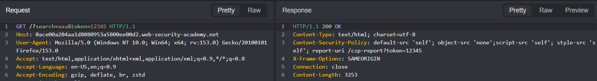

## Metadata

- **Difficulty:** Expert
- **Category:** Cross-site Scripting
- **Lab URL:** [Lab: Reflected XSS protected by CSP, with CSP bypass](https://portswigger.net/web-security/cross-site-scripting/content-security-policy/lab-csp-bypass)
- **Date Solved:** 27/7/2026
## Vulnerability Summary

The app contains a reflected XSS vulnerability in its search functionality and a CSP injection vulnerability in the `token` parameter. The user-controllable `token` parameter is appended directly into the `Content-Security-Policy` header without any sanitization. Thus, we can break out of the intended CSP directive to inject a new directive that allows for our inline arbitrary `JavaScript` code to be executed, bypassing CSP.
## Reconnaissance

- Entering a random string (e.g. `aaa`) into the search bar produces this request: `GET /?search=aaa`, and the string is reflected back in the response body inside a `<h1>` element: `<h1>0 search results for 'test'</h1>`. User input is being placed directly into the HTML without escaping.
- Trying to inject ``, however, does not succeed in exploiting XSS, since there is a `Content-Security-Policy` header implemented specifically to block inline scripts: `Content-Security-Policy: ...; script-src 'self'; ...`.
- Inspecting the `Content-Security-Policy` header, we see that at the end there's a token: `Content-Security-Policy: ...; report-uri /csp-report?token=`. Supplementing this token in the request line reveals that we can manipulate the value of this `token`:

There appears to be no sanitization regarding this token either. Since this is the last value of the `Content-Security-Policy` header, we can potentially inject a semicolon `;` to terminate the `report-uri` directive and introduce our own. One that would allow the execution of inline scripts.
## Exploitation Steps

1. Enter a random string (e.g. `aaa`) into the search bar and search. Intercept the request.
2. Modify the request line to `GET /?search=%3Cscript%3Ealert%281%29%3C%2Fscript%3E&token=%3Bscript-src-elem%20%27unsafe-inline%27 HTTP/1.1` and send request. 
3. Lab should be marked as solved. When you open the response to the request in browser, a dialogue box should pop up, signifying that the `alert()` function was successfully invoked.
## Payload Used

`%3Cscript%3Ealert%281%29%3C%2Fscript%3E&token=%3Bscript-src-elem%20%27unsafe-inline%27`
This is the URL-encoded version of this payload:
`&token=;script-src-elem 'unsafe-inline'`. 
- As discussed in the **Reconnaissance** section, we use a semicolon to terminate the `report-uri` directive to introduce ours, `script-src-elem`. This directive allows you to control script blocks and, importantly, **overwrites** the existing `script-src` directive. Along with `unsafe-inline`, we successfully configured the app to execute inline scripts, which was previously banned.
- The inline script we injected is the textbook ``, URL-encoded to be delivered in the URL. 
## Root Cause

The vulnerability exists because of a lack of input validation and output encoding on two separate parameters. The `search` parameter allows arbitrary HTML reflection, while the `token` parameter allows HTTP header injection specifically within the `Content-Security-Policy` header.
## Remediation

Input validation and context-aware output encoding must be done on 2 parameters:
- `search`: HTML-encode before reflecting to the DOM (e.g. `<` to `&lt;`, `>` to `&gt;`).
- `token`: Implement a whitelist to validate the value of this parameter. Strip any characters that have special meaning in HTTP headers: `;`, `\n`, `\r`...