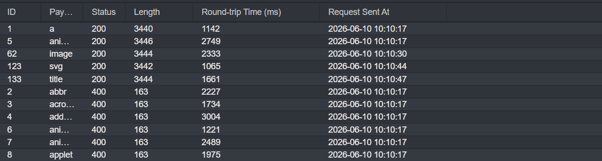
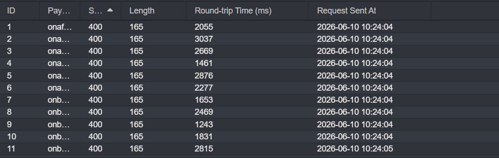

## Metadata

- **Difficulty:** Expert
- **Category:** Cross-site Scripting (XSS)
- **Lab URL:** [Lab: Reflected XSS with event handlers and `href` attributes blocked](https://portswigger.net/web-security/cross-site-scripting/contexts/lab-event-handlers-and-href-attributes-blocked)
- **Date Solved:** 10/6/2026
## Vulnerability Summary

The app contains a XSS vulnerability in the search function. Though it does attempt to block most tags and all events, we can use the whitelisted tags - specifically the `<svg>`, `<animate>`, and `<a>` tags - to tell the browser to parse the content as Scalable Vector Graphics to enable SMIL animations. Coupled with setting the `attributeName` attribute to `href` in the `<animate>` tag, we can bypass the `href` blocking of the WAF, triggering XSS.
## Reconnaissance

- Entering a normal string like `aaa` into the search bar produces this request: `GET /?search=aaa`, and the string is reflected back in the response body inside a `<h1>` element: `<h1>0 search results for 'aaa'</h1>`. User input is being placed directly into the HTML without escaping.
- Trying to inject `<script>alert(1)</script>` to the search parameter, we get a `400 Bad Request` HTTP response that reads `"Tag is not allowed"`. We need to find tags and events that are allowed.
- Type in a random string in the search bar and intercept this request. Modify the header of the request to `GET /?search=<> HTTP/2` and add payload position between the angle brackets. Paste the tags on [XSS Cheatsheet](https://portswigger.net/web-security/cross-site-scripting/cheat-sheet) onto the list of payloads to be used, then start the tags enumeration. After it's done, sort the status code column in ascending order, as we need to find the allowed tags with `200 OK` HTTP Responses. You should see that these tags are allowed: `<a>`, `<animate>`, `<image>`, `<svg>`, `<title>`.

- We use one of these tags (e.g. `<svg>`) to enumerate through the events to to see what's allowed. Like the lab's name suggests, all of them are blocked.

- We need to use the tags to deliver the XSS payload.
## Exploitation Steps

1. Type in a random string into the search bar, e.g. `aaa`. Intercept this request.
2. Paste this payload onto the `search` parameter:
```
%3Csvg%3E%20%3Ca%3E%20%3Canimate%20attributeName%3D"href"%20values="javascript:alert(1)"%20%2F%3E%20%3Ctext%20x%3D"20"%20y%3D"20"%3EClick%20Me%3C%2Ftext%3E%20%3C%2Fa%3E%3C%2Fsvg%3E
```
3. You should get a `200 OK` HTTP Response that reads lab is solved.
## Payload Used

[XSS Cheatsheet](https://portswigger.net/web-security/cross-site-scripting/cheat-sheet)
```
%3Csvg%3E%20%3Ca%3E%20%3Canimate%20attributeName%3D"href"%20values="javascript:alert(1)"%20%2F%3E%20%3Ctext%20x%3D"20"%20y%3D"20"%3EClick%20Me%3C%2Ftext%3E%20%3C%2Fa%3E%3C%2Fsvg%3E
```
- The payload is the URL-encoded version of this block (prettified):
```html
<svg>
  <a>
    <animate attributename="href" values="javascript:alert(1)" />
    <text x="20" y="20">Click Me</text>
  </a>
</svg>  
```

| Character | HTML URL encoded (UTF-8) |
| --------- | ------------------------ |
| /         | %2F                      |
| <         | %3C                      |
| =         | %3D                      |
| >         | %3E                      |
| space     | %20                      |
- The enabled `<svg>` tag tells the browser to parse the content as Scalable Vector Graphics, enabling Synchronized Multimedia Integration Language (SMIL) animations.
- There's no `href` attribute in the `<a>` tag, bypassing the WAF.
- When encountered the allowed `<animate>` tag, the app immediately executes the animation directive, as in "take the parent element (`<a>`) and continuously set its `href` attribute to `javascript:alert(1)`."
- The vector is labeled with `Click me` to induce the simulated lab user to click our vector.
## Root Cause

The app takes untrusted input from the `search` parameter and reflects it directly into the HTML document structure (inside the `<h1>` tag).

Additionally, the app insecurely relies on a WAF as the primary defense mechanism against XSS. The WAF was configured with a flawed whitelist that failed to account for the obfuscation of the `href` attribute inside the `<animate>` tag. 
## Remediation

-  The application must treat the user-supplied input as data (instead of executable code) and HTML-entity encode it before reflecting it into the HTML document. Specifically, the following characters must be converted into their safe HTML entity equivalents:
    - `<` to `&lt;`
    - `>` to `&gt;`
    - `"` to `&quot;`
    - `'` to `&#x27;`
    - `&` to `&amp;`
- Implement strict a CSP Level 2 policy with Google Universal's `strict-dynamic` via HTTP response headers to mitigate the impact of any missed injection flaws. 