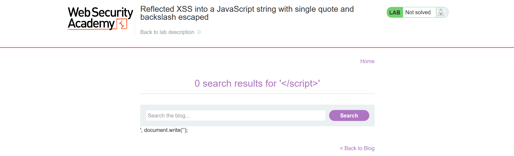

## Metadata

- **Difficulty:** Practitioner
- **Category:** Cross-site Scripting (XSS)
- **Lab URL:** [Lab: Reflected XSS into a JavaScript string with single quote and backslash escaped](https://portswigger.net/web-security/cross-site-scripting/contexts/lab-javascript-string-single-quote-backslash-escaped)
- **Date Solved:** 12/6/2026
## Vulnerability Summary

The app contains a XSS vulnerability in the search functionality. The user-supplied input is directly reflected inside a `JavaScript` string, allowing us to break out of this string and inject our own `JavaScript` script to call the `alert()` function.
## Reconnaissance

-  Entering a normal string like `aaa` into the search bar produces this request: `GET /?search=aaa`, and the string is reflected back in the response body inside the `JavaScript` `<script>` tags as follows:
```html
<script>
    var searchTerms = 'aaa';
    document.write('');
</script>
```
- Trying to break out of the existing `<script>` tag by sending `GET /?search=</script>` will yield us a `200 OK` HTTP Response that reads:
```html
<script>
    var searchTerms = '
</script>';
document.write('');
```
and on the browser:

`';document.write` is returned as plaintext instead of part of the `JavaSript`, signifying that we have successfully broken out of the existing `<script>` tag.
## Exploitation Steps

1. Type in a random string into the search bar, e.g. `aaa`. Intercept this request.
2. Paste the payload below onto the `search` parameter and send request:
```
</script><script>alert(1)</script>
```
3.  You should get a `200 OK` HTTP Response. Copy the response URL and open it in browser. The `alert()` function should trigger and lab is solved.
## Payload Used

`</script><script>alert(1)</script>`
- The prefix `</script>` tag close the existing `<script>` tag, breaking out of it.
- The remaining `<script>alert(1)</script>` string is a standard `JavaScript` payload that invokes the `alert()` function. 
The browser first performs HTML parsing to identify the page elements, including blocks of script. Because the HTML parser does not understand `JavaScript`, it only knows when to start and stop passing contents to the `JavaScript` engine using the `<script>` and `</script>` tags.  Thus, after reading `</script>`, it closes the existing `<script>` block and performs DOM insertion of our own `<script>alert(1)</script>`.
## Root Cause

The app reflects user input inside a JavaScript string literal. Though it does attempt to sanitize the input by escaping single quotes (`'`) and backslashes (`\`) to prevent attackers from breaking out of the variable assignment, it failed to HTML-encode the input. Because the browser's HTML parser processes the document from top to bottom before the JavaScript engine executes the contents of the `<script>` blocks, an unencoded `</script>` tag terminates the script block entirely, rendering the JavaScript string escaping useless.
## Remediation

- **HTML Encoding:** Because the JavaScript is embedded within an HTML document, characters with special meaning in HTML (such as `<`, `>`, `&`, `"`, and `'`) must be converted to their corresponding HTML entities (e.g., `<` becomes `&lt;`).
- **JavaScript Unicode Escaping:** When reflecting untrusted data into a JavaScript string, use Unicode escapes for safety. For example, `<` should be encoded as `\u003c`. Modern web frameworks typically handle this automatically if data is passed to the DOM safely (e.g., via `textContent`), but server-side rendering requires strict encoding before the response is constructed.