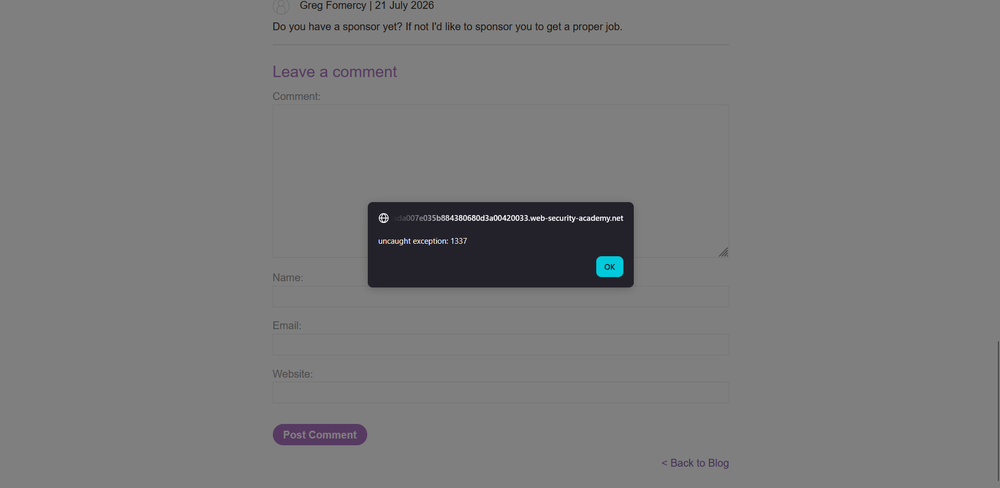

## Metadata

- **Difficulty:** Expert
- **Category:** Cross-site Scripting (XSS)
- **Lab URL:** [Lab: Reflected XSS in a JavaScript URL with some characters blocked](https://portswigger.net/web-security/cross-site-scripting/contexts/lab-javascript-url-some-characters-blocked)
- **Date Solved:** 27/7/2026
## Vulnerability Summary

The app contains a reflected XSS vulnerability within a `javascript:` URL context. The `postId` parameter is reflected inside a single-quoted string within a `fetch()` API call. Though the WAF blocks standard execution characters like `;` and `()`, we can bypass this by chaining expressions with the comma operator, using an ES6 arrow function (to bypass the`()` blocking), and forcing implicit type coercion to execute arbitrary `JavaScript` (refer to [XSS without parentheses and semi-colons](https://portswigger.net/research/xss-without-parentheses-and-semi-colons)  for more details.
## Reconnaissance

- Navigating to a random post and inspecting the app's response, we see that the parameter is reflected. The code snippet below is the response to `GET /post?postId=3`.
```html
<div class="is-linkback">
    <a href="javascript:fetch('/analytics',{method:'post',body:'/post%3fpostId%3d3'}).finally(_ => window.location = '/')">Back to Blog</a>
</div>
```
- Trying to close the string, the object literal and the `fetch()` function call with `'})` and appending `;alert(1337)//` returns a `400 Bad Request` HTTP Response. This is expected, because the learning material for this lab includes this blog post [XSS without parentheses and semi-colons](https://portswigger.net/research/xss-without-parentheses-and-semi-colons), implying that the app in this lab blocks parentheses (`()`) and semicolons (`;`). 
- Since semicolons are blocked, we may not be able to terminate the `fetch()` function call and introduce our own statement. We can, however, use the comma operator to chain expressions.
- To call `JavaScript` functions without using parentheses and semicolons, we define an ES6 arrow function, then wrap  the `onerror` event and the `throw` statement in it. Once again, for more details, refer to [XSS without parentheses and semi-colons](https://portswigger.net/research/xss-without-parentheses-and-semi-colons).
- After successfully defining such a function, we still need to somehow call it. Since we cannot use `()` to call it, we must force the `JavaScript` engine to invoke it for us. We can do this through type coercion (**not** type *conversion*, which is explicit and done by the programmer).
## Exploitation Steps

1. Navigate to any post, e.g. `url/post?postId=1`. Intercept this request with Burp/Caido.
2. Modify the `postId` parameter to `1&%27},func=x=%3E{throw/**/onerror=alert,1337},toString=func,window%2B%27%27,{func:%27`. Send the request.
3. Open the response in browser. Lab should be marked as solved. When you click "Back to Blog" at the end of the post, a dialogue box should pop up: 

## Payload Used

`1&%27},func=x=%3E{throw/**/onerror=alert,1337},toString=func,window%2B%27%27,{func:%27`
- `&` acts as safe URL parameter delimiter for the internal `fetch` request.
- `%27}` is the URL-encoded version of `'}`, which we use to break out of the object literal in order to introduce our expression, done using commas.
- `func=x=%3E{throw/**/onerror=alert,1337}` is the URL-encoded version of `func=x=>{throw/**/onerror=alert,1337}`. This is where we define our arrow function, that overrides the global error handler with `alert` and throws `1337`. `/**/` is to bypass whitespace filters, helping the function to be treated as `throw onerror=alert,1337` by the `JavaScript` engine.
- `toString=func`: we overwrite the `toString` method with our malicious `func` function. The `toString` method is automatically triggered by `JavaScript` to perform implicit type coercion...
- which we force using `window%2B%27%27`, which is the URL-encoded version of `window+''`. We concatenate `window` with an empty string to force `JavaScript` to perform type coercion on `window`, triggering the `toString` method that was previously overridden with `func`, calling it.
- `{func:%27` opens a dummy object to consume the automatically appended `'})`, preventing syntax error.
## Root Cause

The vulnerability exists because user-controlled data is concatenated directly into a client-side executable context (`javascript:` URI) without proper output encoding. Furthermore, the app relies on a fundamentally flawed blacklist approach (filtering specific characters like `()` and `;`) instead of utilizing strict, context-aware encoding or avoiding dangerous sinks entirely.
## Remediation

Avoid using `javascript:` pseudo-protocols for navigation or event handling. Instead, use standard HTML `<a href="...">` links. If client-side JavaScript execution is strictly required, attach event listeners unobtrusively (e.g., `element.addEventListener()`). Never concatenate raw user input into JavaScript execution contexts; use robust output encoding and handle dynamic data securely via HTML `data-*` attributes.