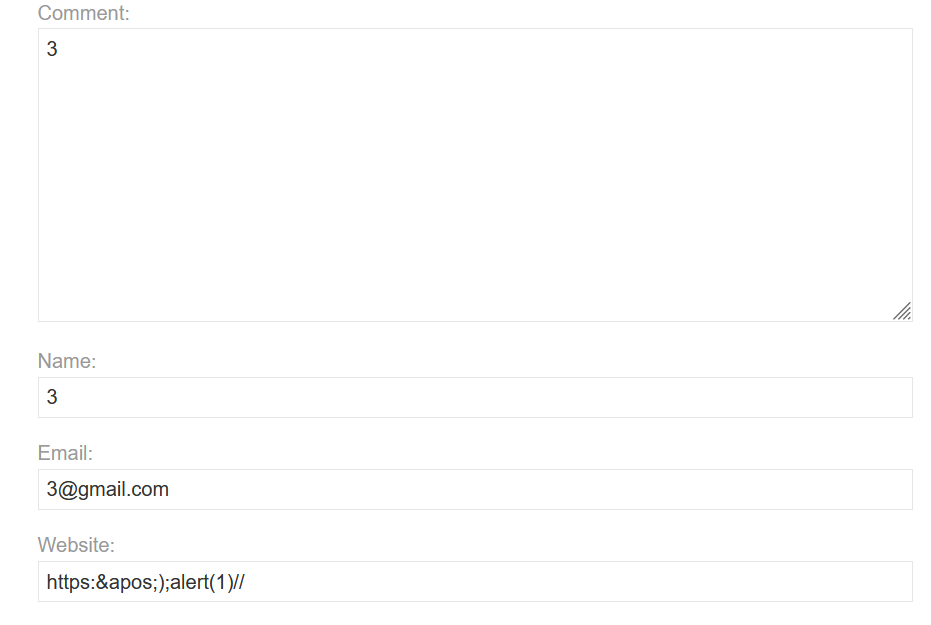

## Metadata

- **Difficulty:** Practitioner
- **Category:** Cross-site Scripting (XSS) - Stored
- **Lab URL:** [Lab: Stored XSS into `onclick` event with angle brackets and double quotes HTML-encoded and single quotes and backslash escaped](https://portswigger.net/web-security/cross-site-scripting/contexts/lab-onclick-event-angle-brackets-double-quotes-html-encoded-single-quotes-backslash-escaped)
- **Date Solved:** 17/6/2026
## Vulnerability Summary

The app contains a stored XSS vulnerability in the comment functionality. The user-supplied input is reflected inside an `onclick` event handler attribute. Though it does attempt to perform HTML encoding with angle brackets and double quotes, as well as prevent input from breaking out of this string literal by escaping single quote characters with a backslash, we can bypass this input validation mechanism by HTML encoding certain characters. As they are HTML-decoded before `JavaScript` is interpreted, XSS is exploitable.
## Reconnaissance

- Entering these values: `1`, `1`, `1@gmail.com`, and `https://comment1` to the `Comment`, `Name`, `Email` and `Website` respectively and submit the comment. After that, intercept the request to view the post (`GET /post?postId=2 HTTP/1.1`). We see that in the response body, our `website` string has been reflected inside an `onclick` event handler attribute:
```html
<section class="comment">
    <p>
         <a id="author" href="https://comment1" onclick="var tracker={track(){}};tracker.track('https://comment1');">1</a> | 17 June 2026
    </p>
    <p>1</p>
    <p></p>
</section>
```
- Trying to break out of the existing `JavaScript` string with `'` and the payload (in the `website` parameter) `https:';alert(1)//` will yield a response that reads:
```html
 <a id="author" href="https:\';alert(1)//" onclick="var tracker={track(){}};tracker.track('https:\';alert(1)//');">2</a> | 17 June 2026
```
As the lab's name suggests, a backslash is automatically appended to escape single quote characters. Supplying our own backslash character does not work in this lab, as that gets escaped as well.
We need to escape both the string AND the `track` command, in that order.
## Exploitation Steps

1. Enter these values and submit the comment. Note that only the value of the `website` parameter: `https:&apos;);alert(1)//` is relevant to solving the lab - the other values can be random.

(Note that, if you want to do this with Burp Suite/Caido), the payload has to be fully URL-encoded: `https%3A%26apos%3B%29%3Balert%281%29%2F%2F`.
2. You should see that lab is solved. To confirm XSS, go back to the block and click on the author's name. The `alert()` function should trigger.
## Payload Used

`https:&apos;);alert(1)//`
- The `https:` prefix is required by the app.
- `&apos;` is a HTML entity version of (`'`). It serves the same purpose as `'`: to break out of the existing `JavaScript` string, but is used to bypass the backslash escaping.
- The closing parenthesis `)` finishes the `track` command. Coupled with the semicolon `;` right after it, we are able to introduce the new `alert()` function.
- The `//` comments out the rest of the query, preventing an `Unterminated string literal` error.
## Root Cause

The app's sanitization logic fails to account for the browser's parsing order. When a browser processes an HTML document, it decodes HTML entities within attribute values (such as `onclick`, `href`, or `onmouseover`) *before* the JavaScript engine executes the contents of that attribute.

The app attempts to prevent string breakouts by escaping literal single quotes (`'`) with a backslash (`\'`) on the server side. However, by supplying the HTML entity `&apos;` (or `&#39;`), the input bypasses the backend's backslash escaping mechanism because no literal single quote is present in the HTTP request. Once the browser parses the HTML response, it decodes `&apos;` into a literal single quote (`'`) within the `onclick` execution context. This allows an attacker to terminate the string literal, close the function call, and execute arbitrary JavaScript.
## Remediation

The app must implement context-aware output encoding.
- **HTML Encoding:** Because the JavaScript is embedded within an HTML document, characters with special meaning in HTML (such as `<`, `>`, `&`, `"`, and `'`) must be converted to their corresponding HTML entities (e.g., `<` becomes `&lt;`).
- **JavaScript Unicode Escaping:** When reflecting untrusted data into a JavaScript string, use Unicode escapes for safety. For example, `<` should be encoded as `\u003c`. Modern web frameworks typically handle this automatically if data is passed to the DOM safely (e.g., via `textContent`), but server-side rendering requires strict encoding before the response is constructed.
- **JSON Serialization:** Pass the data through a JSON serializer on the server-side (e.g., `json_encode()` in PHP or `JSON.stringify()` in Node.js) before echoing it into the JavaScript execution context. This ensures all special characters, including quotes and backslashes, are strictly and safely escaped according to JSON string specifications, neutralizing any attempt to break out of the string literal.