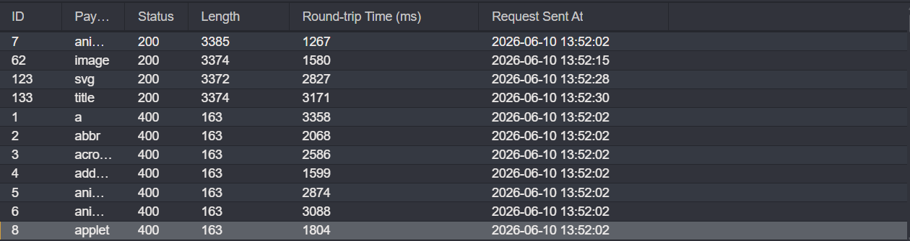
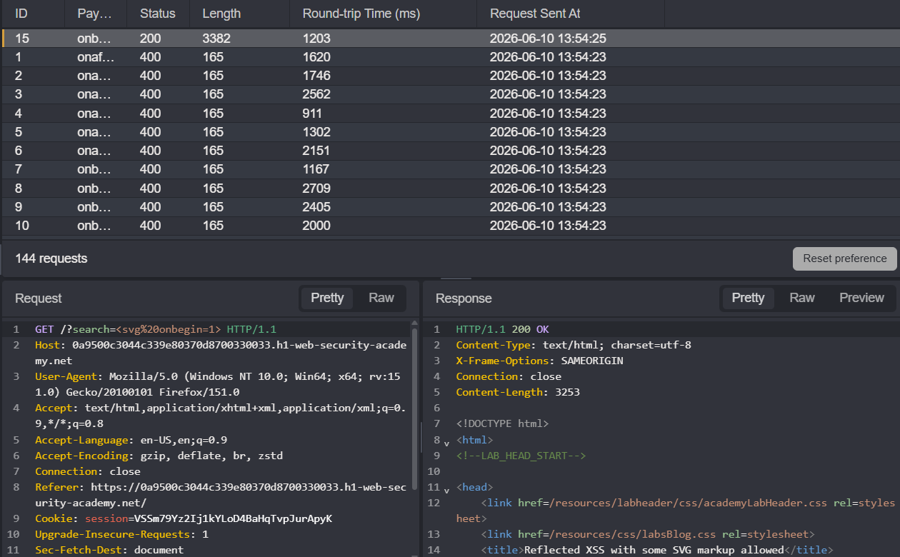

## Metadata

- **Difficulty:** Practitioner 
- **Category:** Cross-site Scripting (XSS)
- **Lab URL:** [Lab: Reflected XSS with some SVG markup allowed](https://portswigger.net/web-security/cross-site-scripting/contexts/lab-some-svg-markup-allowed)
- **Date Solved:** 10/6/2026
## Vulnerability Summary

The app's search functionality is vulnerable to XSS. The application takes users' input from the `search` parameter and reflects it directly into the HTML document structure (inside the `<h1>` tag). Though it does attempt to block most tags and events, we can still use the tags `<svg>` and `<animatetransform>` along with the event `onbegin` to exploit XSS.
## Reconnaissance

- Entering a normal string like `aaa` into the search bar produces this request: `GET /?search=aaa`, and the string is reflected back in the response body inside a `<h1>` element: `<h1>0 search results for 'aaa'</h1>`. User input is being placed directly into the HTML without escaping.
- Trying to inject `` to the search parameter, we get a `400 Bad Request` HTTP response that reads `"Tag is not allowed"`. We need to find tags and events that are allowed.
- Type in a random string in the search bar and intercept this request. Modify the request line to `GET /?search=<> HTTP/2` and add payload position between the angle brackets. Paste the tags on [XSS Cheatsheet](https://portswigger.net/web-security/cross-site-scripting/cheat-sheet) onto the list of payloads to be used, then start the tags enumeration. After it's done, sort the status code column in ascending order, as we need to find the allowed tags with `200 OK` HTTP Responses. You should see that only the `<animatetransform>`, `<image>`, `<svg>`, and `<title>` tags are allowed.

- We use one of these tags (e.g. `<svg>`) to enumerate through the events (on [XSS Cheatsheet](https://portswigger.net/web-security/cross-site-scripting/cheat-sheet)) to to see what's allowed. Again, after the events enumeration's done, sort the status code column in ascending order. You should see that only the `onbegin` event is allowed.

- We need to find a way to exploit XSS using these allowed tags and the event `onbegin`. [XSS Cheatsheet](https://portswigger.net/web-security/cross-site-scripting/cheat-sheet) is a really helpful resource to figure this out.  
## Exploitation Steps

1. Type in a random string into the search bar, e.g. `aaa`. Intercept this request.
2. Paste this payload onto the `search` parameter:
`%3Csvg%3E%3Canimatetransform%20onbegin%3Dalert(1)%20attributeName%3Dtransform%3E`
3. You should get a `200 OK` HTTP Response that reads lab is solved.
## Payload Used

[XSS Cheatsheet](https://portswigger.net/web-security/cross-site-scripting/cheat-sheet)
`%3Csvg%3E%3Canimatetransform%20onbegin%3Dalert(1)%20attributeName%3Dtransform%3E`
The payload is the URL-encoded version of this string:
`<svg><animatetransform onbegin=alert(1) attributeName=transform>`

| Character | HTML URL encoded (UTF-8) |
| --------- | ------------------------ |
| /         | %2F                      |
| <         | %3C                      |
| =         | %3D                      |
| >         | %3E                      |
| space     | %20                      |
 - The payload embeds an animation (`<animatetransform>`) inside a graphic element (`<svg>`). The `onbegin` event triggers the exact moment the browser parses the animation, instantly executing the JavaScript payload (in this case, popping up an `alert(1)` box).
## Root Cause

The app takes untrusted input from the `search` parameter and reflects it directly into the HTML document structure (inside the `<h1>` tag).

Additionally, the app insecurely relies on a WAF as the primary defense mechanism against XSS. The WAF was configured with a flawed whitelist that failed to account for the exploitation of XSS through `<svg>` and the event `onbegin`.
## Remediation

-  The application must treat the user-supplied input as data (instead of executable code) and HTML-entity encode it before reflecting it into the HTML document. Specifically, the following characters must be converted into their safe HTML entity equivalents:
    - `<` to `&lt;`
    - `>` to `&gt;`
    - `"` to `&quot;`
    - `'` to `&#x27;`
    - `&` to `&amp;`
- Implement a strict Content Security Policy (CSP) via HTTP response headers. Specifically, ensure the `script-src` directive is defined and explicitly omits the `'unsafe-inline'` keyword. Disallowing `'unsafe-inline'` completely prevents the browser from executing inline event handlers (such as the `onbegin` attribute used in this exploit), neutralizing the attack vector even if the HTML injection occurs.