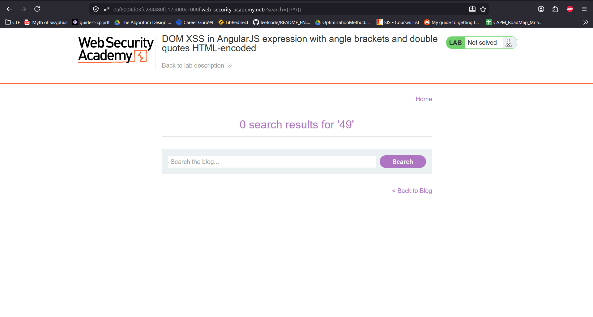
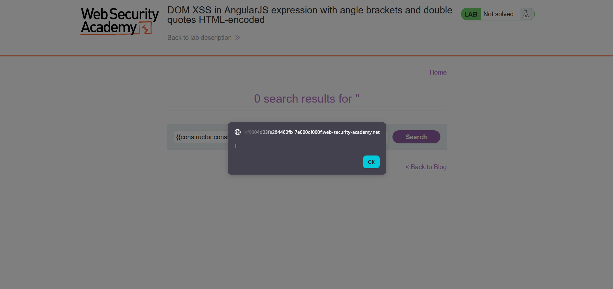

## Metadata

- **Difficulty:** Practitioner
- **Category:** Cross-site Scripting (XSS) - DOM-based
- **Lab URL:** [Lab: DOM XSS in AngularJS expression with angle brackets and double quotes HTML-encoded](https://portswigger.net/web-security/cross-site-scripting/dom-based/lab-angularjs-expression)
- **Date Solved:** 19/6/2026
## Vulnerability Summary

The app contains a DOM-based XSS vulnerability in a `AngularJS` expression within the search functionality. User-supplied input (in the search box) is reflected directly into an HTML governed by `AngularJS`'s `ng-app` directive without proper sanitization. By escaping  local `$scope` object context and traversing up the prototype chain, we can reach the native `Function` object to execute our `JavaScript` payload.
## Reconnaissance

- Entering a random string like `aaa` into the search bar produces this request: `GET /?search=aaa`. The response to this request reads:
```html
<html>
<!--LAB_HEAD_START-->

<head>
    <link href=/resources/labheader/css/academyLabHeader.css rel=stylesheet>
    <link href=/resources/css/labsBlog.css rel=stylesheet>
    <script type="text/javascript" src="/resources/js/angular_1-7-7.js"></script>
    <title>DOM XSS in AngularJS expression with angle brackets and double quotes HTML-encoded</title>
</head>
<!--LAB_HEAD_END-->

<body ng-app>
    <script src="/resources/labheader/js/labHeader.js"></script>
    <!--LAB_HEADER_START--> 
    ...
</body>
```
Our input to the search box is enclosed inside `AngularJS`'s `ng-app` directive.
- Inputting `{{7*7}}` into the search bar, we get a response in the browser:

The multiplication, when placed inside double curly braces, is executed by `AngularJS` and its result is reflected in the response. 
- However, inputting `{{alert(1)}}` into the search bar does not trigger the `alert()` function. This is (probably) because that this function is a property of the global `window` object and is not defined within the local `$scope`.
## Exploitation Steps

1. Input `{{constructor.constructor('alert(1)')()}}` and search. 
2. The `alert()` function should be triggered, and lab is marked as solved.
 
## Payload Used

`{{constructor.constructor('alert(1)')()}}`
- The payload is placed inside double curly braces to make it be parsed and executed by the `AngularJS` expression evaluator rather than the `JavaScript` engine.
- `constructor` is to access the `constructor` property (`Object`) of the `$scope` object. The`.constructor` after that accesses the `Object` constructor's constructor, which is the native `JavaScript` `Function` object, helping us acquire a reference to a native `JavaScript` component.
- Passing the string `'alert(1)'` dynamically generates a new function: `function() { alert(1); }` in the **global** execution context (because it was created via the `Function` constructor).
- The final sets of parentheses `()` invokes the `alert()` function. As it is executed in the global context, it has full access to the `window` object, allowing `alert(1)` to execute successfully.
## Root Cause

User input is reflected directly into an HTML structure governed by the `ng-app` directive without proper sanitization. Even if angle brackets (`<`, `>`) and quotes (`"`) are HTML-encoded, AngularJS still parses and evaluates the expression within the curly braces. By escaping the local `$scope` object, we can execute malicious `JavaScript`. 
## Remediation

- **Avoid Reflection inside `ng-app`:** Never reflect unsanitized user input directly into a DOM node controlled by AngularJS.
- **Use `ng-non-bindable`:** If user input must be displayed within an Angular application, wrap the container element with the `ng-non-bindable` directive. This instructs Angular to ignore interpolations within that specific DOM node.
- **Keep Frameworks Updated:** Modern versions of Angular (Angular 2+) use strict Contextual Auto-Escaping and Ahead-of-Time (AOT) compilation, which severely mitigates client-side template injection (CSTI) vulnerabilities.