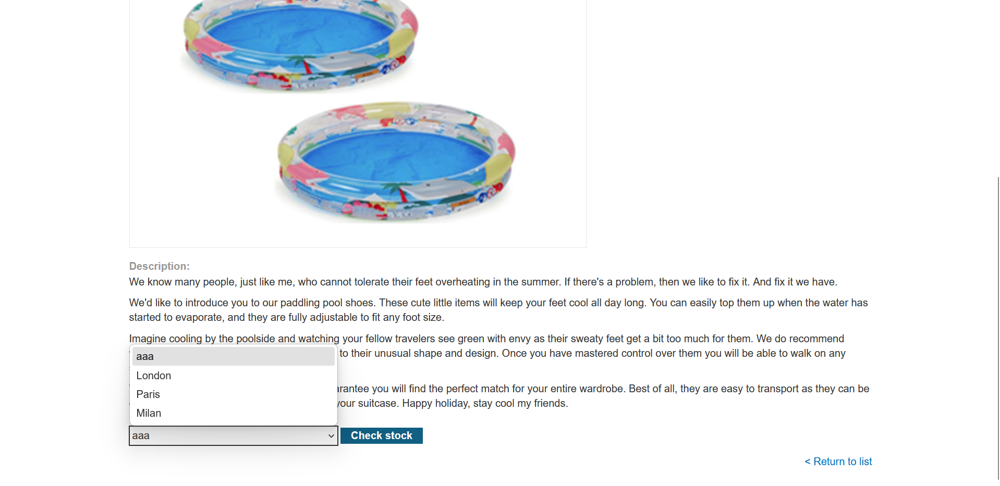

## Metadata

- **Difficulty:** Practitioner
- **Category:** Cross-site Scripting (XSS) - DOM-based
- **Lab URL:** [Lab: DOM XSS in `document.write` sink using source `location.search` inside a select element](https://portswigger.net/web-security/cross-site-scripting/dom-based/lab-document-write-sink-inside-select-element)
- **Date Solved:** 18/6/2026
## Vulnerability Summary

The stock checker functionality uses client-side JavaScript extract the `storeId` parameter from `location.search`, then uses `document.write` to create a new option in the `select` element for this same functionality. After breaking out of the `select` element, we can introduce our own payload in the `storeId` parameter to exploit XSS.
## Reconnaissance

- Send a request to view a product (`GET /product?productId=1`) results in a response that reads:
```html
<script>
    var stores = ["London", "Paris", "Milan"];
    var store = (new URLSearchParams(window.location.search)).get('storeId');
    document.write('<select name="storeId">');
    if (store) {
        document.write('<option selected>' + store + '</option>');
    }
    for (var i = 0; i < stores.length; i++) {
        if (stores[i] === store) {
            continue;
        }
        document.write('<option>' + stores[i] + '</option>');
    }
    document.write('</select>');
</script>
```
The `storeId` parameter is extracted from the `location.search` source. The script then uses `document.write` to create a new option in the `select` element for the stock checker functionality. There are no checks to see if this option existed in the `stores` array. 
- Trying to create our own `storeId` parameter with a request `GET /product?productId=1&storeId=aaa`, we get a `200 OK` HTTP Response. Opening this response in the browser, we see that `aaa` is listed as one of the options of the product.

- To exploit this vulnerability, we will need to break out of the `option` context and the `select` element first. We see that the script manually does this by using `document.write` to introduce closing tag `</select>` - we can introduce our own closing tag too, since nothing is HTML-encoded.
## Exploitation Steps

1. Intercept a request to view a product page (`GET /product?productId=1`).
2. Modify the request line to `GET /product?productId=1&storeId=</option></select><iframe%20onfocus=alert(1)%20autofocus%20tabindex=1>` and send the request. Lab should be marked as solved.
## Payload Used

`</option></select><iframe%20onfocus=alert(1)%20autofocus%20tabindex=1>` (URL encoded version of the payload: `</option></select><iframe onfocus=alert(1) autofocus tabindex=1`).
- `</option>` closes the existing `<option>` tag
 - `</select>` close the existing `select` element
 - `<iframe%20onfocus=alert(1)%20autofocus%20tabindex=1>` is a XSS payload that triggers the `alert()` function when the element has focus. The `autofocus` attribute is used to focus automatically
## Root Cause

The page contains a JavaScript sink (`document.write`) that receives data from a taint source (`location.search`) without any sanitization or encoding. Because this happens entirely in the browser, standard server-side output encoding offers no protection — the vulnerability exists purely in the client-side code.
## Remediation

-  Replace `document.write` with safe DOM APIs that do not parse HTML. Use `textContent` or `createElement` + `setAttribute` instead:
```javascript
let selectElement = document.querySelector('select[name="storeId"]');
let newOption = document.createElement('option');
newOption.textContent = store; // textContent safely encodes HTML entities
selectElement.appendChild(newOption);
```
- Apply a strict Content Security Policy to block inline event handlers (`script-src 'self'`).
