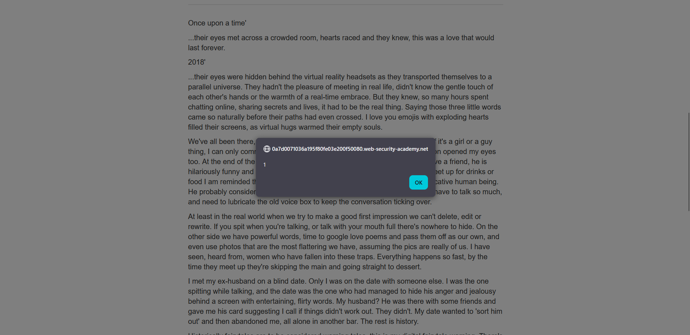

## Metadata

- **Difficulty:** Practitioner
- **Category:** Cross-site Scripting (XSS) - DOM-based
- **Lab URL:** [Lab: Stored DOM XSS](https://portswigger.net/web-security/cross-site-scripting/dom-based/lab-dom-xss-stored)
- **Date Solved:** 21/7/2026
## Vulnerability Summary

The app contains a stored DOM-based XSS vulnerability in the blog comment functionality. Though the server securely stores and serializes user comments as JSON, the client-side `JavaScript` uses a flawed `escapeHTML` function that to sanitize the data before passing it to the `innerHTML` sink. This allows us to inject and execute `JavaScript` in the context of any user who views the comments.
## Reconnaissance

- View any post. In the page source, you should see that the user comments are loaded using a *very suspicious looking* `JavaScript` script named `loadCommentsWithVulnerableEscapeHtml.js`, and the function `loadComments()` is called.
- In this script, there is a flawed function, `escapeHTML()`. It reads:
```js
    function escapeHTML(html) {
        return html.replace('<', '&lt;').replace('>', '&gt;');
    }
```
The `replace()` method, which is implemented using a string literal (`'<'`) as the first argument, will only replace the **first occurrence** of that string. Any subsequent `<` or `>` characters are completely ignored by the filter and passed directly into an `innerHTML` sink:
```js
let newInnerHtml = firstPElement.innerHTML + escapeHTML(comment.author)
```
We can use this sink to execute our own arbitrary `JavaScript`.
## Exploitation Steps

1. Navigate to any post, e.g. `url/post?postId=1`.
2. Type in these values (only the `Comment` and `Name` matter) and post comment.
```
Comment: <>
Name: <>
Email: aaa@gmail.com
Website: https:bbb
```
3. After successfully submitting the comment, click back to blog. The `alert()` function should be triggered, and lab is marked as solved.

## Payload Used

`<>`
- The `escapeHTML` function processes the payload linearly. It encounters the first `<` and replaces it with `&lt;`. It encounters the first `>` and replaces it with `&gt;`. The transformed string becomes: `&lt;&gt;`
- The remaining payload (``) successfully bypasses the filter and is evaluated as executable HTML by the browser due to the `innerHTML` sink.
## Root Cause

1. The client-side input sanitization is flawed with the use of the `replace()` method without a global regex flag (`/g`). Thus, it fails to sanitize the entire input string.
2. The app uses `innerHTML` to render text context. This is insecure as `innerHTML` forces the browser to parse the input as HTML, triggering execution.
## Remediation

- Use `.textContext` to render text context instead of `innerHTML`. It renders only plain text.
```js
let commentBody = document.createElement('p');
commentBody.textContent = comment.body;
commentSection.appendChild(commentBody);
```
- Sanitize the user input properly, with secure, established sanitization libraries or use global regex:
```js
function escapeHTML(html) {
    return html.replace(/</g, '&lt;').replace(/>/g, '&gt;');
}
```