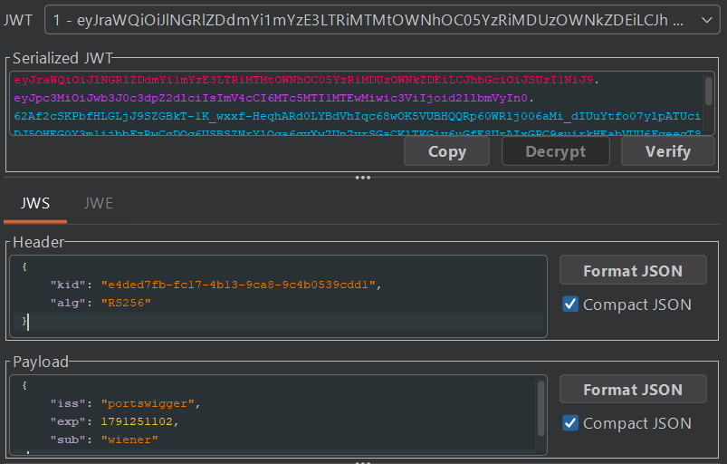
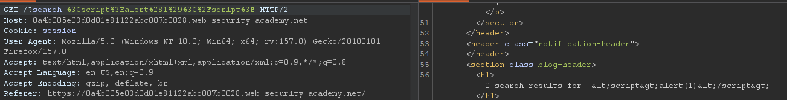
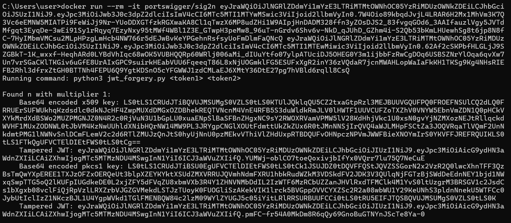
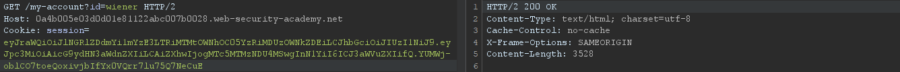
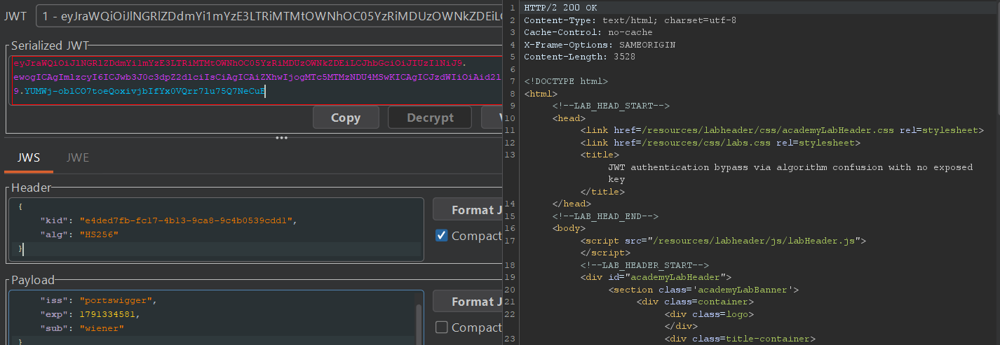

## Metadata

- **Difficulty:** Expert
- **Category:** JWT
- **Lab URL:** [Lab: JWT authentication bypass via algorithm confusion with no exposed key](https://portswigger.net/web-security/jwt/algorithm-confusion/lab-jwt-authentication-bypass-via-algorithm-confusion-with-no-exposed-key)
- **Date Solved:** 6/10/2026
## Vulnerability Summary

The app is vulnerable to algorithm confusion attacks in its JWT signing and verifying mechanism. It uses the asymmetric `RS256` algorithm to sign and verify JWTs. However, due to implementation flaws, we can forge a valid `administrator` JWT by changing the `alg` parameter in the header portion of a JWT to `HS256`, a symmetric algorithm, and using a script ([portswigger/sig2n](https://hub.docker.com/r/portswigger/sig2n)) to calculate the server's public key to then use as the secret symmetric key. This forged token allows us to gain administrative functionalities.
## Reconnaissance

- Navigate to the `/login` endpoint and login with the credentials `wiener:peter`.
- Inspect the HTTP history in Burp Suite with the `JWT Editor` extension enabled. Observe that requests to `/my-account?id=wiener` include a `Session` cookie holding a JSON Web Token:

The server uses `RS256`, an asymmetric digital signature algorithm.
- Modifying the `sub` field's value to `"administrator"`, copying the new token generated, then using it in the `Cookie` header while sending a request to the `/admin` endpoint results in a `401 Unauthorized` response. This means that the signature verification is active for the server's configured algorithm.
- Modifying the `alg` field in the header to `"none"` and deleting the signature portion yields the same result, `401 Unauthorized`.
- The `kid` parameter in the header portion is not vulnerable to path traversal attacks.
- The `/?search` endpoint is not vulnerable to XSS, as the payload is URL encoded in the request line and sanitized before being reflected in the response:

- There is no endpoint exposing the server's public key. 
We will attempt to perform an *algorithm confusion* attack again. But without the server's key, we will have to derive the key itself. We can do so using the [portswigger/sig2n](https://hub.docker.com/r/portswigger/sig2n) script.
- First, obtain 2 JWTs. You can do so by logging in to the `wiener` account, log out, then log in again.
- Then, run the script with:
```
`docker run --rm -it portswigger/sig2n <token1> <token2>`
```
(docker is needed).
- The output looks something like this:

- As you can see, there are 2 tampered JWTs. Only one of them passes as a valid JWT, though, so test them. In this case, the first tampered JWT works:

and the digital signature algorithm was changed to `HS256` automatically:

Now that we have a known-good JWT and its corresponding base64-encoded, `X.509 PEM` formatted, key, the job left is similar to steps 3-5 in the *algorithm confusion* attack process described in the **Reconnaissance** section of [Writeup for Lab: JWT authentication bypass via algorithm confusion](../lab-jwt-authentication-bypass-via-algorithm-confusion/writeup.md). Simply follow them to create a symmetric key.
## Exploitation Steps

1. Navigate to the `/login` endpoint and login with credentials `wiener:peter`.
2. Make a note of the JWT in the `Session` header of the `GET /my-account?id=wiener` request.
3. Log out, then login with credentials `wiener:peter` again. Make a note of the different JWT in the `Session` header of the `GET /my-account?id=wiener`.
4. With these 2 JWTs, run the [portswigger/sig2n](https://hub.docker.com/r/portswigger/sig2n) with command:
```
`docker run --rm -it portswigger/sig2n <token1> <token2>`
```
5. The output of the script contains a base64-encoded x509 key. Use this key to create a **symmetric** key in Burp. Follow step 3-4 in the **Reconnaissance** section of [Writeup for Lab: JWT authentication bypass via algorithm confusion](../lab-jwt-authentication-bypass-via-algorithm-confusion/writeup.md). 
6. Modify the payload portion of the JWT to contain these contents (base64-decoded):
```json
{  
    "iss": "portswigger",  
    "exp": [value],  
    "sub": "administrator"  
}
```
7. Sign the JWT with the symmetric key you just created, and use it to send a request to the `/admin` endpoint. You should receive a `200 OK`, signifying that you have gained administrative functionalities.
8. Modify the request line to `GET /admin/delete?username=carlos HTTP/2` and send the request. `carlos` should be deleted successfully and lab is solved.
## Payload Used

- Header:
```json
{
  "alg": "HS256",
  "typ": "JWT"
}
```
- Payload:
```json
{  
    "iss": "portswigger",  
    "exp": [val],  
    "sub": "administrator"  
}
```
- Base64-encoded PEM key:
```
LS0tLS1CRUdJTiBQVUJMSUMgS0VZLS0tLS0KTUlJQklqQU5CZ2txaGtpRzl3MEJBUUVGQUFPQ0FROEFNSUlCQ2dLQ0FRRUErSUFWUkhqKzdsdlc0dkNJcHF4ZwpMUXdDMGxOZDBhekREQTVNcnM4VnE4RFB5S3duWldkRmJLV0lHWTF1UUVCUFZoTXZhV0VNYW5EbnVmZDN1Q0pHCkVXYkMrdXdBSWo2MUZPMGNJZ0N4R2c0RjVuN3U1bGpLU0xuaENpSlBaSFBnZHgxNC9sY2RWOXRVamVPMW5lV28KdHhjVkc1U0xsN0gvYjNZMXozNEJtRllqckdWVHF1MUxZODNWL0tJbVM4KzNwUUhldXNibHQrNW14MW9PL3JRYgpCNGlXOUtFdmttUkZkZUx6R0tJMnNNSjIrQVQ4aWJLMHpFSCtZa3JOQVRqaTlVQmF2UnNkdmtPMG1lNWNvSnlDCmFLemV2c2d6RTlZMUJzQnJtS0hyUjNnU0pzMEkvVThiVlZHdUxpRTBDQUFvOHNpczNPVmJWWFBieXNOYmIrS0YKVFFJREFRQUIKLS0tLS1FTkQgUFVCTElDIEtFWS0tLS0tCg==
```
Under `RS256`, the server uses its private key to generate an asymmetric RSA signature and its public key to verify that signature. However, when the header algorithm is switched to `HS256`, the server’s verification method switches to an HMAC operation: `HMAC-SHA256(data, secret)`. Because the server code fetches its standard verification key (the public key string or bytes) and passes it blindly to the generic verification function without constraining the algorithm, the server uses its own ASCII/PEM-formatted public key string as the HMAC secret key.
An attacker can use the public key string derived from JWTs as the symmetric HMAC key to generate a signature that the server accepts as valid.
## Root Cause

- The server trusts the client-controllable `alg` parameter specified in the incoming JWT header instead of enforcing an explicit, server-side whitelist (e.g., hardcoding `RS256`).
- The verification library uses an overloaded method or key resolver that treats the configured verification key as a raw byte array rather than enforcing cryptographic key typing. When the header specifies `HS256`, the verification routine repurposes the server's public key (stored on the filesystem in standard ASCII PEM or X.509 format) as the shared secret string for an HMAC-SHA256 signature check.
## Remediation

- **Enforce Server-Side Algorithm Whitelisting:** Configure the JWT verification library to strictly accept only the expected asymmetric algorithm (`RS256`) and ignore whatever algorithm is supplied in the token header:
```python
    # PyJWT
    jwt.decode(
        token,
        public_key,
        algorithms=["RS256"],  # Reject any token header declaring 'HS256', 'none', etc.
        options={"require": ["exp", "iss", "sub"]}
    )
```
- **Strict Key Type Enforcement:** Ensure verification keys are strictly typed objects (e.g., an RSA Public Key instance) rather than raw byte buffers or strings, preventing cryptographic APIs from inadvertently treating asymmetric public keys as symmetric HMAC shared secrets.
- **Avoid Dynamic Key/Algorithm Binding from Header Data:** Never dynamically select verification procedures or key types based on untrusted values inside the JWT header (`alg`, `kid`, `jku`).