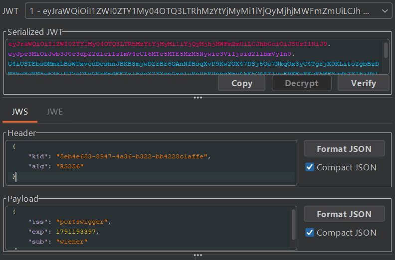
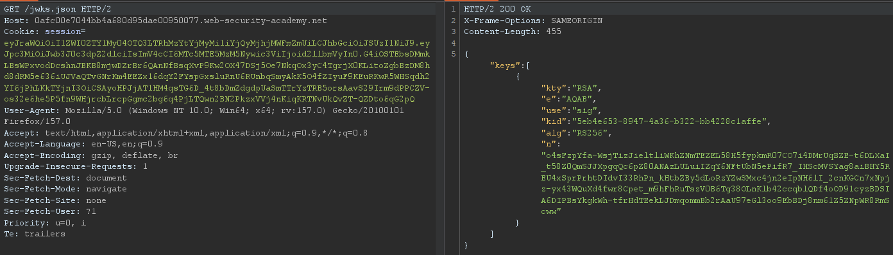
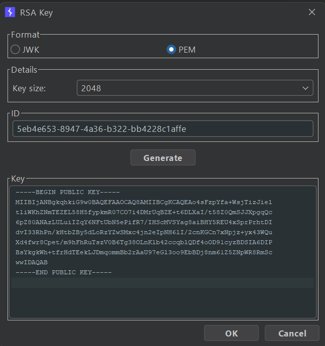
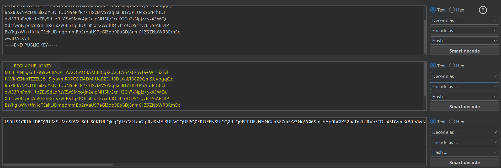
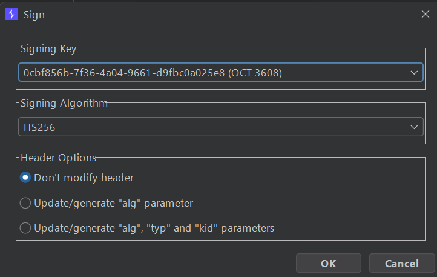

## Metadata

- **Difficulty:** Expert
- **Category:** JWT
- **Lab URL:** [Lab: JWT authentication bypass via algorithm confusion](https://portswigger.net/web-security/jwt/algorithm-confusion/lab-jwt-authentication-bypass-via-algorithm-confusion)
- **Date Solved:** 5/10/2026
## Vulnerability Summary

The app is vulnerable to algorithm confusion attacks in its JWT signing and verifying mechanism. It uses the asymmetric `RS256` algorithm to sign and verify JWTs. However, due to implementation flaws, we can forge a valid `administrator` JWT by changing the `alg` parameter in the header portion of a JWT to `HS256`, a symmetric algorithm, then using the server's exposed public key as a secret. This allows us to gain administrative functionalities.
## Reconnaissance

- Navigate to the `/login` endpoint and login with the credentials `wiener:peter`.
- Inspect the HTTP history in Burp Suite with the `JWT Editor` extension enabled. Observe that requests to `/my-account?id=wiener` include a `Session` cookie holding a JSON Web Token:

The server uses `RS256`, an asymmetric digital signature algorithm.
- Modifying the `sub` field's value to `"administrator"`, copying the new token generated, then using it in the `Cookie` header while sending a request to the `/admin` endpoint results in a `401 Unauthorized` response. This means that the signature verification is active for the server's configured algorithm.
- Modifying the `alg` field in the header to `"none"` and deleting the signature portion yields the same result, `401 Unauthorized`.
- The `kid` parameter in the header portion is not vulnerable to path traversal attacks.
Perhaps we can find the server's public key. Navigating to the `/jwks.json` endpoint reveals it:

We will attempt to perform an *algorithm confusion* attack. Basically, we will try to:
- Modify the algorithm (`alg` parameter) to `HS256` - a symmetric algorithm (the server uses a single key to sign **and** verify the token. This is different from asymmetric algorithms, where the server uses a secret key to sign and public key to verify).
- Forge a JWT and use the server's public key, in PEM form, to sign the JWT. The goal is to trick the server into believing that its digital signature algorithm is symmetric, thus successfully validating our public key as a signing key.

The steps to doing this are as follows:
1. Copy the body of the key in the JWK set at the `/jwks.json` endpoint. In Burp, go to the JWT Editor tab > New RSA key. Paste the body into `Key` dialogue box, then select the `PEM` format. Observe that the key has been created in PEM format:

Copy the entire block (even the "BEGIN PUBLIC KEY" and "END PUBLIC KEY" part).
2. Go to the Decoder tab, and base64-encode the key.

Copy the resulting base64-encoded key.
3. Go back to the JWT Editor tab > New Symmetric Key. Generate a key. **Before** saving it with OK, modify the `k` parameter in the body with the base64-encoded key you just copied.
4. In the intercepted `GET /my-account?id=wiener` request, in the JSON Web Token tab:
	- Modify the `alg` parameter in the header portion of the token to `HS256`.
	- Sign the token using the symmetric key you just created:
	
5. Send the request. Observer that you received a `200 OK` HTTP response with `Your username is: wiener`. This confirms that we still have access to `wiener`'s account using a forged JWT. The algorithm confusion attack worked.
## Exploitation Steps

1. Navigate to the `/login` endpoint and login with credentials `wiener:peter`.
2. Follow the first 3 steps in the **Reconnaissance** section to create a symmetric key using the server's public key on the `jwks.json` endpoint.
3. Modify the payload portion of the JWT to contain these contents (base64-decoded):
```json
{  
    "iss": "portswigger",  
    "exp": [value],  
    "sub": "administrator"  
}
```
4. Sign the JWT with the symmetric key you just created, and use it to send a request to the `/admin` endpoint. You should receive a `200 OK`, signifying that you have gained administrative functionalities.
5. Modify the request line to `GET /admin/delete?username=carlos HTTP/2` and send the request. `carlos` should be deleted successfully and lab is solved.
## Payload Used

- Header:
```json
{
  "alg": "HS256",
  "typ": "JWT"
}
```
- Payload:
```json
{  
    "iss": "portswigger",  
    "exp": 1791193397,  
    "sub": "administrator"  
}
```
- Secret Used for Signing:
```
-----BEGIN PUBLIC KEY-----
MIIBIjANBgkqhkiG9w0BAQEFAAOCAQ8AMIIBCgKCAQEAo4sFzpYfa+WsjTizJiel
tliWKhZNmTEZEL58H5fypkmR07CO7i4DMrUqBZE+t6DLXaI/t58Z0QmSJJXpgqQc
6pZ80ANAzLULuiIZqY6NFtUbN5ePifR7/IHScMVSYag8aiBHY5REU4xSprPrhtDI
dvI33RhPn/kHtbZBy5dLoRzYZwSMxc4jn2eIpNH6lI/2cnKGCn7xNpjz+yx43WQu
Xd4fwr8Cpet/m9hFhRuTszV0B6Tg38OLnKlb42ccqblQDf4oOD91cyzBDSIA6DIP
BsYkgkWh+tfrHdTEekLJDmqommBb2rAaU97eGl3oo9EbBDj8nm61Z5ZNpWR8RmSc
wwIDAQAB
-----END PUBLIC KEY-----
```

Under `RS256`, the server uses its private key to generate an asymmetric RSA signature and its public key (`/jwks.json`) to verify that signature. However, when the header algorithm is switched to `HS256`, the server’s verification method switches to an HMAC operation: `HMAC-SHA256(data, secret)`. Because the server code fetches its standard verification key (the public key string or bytes) and passes it blindly to the generic verification function without constraining the algorithm, the server uses its own ASCII/PEM-formatted public key string as the HMAC secret key.
And since the public key is intentionally exposed at `/jwks.json`, an attacker can use that exact public key string as the symmetric HMAC key to generate a signature that the server accepts as valid.
## Root Cause

The app relies on the untrusted, client-controllable JWT header (`alg`) to dictate the cryptographic algorithm used during verification, combined with passing a fixed public key into a generic verification function (e.g., `jwt.verify(token, key)`). Because the app blindly passes its RSA public key material as the verification secret without enforcing an algorithm whitelist (e.g., strictly allowing only `RS256`), the library accepts `HS256` and treats the public key buffer as a shared symmetric secret.
## Remediation

- Explicitly restrict allowed algorithms in the JWT verification call instead of letting the token header dictate verification logic:
```python
# Example: PyJWT
jwt.decode(token, public_key, algorithms=["RS256"])
```
- Ensure asymmetric public keys can never be passed into symmetric validation contexts. Decouple signature verification implementations completely between symmetric and asymmetric paths.