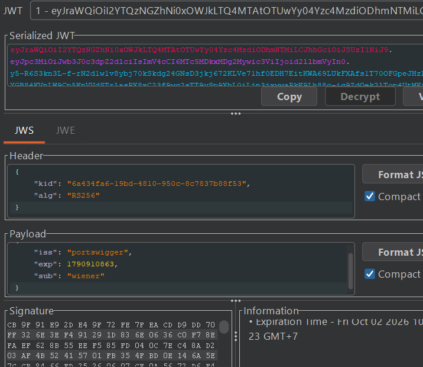

## Metadata

- **Difficulty:** Apprentice
- **Category:** JWT
- **Lab URL:** [Lab: JWT authentication bypass via flawed signature verification](https://portswigger.net/web-security/jwt/lab-jwt-authentication-bypass-via-flawed-signature-verification)
- **Date Solved:** 2/10/2026
## Vulnerability Summary

The app implicitly trusts the user-supplied `alg` field in the header portion of the JWT, failing to enforce server-side algorithm restrictions, allowing us to set this value to `none`. Crucially, it accepts tokens with no signature, leading to a complete bypass of the signature by simply omitting it. This allows us to forge a valid JWT of the `administrator` user, gaining access to the `/admin` endpoint and deleting user `carlos`.
## Reconnaissance

- Navigate to the `/login` endpoint and login with the credentials `wiener:peter`. If you are using Burp and have the extension `JWT Editor` installed (which you should), you should see that there are requests that are highlighted - those are the requests that contain a JWT. 
- Sending the `GET /my-account?id=wiener` request to Repeater and using the `JSON Web Token` tab reveals the structure of the payload portion:

- Modifying the `sub` field's value to `"administrator"`, copying the new token generated, then using it in the `Cookie` header while sending a request to the `/admin` endpoint results in a `401 Unauthorized` response.
This means that the signature verification is active for the server's configured algorithm `RS256`.
- However, modifying the `alg` field in the header to `"none"` and deleting the signature portion yields a `200 OK` when sent to the `/admin` endpoint. We have successfully gained administrative privileges.
## Exploitation Steps

1. Navigate to the `/login` endpoint and login with credentials `wiener:peter`.
2. Intercept the `GET /my-account?id=wiener` request. Modify the header portion of the JWT to contain these contents (base64-decoded):
```json
{  
    "kid": [value],  
    "alg": "none"  
}
```
3. In the same modified JWT, modify the payload portion of the JWT to contain these contents (base64-decoded):
```json
{  
    "iss": "portswigger",  
    "exp": [value],  
    "sub": "administrator"  
}
```
4. Copy the newly generated token and delete the signature portion (do keep the trailing dot at the end of the payload portion). Use this token in the `Cookie` header while sending a request to the `/admin` endpoint. You should see that you have gained administrative functionalities in the response.
5. Modify the request line to `GET /admin/delete?username=carlos HTTP/2` and send the request. `carlos` should be deleted successfully and lab is solved.
## Payload Used

`eyJraWQiOiJhNDk4NGYwYS1jZjJhLTRkYzktOWY3NC04ZTBjZjg5OGRiOGEiLCJhbGciOiJub25lIn0.eyJpc3MiOiJwb3J0c3dpZ2dlciIsImV4cCI6MTc5MDkxMTYyNywic3ViIjoiYWRtaW5pc3RyYXRvciJ9.`
The exact value changes from lab to lab but the core idea (specified in the **Exploitation Steps** section) is the same.
By setting `"alg": "none"` in the header portion, the backend JWT parser is instructed that the token does not require cryptographic integrity checks. The token concludes with a trailing dot and an empty signature component, satisfying the format expectations of the JWT parser while bypassing cryptographic verification.
## Root Cause

The backend uses a vulnerable/improperly configured JWT verification library that trusts the `alg` header supplied by the client without enforcing server-side algorithm restrictions. Because the verification routine treats the token-defined `"none"` algorithm as valid, it omits signature integrity validation entirely, allowing arbitrary modification of the claims (`sub: administrator`).
## Remediation

- **Enforce Server-Side Algorithm Whitelisting:** Never allow client-controlled headers to dictate cryptographic verification logic. Configure the verification function to explicitly enforce expected algorithms (e.g., `algorithms=['RS256']` or `algorithms=['HS256']`).
- **Explicitly Reject the `none` Algorithm:** Ensure the underlying JWT library is updated and configured to drop tokens declaring `"alg": "none"` or case-mutated/obfuscated variations (`"None"`, `"NONE"`).
- **Validate Token Claims and Integrity Before Context Assignment:** Ensure the application framework enforces strict signature checks prior to deserializing and trusting claims (`sub`, `roles`) for authorization decisions.