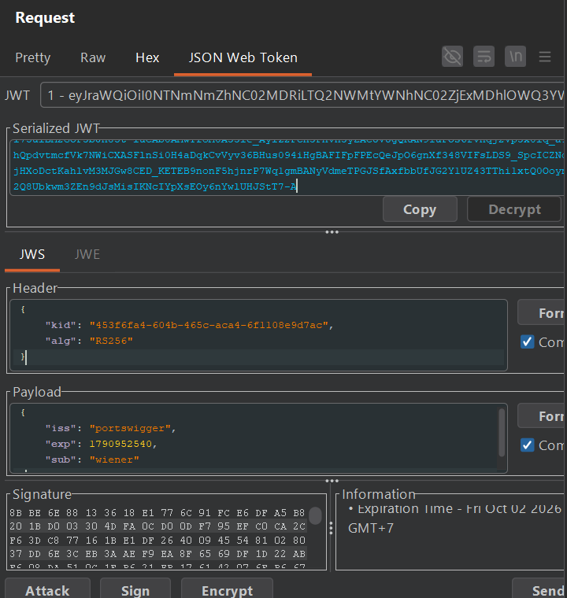
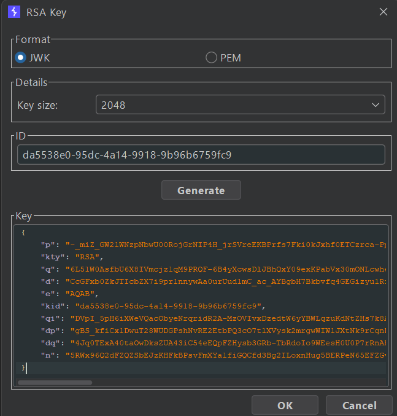
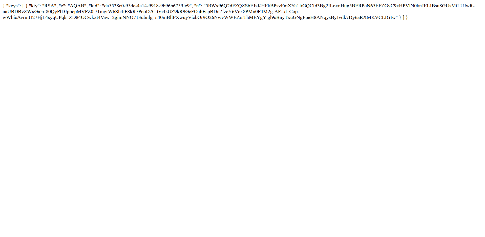
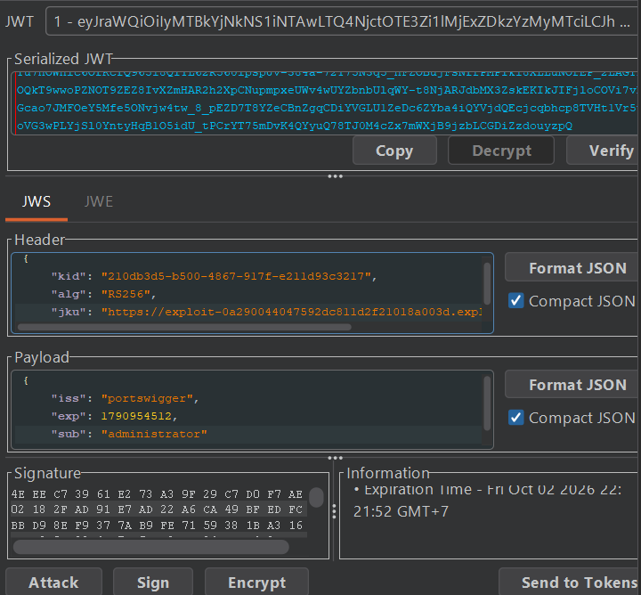

## Metadata

- **Difficulty:** Practitioner
- **Category:** JWT
- **Lab URL:** [Lab: JWT authentication bypass via jku header injection](https://portswigger.net/web-security/jwt/lab-jwt-authentication-bypass-via-jku-header-injection)
- **Date Solved:** 2/10/2026
## Vulnerability Summary

The app supports the `jku` parameter in the JWT header to locate the JSON Web Key Set (JWKS) containing the public key needed for signature verification. However, the server fails to validate whether the URL provided in the `jku` parameter belongs to a trusted whitelist. This allows an attacker to host a malicious JWKS on the provided exploit server, sign a forged administrative token with an attacker-controlled private RSA key, and direct the server via `jku` to fetch the matching public key. The server deems the forged token valid, enabling full authentication bypass and privilege escalation to delete the user `carlos`.
## Reconnaissance

- Navigate to the `/login` endpoint and login with the credentials `wiener:peter``.
- Inspect the HTTP history in Burp Suite with the `JWT Editor` extension enabled. Observe that requests to `/my-account?id=wiener` include a `Session` cookie holding a JSON Web Token.
- Send the `GET /my-account?id=wiener` request to Repeater and inspect the decoded token in the `JSON Web Token` tab:

The server uses `RS256`, an asymmetric digital signature algorithm. 
- Modifying the `sub` field's value to `"administrator"`, copying the new token generated, then using it in the `Cookie` header while sending a request to the `/admin` endpoint results in a `401 Unauthorized` response. This means that the signature verification is active for the server's configured algorithm.
- Modifying the `alg` field in the header to `"none"` and deleting the signature portion yields the same result, `401 Unauthorized`.
The lab's name is "jku header injection", and it is observed that we have an exploit server. Maybe we can host a JWK set on our exploit server, then inject the URL link through the `jku` parameter in the header portion?
- In Burp, open the **JWT Editor Keys** tab and click **New RSA Key**. Click **Generate** to generate a fresh 2048-bit RSA key pair, and click **OK** to save it.

- Right-click the newly generated RSA key and select **Copy Public Key as JWK**.
- Navigate to the provided exploit server. The app expects a JSON Web Key Set format (a JSON object with a `keys` array containing JWKs). The copied key must be wrapped as follows:
```json
{
  "keys": [
    {
      "kty": "RSA",
      "e": "AQAB",
      "kid": "[kid_val]",
      "n": "[modulus_val]"
    }
  ]
}
```
Paste this block onto the body -> Store exploit. When you click on view exploit, the JWK set should appear at the `/exploit` endpoint of the exploit server:

This is also the URL we will be injecting into the `jku` field of the header portion.
- Now, go back to Burp. In the intercepts JWT, first, modify the `sub` field in the payload portion to `administrator`. After that. modify the `kid` field in the original JWT to match the `kid` of the key you generated. Then, inject the URL `https://exploit-[exploit-server-id].exploit-server.net/exploit` into the `jku` field like so:

- Then sign the token, using your generated key as the signing key and the signing algorithm `RS256`.
Using this newly crafted JWT, we get a `200 OK` sending a request to the `/admin` endpoint. We have successfully crafted a valid `adminstrator` JWT by using our own pair of public-private RSA keys.
## Exploitation Steps


Follow the steps to craft a valid JWT in the **Reconnaissance** section. Then, modify the request line to `GET /admin/delete?username=carlos HTTP/2` and send the request. `carlos` should be deleted successfully and lab is solved.
## Payload Used

- Forged JWT header:
```json
{
  "kid": "[key-value]",
  "alg": "RS256",
  "jku": "https://exploit-[exploit-server-id].exploit-server.net/exploit"
}
```

- Forged JWT Payload:
```json
{
  "iss": "portswigger",
  "sub": "administrator",
  "exp": [value]
}
```

The payload works because the app server extracts the `jku` URL from the untrusted JWT header, issues an HTTP request to that URL to download the JWKS, and uses the matching public key (`kid`) to verify the signature. Because we host our own public key at that URL and signed the token with our corresponding private key, signature verification succeeds.
## Root Cause

The server blindly trusts the client-supplied `jku` header parameter without verifying that the URL matches an internal, strictly whitelisted domain or origin. This causes a Server-Side Request Forgery (SSRF) / untrusted key lookup flaw where an attacker can supply an arbitrary endpoint hosting their own verification keys, bypassing the cryptographic integrity of the token.
## Remediation

- **Enforce Strict Whitelisting:** Never fetch JWKS from arbitrary URLs supplied in the `jku` header. Enforce an immutable, hardcoded whitelist of trusted domains and paths (e.g., strictly internal domains or identity providers).
- **Avoid Dynamic `jku` Processing:** Instead of fetching keys dynamically based on client-controlled URLs, configure the verification middleware with static, pre-configured JWKS endpoints or local public key stores mapped solely by the `kid` identifier.
- **Header Sanitization:** Strip or ignore `jku` headers from untrusted clients unless external key retrieval is explicitly required by architecture and strictly isolated.