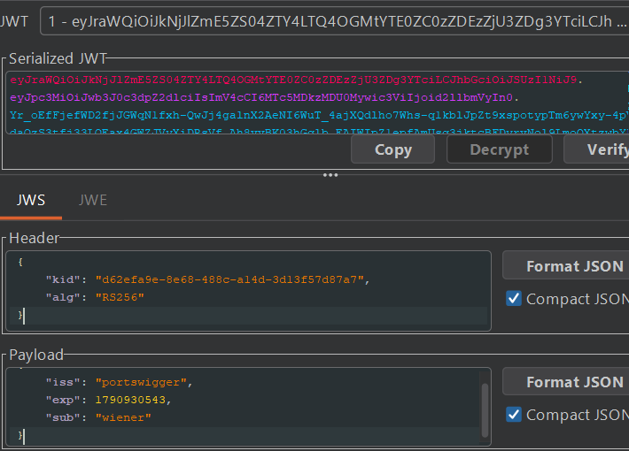
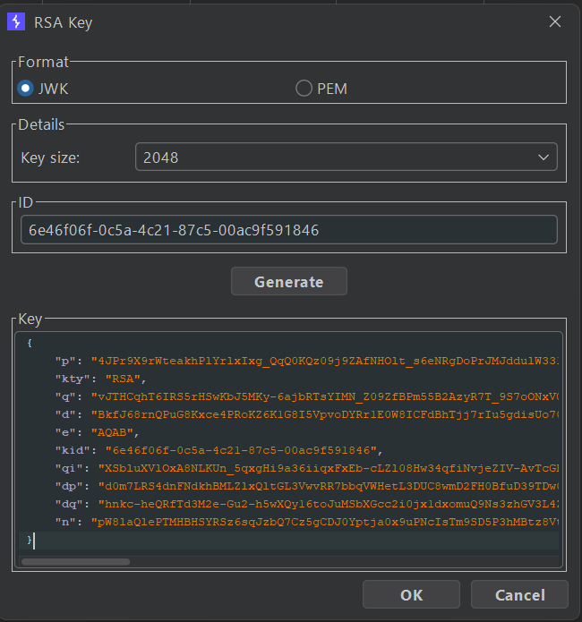
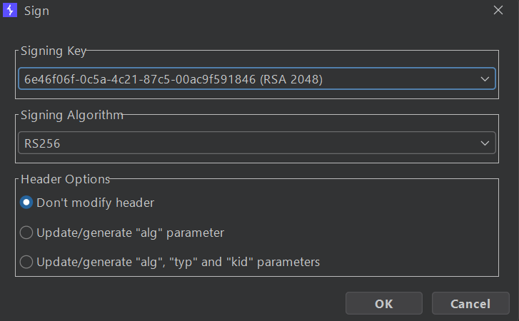

## Metadata

- **Difficulty:** Practitioner
- **Category:** JWT
- **Lab URL:** [Lab: JWT authentication bypass via jwk header injection](https://portswigger.net/web-security/jwt/lab-jwt-authentication-bypass-via-jwk-header-injection)
- **Date Solved:** 2/10/2026
## Vulnerability Summary

The server supports the `jwk` parameter in the JWT header. This is used to embed the correct verification key directly in the JWT. However, it fails to check if the provided key comes from the trusted source. This allows us to create our own private key, sign a modified JWT with it, then embed the matching public key in the `jwk` header. The resulting JWT is valid, granting us administrative functionalities that includes the ability to delete the user `carlos`.
## Reconnaissance

- Navigate to the `/login` endpoint and login with the credentials `wiener:peter`. If you are using Burp and have the extension `JWT Editor` installed (which you should), you should see that there are requests that are highlighted - those are the requests that contain a JWT. 
- Sending the `GET /my-account?id=wiener` request to Repeater and using the `JSON Web Token` tab reveals the structure of the header and payload portions: 

The server uses `RS256`, an asymmetric digital signature algorithm. 
- Modifying the `sub` field's value to `"administrator"`, copying the new token generated, then using it in the `Cookie` header while sending a request to the `/admin` endpoint results in a `401 Unauthorized` response. This means that the signature verification is active for the server's configured algorithm.
- Modifying the `alg` field in the header to `"none"` and deleting the signature portion yields the same result, `401 Unauthorized`.
Since the server uses `RS256`, the `jwk`  field in the header portion might be supported to embed the public cryptographic key used to sign the token. If the server doesn't verify the source of the key, we may be able to supply our own pair of public-private keys.
- In the JWT Editor tab, generate a new RSA key:

- Modify the `sub` field in the payload portion to `administrator`. Then, click on Attack -> Embedded JWK. A dialogue box should pop up. Select the key you just created, with `RS256` as the signing algorithm - matching with the server's, then click OK. You should see that the complete `jwk` parameter has been appended into the header portion:
```json
    "jwk": {  
        "kty": "RSA",  
        "e": "AQAB",  
        "kid": "6e46f06f-0c5a-4c21-87c5-00ac9f591846",  
        "n": "pW8laQlePTMHBHSYRSz6sqJzbQ7Cz5gCDJ0Yptja0x9uPNcIsTm9SD5P3hMBtz8VtOIw-XeqUlvd7xwLcVxfHRhqnU4JDHg75xVNf3v_PH44T105mD6otN2ORuIPZQ9wcb39U0Nh02N55LrdQXQUnmyQs4r8gnFdRmHOLEKgEgxkw3v_gN577CrMyw3wStJf4G72h587j4keMx6Ia_uEO-sJljv6oWaI1aOrpM-QMlYTIiboie4erqlEnAU0eEmcjivwPjqoQNpWyMFIP4enmJcqHjanR0QYflk24WAtoKNaYZIUVAsvgjmd3Jjm97vN2BfybBKIh7am9-i7VpR8lw"  
    }
```
- Sign the modified JWT using your own RSA private key:

Using this newly crafted JWT, we get a `200 OK` sending a request to the `/admin` endpoint. We have successfully crafted a valid `adminstrator` JWT by using our own pair of public-private RSA keys.
## Exploitation Steps

Follow the steps to craft a valid JWT in the **Reconnaissance** section. Then, modify the request line to `GET /admin/delete?username=carlos HTTP/2` and send the request. `carlos` should be deleted successfully and lab is solved.
## Payload Used

```
Cookie: session=eyJraWQiOiI2ZTQ2ZjA2Zi0wYzVhLTRjMjEtODdjNS0wMGFjOWY1OTE4NDYiLCJ0eXAiOiJKV1QiLCJhbGciOiJSUzI1NiIsImp3ayI6eyJrdHkiOiJSU0EiLCJlIjoiQVFBQiIsImtpZCI6IjZlNDZmMDZmLTBjNWEtNGMyMS04N2M1LTAwYWM5ZjU5MTg0NiIsIm4iOiJwVzhsYVFsZVBUTUhCSFNZUlN6NnNxSnpiUTdDejVnQ0RKMFlwdGphMHg5dVBOY0lzVG05U0Q1UDNoTUJ0ejhWdE9Jdy1YZXFVbHZkN3h3TGNWeGZIUmhxblU0SkRIZzc1eFZOZjN2X1BINDRUMTA1bUQ2b3ROMk9SdUlQWlE5d2NiMzlVME5oMDJONTVMcmRRWFFVbm15UXM0cjhnbkZkUm1IT0xFS2dFZ3hrdzN2X2dONTc3Q3JNeXczd1N0SmY0RzcyaDU4N2o0a2VNeDZJYV91RU8tc0psanY2b1dhSTFhT3JwTS1RTWxZVElpYm9pZTRlcnFsRW5BVTBlRW1jaml2d1BqcW9RTnBXeU1GSVA0ZW5tSmNxSGphblIwUVlmbGsyNFdBdG9LTmFZWklVVkFzdmdqbWQzSmptOTd2TjJCZnliQktJaDdhbTktaTdWcFI4bHcifX0.eyJpc3MiOiJwb3J0c3dpZ2dlciIsImV4cCI6MTc5MDkzMDU0Mywic3ViIjoiYWRtaW5pc3RyYXRvciJ9.OWTtlpOAjmK3OGObho3JP4GBPpFZ_LBUKDmvHSriDjd4j0qy-gEe98yqdwZ2kUr3JHtop8ikMV4-shcsB6KAGorp6aAeRDICaV9CWd5IHCVQIU6z989dL-xw77sC47ofVUZLdhyQ8MHafMy2MR0oumiipVf-i2vpaltmv6ty1oiUZ5OpQMCniL9ybkLYc6voInq103WkLzUJrJYNxvSiA43IClzC4dkRKfd6NGHP7Nr5v3mteQZEiulXL44XHVcd9CSdrUJ-zmeFDsvemvmYKs92iRBjLZCmte1HQxZp_YlqFcSmPBnsSqUCRRCc9JckTTfw9tT2CkH7wE3EGE2HBA
```
The exact value changes from lab to lab, but the idea (specified in the **Reconnaissance** section) is the same.
The payload works because we supply the JWT with our public RSA key using the `jwk` parameter in the header portion of the token, then sign the token with our private RSA key.  The server uses our supplied public RSA key to verify the token, thus deeming it valid.
## Root Cause

The server uses the `jwk` parameter in the header portion of the JWT to verify the private RSA key used to sign the token, but it fails to check if the provided public key came from a trusted source.  Relying on an embedded, arbitrary public key from an untrusted client allows an attacker to dictate the verification key, creating a self-signed circular validation flaw.
## Remediation

- **Reject Embedded Public Keys:** Do not verify incoming tokens using public keys supplied directly inside the token header (`jwk` parameter) unless cryptographically chained to an internal, trusted Certificate Authority (e.g., via `x5c`).
- **Use Server-Side Key Management:** Store valid public signing keys server-side or fetch them strictly from a trusted OpenID Connect / JWKS endpoint (e.g., standard `.well-known/jwks.json`) mapped against the `kid` claim.
 - **Strict Header Validation:** Configure the JWT verification library to reject unexpected headers and ignore client-supplied `jwk` elements during verification routines.