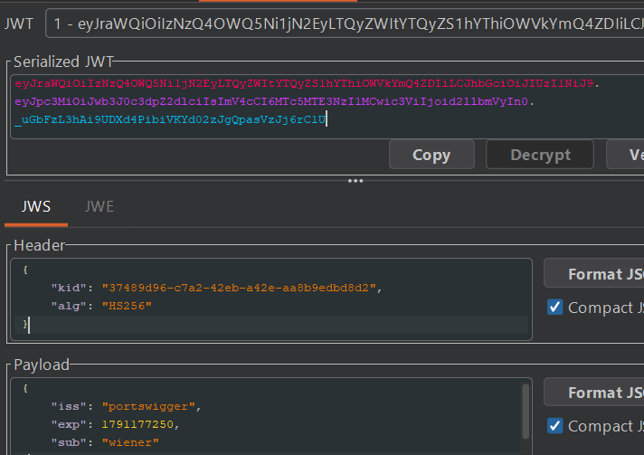
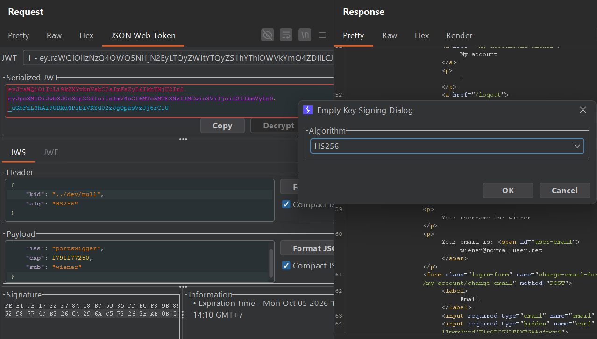
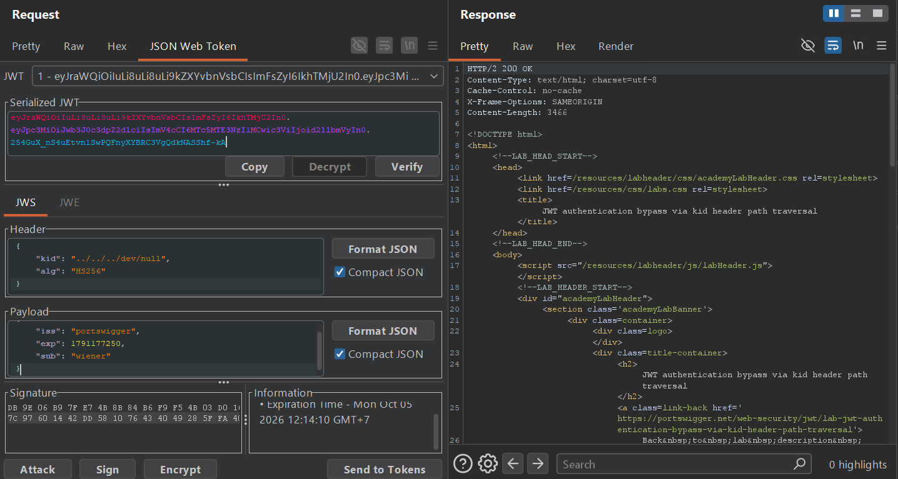

## Metadata

- **Difficulty:** Practitioner
- **Category:** JWT
- **Lab URL:** [Lab: JWT authentication bypass via kid header path traversal](https://portswigger.net/web-security/jwt/lab-jwt-authentication-bypass-via-kid-header-path-traversal)
- **Date Solved:** 5/10/2026
## Vulnerability Summary

The `kid` parameter in the header portion of the app's JWT is vulnerable to path traversal. The app does not sanitize or strip traversal sequences (`../`) from user-supplied input. Combined with the use of the symmetric signing algorithm `HS256`, this allows an attacker to traverse to the `/dev/null` file, which is empty, and sign the JWT using an empty key (an empty string), forging a valid `administrator` JWT to gain administrative functionalities.
## Reconnaissance

- Navigate to the `/login` endpoint and login with the credentials `wiener:peter`.
- Inspect the HTTP history in Burp Suite with the `JWT Editor` extension enabled. Observe that requests to `/my-account?id=wiener` include a `Session` cookie holding a JSON Web Token:

The server uses `HS256`, a symmetric digital signature algorithm. 
- Modifying the `sub` field's value to `"administrator"`, copying the new token generated, then using it in the `Cookie` header while sending a request to the `/admin` endpoint results in a `401 Unauthorized` response. This means that the signature verification is active for the server's configured algorithm.
- Modifying the `alg` field in the header to `"none"` and deleting the signature portion yields the same result, `401 Unauthorized`.
The lab's description says "In order to verify the signature, the server uses the `kid` parameter in JWT header to fetch the relevant key from its filesystem". The `kid` parameter is used as a file fetcher. Perhaps it is vulnerable to path traversal?
Since the server uses a symmetric algorithm to sign its keys, we need a file with static, predictable content (to make our secret matches the content of the file). Even better if the file is empty. Thus, our goal is to path traverse to the `/dev/null` file.
- To start, we will inject 1 traversal sequences, then select Attack > Sign with empty key > `HS256` as algorithm. 

This yields a `302 Found` response that redirects us to the `/login` endpoint, meaning it doesn't work (missing key/invalid signature). Same thing happens with `../../dev/null`.
- However, with 3 traversal sequences, the server returns a `200 OK` with `Your username is: wiener` in the response. This suggests that the path traversal payload works with 3 traversal sequences. We can inject the same payload to forge a valid JWT for the `administrator` account, having inferred its structure. 


## Exploitation Steps

1. Navigate to the `/login` endpoint and login with credentials `wiener:peter`.
2. Intercept the `GET /my-account?id=wiener` request. Modify the header portion of the JWT to contain these contents (base64-decoded):
```json
{  
    "kid": "../../../dev/null",  
    "alg": "HS256"  
}
```
3. In the same modified JWT, modify the payload portion of the JWT to contain these contents (base64-decoded):
```json
{  
    "iss": "portswigger",  
    "exp": [value],  
    "sub": "administrator"  
}
```
4. Select Attack > Sign with empty key > `HS256` as signing algorithm. You should now have a valid `administrator` JWT. Use this token in the `Cookie` header while sending a request to the `/admin` endpoint. You should see that you have gained administrative functionalities in the response.
5. Modify the request line to `GET /admin/delete?username=carlos HTTP/2` and send the request. `carlos` should be deleted successfully and lab is solved.
## Payload Used

`"kid": "../../../dev/null"`
The backend treats the `kid` header parameter as a local filesystem path to retrieve the secret key file. Traversing to `/dev/null` references a special device file that returns an immediate EOF when read, resulting in a byte sequence of length zero (`b""`). By signing the modified token locally using an empty string, the `HS256` signature generated by the attacker matches the signature computed by the backend verification engine.
## Root Cause

- The backend relies on client-controlled metadata (`kid`) to directly construct a filesystem path without strict validation or sanitization. 
- The key-loading routine treats the contents of any arbitrary readable system file as a raw HMAC secret rather than verifying that the target file belongs to an authorized key store.
## Remediation

- Never pass user-controlled `kid` values directly to filesystem I/O APIs. Map `kid` values to a strict internal lookup table or database identifier.
- If loading keys dynamically from disk is required, resolve the absolute path and verify it stays strictly inside the designated directory.
- Enforce minimum entropy and length requirements on HMAC keys before running the verification function, preventing verification against empty files/missing secrets.