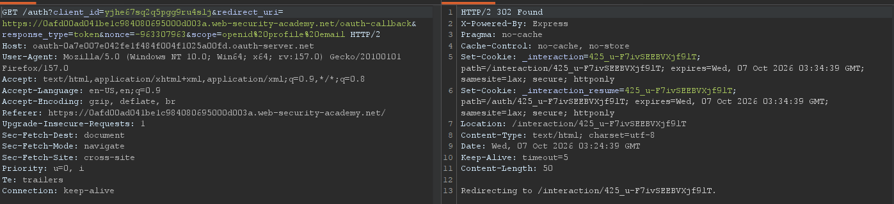
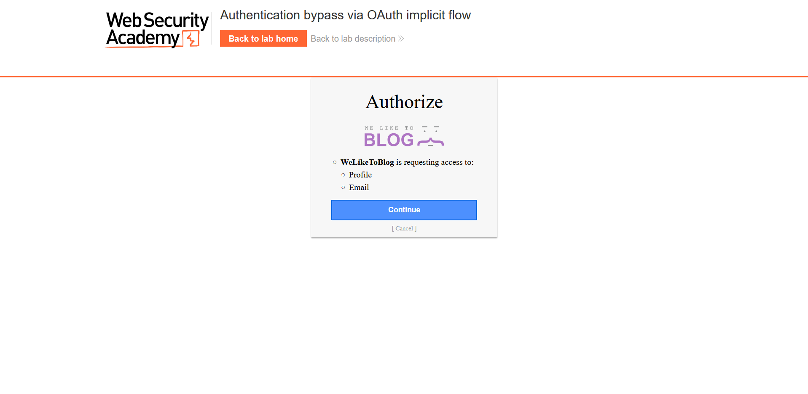
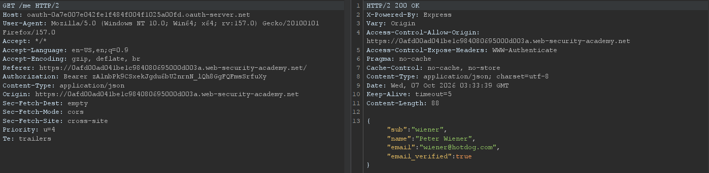
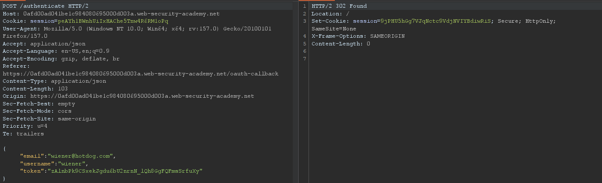
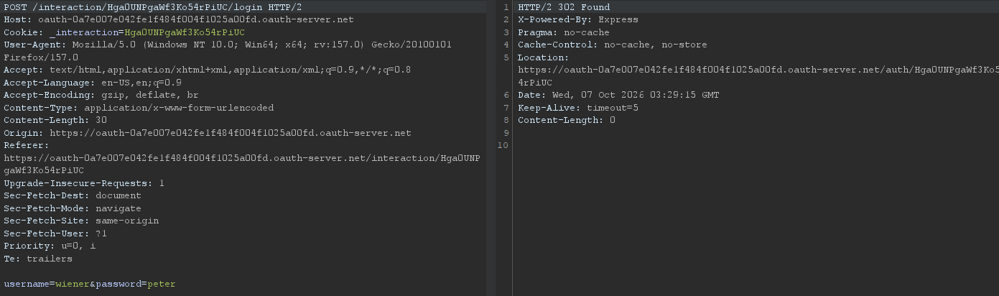
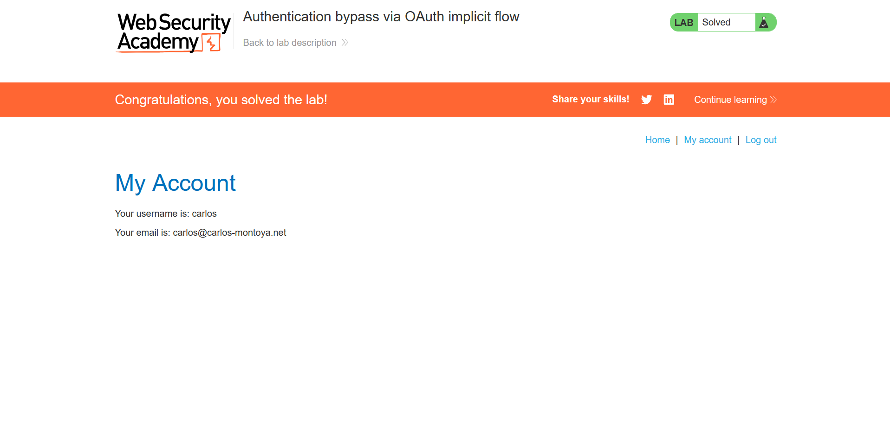

## Metadata

- **Difficulty:** Apprentice
- **Category:** OAuth authentication
- **Lab URL:** [Lab: Authentication bypass via OAuth implicit flow](https://portswigger.net/web-security/oauth/lab-oauth-authentication-bypass-via-oauth-implicit-flow)
- **Date Solved:** 7/10/2026
## Vulnerability Summary

The app uses an OAuth service to allow users to log in with their social media accounts. It logs the user in by submitting the user's data to the server using a `POST` request containing the user's data. However, the client application binds an authenticated session to client-supplied profile identifiers (`email`, `parameter`) without validating if the access token matches the identity. This flawed validation mechanism allows an attacker to manually change the parameters sent to the server to impersonate any arbitrary user, effectively taking over their account.
## Reconnaissance

- Navigating to the `/my-account` endpoint automatically takes us to the `/social-login` endpoint. Here, we can log in with the provided credentials `wiener:peter`.
- The server is using OAuth as the authentication mechanism, as there is a request sent to the server automatically after we are redirected:

We can see that the grant type is *implicit*, due to the `response_type=token` parameter in the request line.
- Proceeding with the login process, we see that the server is asking for our permission to access our profile and email:

- After some more requests to the `interaction/[token]` and `auth/[token]` endpoint, the client application's backend retrieves our data through a `GET` request to the `/me` endpoint on the OAuth server...

- before finally sending a `POST /authenticate` request to the client (host) containing the data retrieved:

This `POST` request is interesting. Since the grant type is implicit, we can study the requests made between the client and the server in our proxy in Burp. We can see that the client did **not** receive any secrets or passwords, the only instance where our password was sent was to the OAuth server:

This suggests that the `POST /authenticate` request and its body (data) is implicitly trusted. Thus, we might be able to modify the data (`email` and `username` parameters) to login to any arbitrary account, if we know those information about said account.
## Exploitation Steps

1. Navigate to the `/my-account` endpoint, where you will be automatically taken to the `/social-login` endpoint. Log in with the credentials `wiener:peter` and proceed with the login process.
2. In your HTTP history, find the `POST /authenticate` request. The host should be `[lab-id].web-security-academy.net`. The request should be found right after the `GET /me` request.
3. Modify the `email` and `username` parameter like so, keeping the token unchanged:
```json
{
  "email":"carlos@carlos-montoya.net",
  "username":"carlos",
  "token":"[token]"
}
```
Then send the `POST /authenticate` request.
4. Observe that you received a `302 Found` HTTP response, signifying a redirection. Right click on the response > Open response in browser. You should be redirected to the root (`/`) directory, and lab should be automatically marked as solved. You can confirm this by going to the `/my-account` endpoint, where you can see that you are logged in as `carlos`:

## Payload Used

```json
{
  "email":"carlos@carlos-montoya.net",
  "username":"carlos",
  "token":"[token]"
}
```
The `POST /authenticate` request is implicitly trusted by the server, and the access `token` is not validated to match the other data in the request, or removed when it has been used. Thus, modifying the parameters to that of `carlos`'s account allows us to log in as him. 
## Root Cause

The client application's backend blindly trusts the user identity parameters (`email`, `username`) sent in the body of the `POST /authenticate` request from the browser. It fails to perform server-side validation of the supplied `token` against the OAuth provider's `/me` or token introspection endpoint to verify that the token was genuinely issued for the identity claimed in the payload. Consequently, an attacker can substitute any identity while supplying any valid token format.
## Remediation

- **Migrate to the Authorization Code Grant Flow with PKCE:**
    - Deprecate the OAuth 2.0 Implicit Grant flow entirely, per the current OAuth 2.0 Security Best Current Practice (BCP).
    - Use the Authorization Code flow (`response_type=code`) coupled with Proof Key for Code Exchange (PKCE). In this model, the authorization code is exchanged for tokens directly via a secure backchannel (server-to-server) using a `client_secret` or code verifier, preventing client-side interception and parameter manipulation.
- **Enforce Backend Identity Validation:**
    - If the backend must accept identity data or tokens forwarded by the browser, the backend server must independently query the OAuth provider's `/userinfo` or `/me` endpoint using the forwarded bearer token over a secure TLS backchannel.
    - The backend must base the session creation solely on the identity returned directly by the IdP, never on user-controllable request body parameters.
- **Implement OpenID Connect (OIDC) ID Tokens:**
    - If federated identity is required, use OIDC. Validate the cryptographically signed `id_token` (JWT) on the backend by verifying the signature against the IdP's public keys (`jwks_uri`), checking the `iss` (issuer), `aud` (client ID), and `exp` (expiration) claims before establishing a local session.