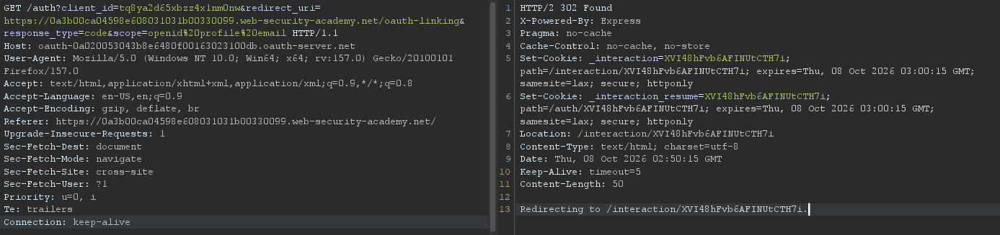

## Metadata

- **Difficulty:** Practitioner
- **Category:** OAuth authentication
- **Lab URL:** [Lab: Forced OAuth profile linking](https://portswigger.net/web-security/oauth/lab-oauth-forced-oauth-profile-linking)
- **Date Solved:** 8/10/2026
## Vulnerability Summary

The app allows users to link a social media profile to their account via an OAuth 2.0 authorization code flow. The client application fails to include a `state` parameter in the authorization request. An attacker can initiate an account-linking flow, intercept the authorization code, and deliver a CSRF payload to an authenticated administrator. When processed by the administrator's browser, the application binds the attacker's OAuth profile to the administrator's account, allowing the attacker to log in as admin via OAuth.
## Reconnaissance

- Navigate to the `/admin` endpoint yields a `401 Unauthorized`.
- Navigate to the `/login` endpoint. We are provided with 2 options - to login with username and password, or to login with our social media account. We log in traditionally with `wiener:peter` first.
- After logging in, we see that we have an option to attach a social profile to our account. We can bind the `peter.wiener:hotdog` social media account to our account. Proceeding with the process reveals that the app uses an OAuth service to perform this task.
- The authorization request sent from the client application to the OAuth server does not contain the `state` parameter:

The `state` parameter, if existed, is exchanged between the client application and the OAuth server throughout the OAuth flow and serves as an anti-CSRF token for the client application. The lack of it indicates that we can perform a CSRF attack on our exploit server, since the client application's callback handler will treat any incoming `code` as valid for whichever user session submits the request, without verifying that the initiating session matches the completing session. We can therefore initiate the OAuth flow, then trick the admin into completing it by injecting the final request endpoint (`GET /oauth-linking?code=[code]`). 
## Exploitation Steps

1. Navigate to the `/login` endpoint. Login using the username and password option, with credentials `wiener:peter`.
2. In the Proxy tab in Burp, start intercepting. Then go back to the browser and initiate the OAuth flow by clicking "Attach a social profile".
3. Forward all the requests **until** you reach the `GET /oauth-linking?code=[code]` request. Send this request to Repeater, then **drop** it. The request must be dropped to make the `[code]` usable, since OAuth authorization codes are **single-use**. Completing the request will consume the code, making it invalid.
4. Go to the exploit server. Using the request line from the request sent to Repeater in Step 3, paste this into the body of the exploit:
```

```
Then deliver exploit to victim.
5. Go back to the app. Logout of `wiener`'s account first. Select the option to login with social media, and you should be logged in automatically. After doing so you will be redirected to the root directory `/`, where you can see that there's a new "Admin panel" tab. Click on it, and you should be on the `/admin` endpoint with the option to delete `carlos` and `wiener`. Delete `carlos` and lab is solved. 
## Payload Used

``
The URL sent is the last request to complete the OAuth flow of linking our social media account to an account. Since there's no CSRF protection due to the lack of the `state` parameter, we can initiate the process from our own browser and deliver the exploit to the victim (admin) to make them complete the account linking process in their own browser and their own account, effectively binding their account to our social media account.
## Root Cause

The client application does not include the `state` parameter in its initial authorization request to the OAuth server. Thus, the flow lacks protection against OAuth CSRF attacks.
## Remediation

- Implement and Validate the `state` Parameter:
    - Before redirecting the user to the OAuth authorization server, the client application must generate a cryptographically secure, unguessable value to use in the `state` parameter.
    - This value must then be stored in the user's server-side session or as a signed, encrypted cookie with `HttpOnly` and `SameSite=Lax` (or `Strict`) attributes.
    - Append this token to the authorization URL as the `state` parameter:
    - When the OAuth server redirects back to `/oauth-linking`, the client application must verify that the returned `state` parameter exactly matches the token bound to the current user's session. If the parameter is missing, or if the value is mismatched or expired, reject the request.
- Use Safe HTTP Methods for State Changes:
    - Account-linking actions alter application state and should not be processed purely via `GET` requests. While the initial OAuth callback redirect is typically a `GET`, finalizing an account link should either require explicit POST submission with a standard anti-CSRF token or immediate re-authentication.
- Short-Lived, Single-Use Codes:
    - Ensure the OAuth authorization server enforces a strict, short expiration window (e.g., 60 seconds) on authorization codes and strictly invalidates them after the first redemption attempt.