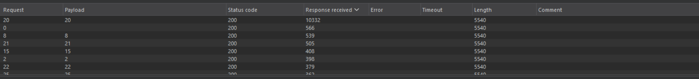
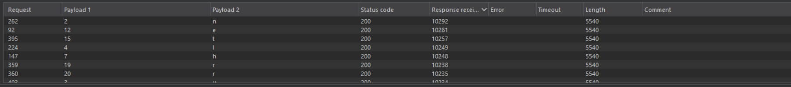

## Metadata

- **Difficulty:** Practitioner
- **Category:** SQL Injection
- **Lab URL:** [Lab: Blind SQL injection with time delays and information retrieval](https://portswigger.net/web-security/sql-injection/blind/lab-time-delays-info-retrieval)
- **Date Solved:** 14/4/2026
## Vulnerability Summary

The app is vulnerable to SQL injection via its tracking cookie. The `TrackingId` cookie value is concatenated directly into a backend SQL query without sanitization. Though the database errors are caught and handled by the application gracefully, the vulnerability can be exploited by triggering time delays depending on whether an injected condition is true or false.
## Reconnaissance

- Injecting a `'` or a `''` into the cookie `TrackingID` field yields a `200 OK` HTTP Response with no visible verbose database errors nor any differences in the response. This suggests that the vulnerability is blind and non-boolean, thus necessitating a time-delay approach. 
- Injecting different database-specific (Oracle/Postgre/MySQL/Microsoft) time delay functions into the `TrackingID` field, we eventually find that the payload `'|| pg_sleep(10)--` works, as the response arrives around 10 seconds later than the others. This confirmed that the underlying database service is PostgreSQL.
## Exploitation Steps

1. Click on any category under the "Refine your search" to get a legitimate, usable cookie `TrackingID`. Intercept this request with Burp Suite proxy, and send the request to Burp Suite Repeater.
2. We need to find out how many characters does the password that belongs to the username `administrator` have. The base payload we're going to use is `'%3B+SELECT+CASE WHEN+(LENGTH(password)=1)+THEN+pg_sleep(10)+ELSE pg_sleep(0)+END+FROM+users+WHERE+username='administrator'--`. After setting up the payload position to be the number 1 `$1$` (at `LENGTH(password)=1`) and using a list of numbers from 1 to 30 in **Payload configuration**, perform a **Sniper Attack**. Configure to show the column **Response received** on the 3 vertical dots on the right corner aligned with the **View filter: Showing all item** Intruder view filter. Look for a response that has the **Response received** value well exceed the other tested password length (see picture below), signifying that our injected condition for password length testing is true, thus trigger the execution of `pg_sleep(10)`, thus triggers a 10 seconds delay. You'll eventually find out that this number is 20.

3.  Now we need to find the actual password. To reduce the search space, I will assume that the password only contains lowercase, alphanumeric characters, just like [Writeup for lab-conditional-responses](../lab-conditional-responses/writeup.md). Injecting this payload onto the `TrackingId` field `'%3B+SELECT+CASE+WHEN+(SUBSTRING(password,1,1)='a')+THEN+pg_sleep(10)+ELSE pg_sleep(0)+END+FROM+users+WHERE+username='administrator'--` while setting the first payload position to be the **first** `1` and the second payload position to be the character `a` in the comparison clause with `SUBSTR(password,1,1)`, perform a **Cluster Bomb** attack. The payload list for the second payload position is `a-z` and `0-9`, while the payload list for the first one is trivially `1-20`.
4. Wait for the attack to finish. After it's done, once again just sort the **Response received** field of the response in decreasing order. You'll find exactly 20 responses that have a **Response Receive** value of roughly `10000` (see picture), which means that the certain character tested is correct in that certain position (since the time delay function is triggered) Manually construct the full password.

5. Go on the lab website, type in `administrator` as the username and the password you just constructed. You're now logged in, and lab is now solved!
## Payload Used

- To find password length: `'%3B+SELECT+CASE WHEN+(LENGTH(password)=1)+THEN+pg_sleep(10)+ELSE pg_sleep(0)+END+FROM+users+WHERE+username='administrator'--`

- To find each character of the password: `'%3B+SELECT+CASE+WHEN+(SUBSTRING(password,1,1)='a')+THEN+pg_sleep(10)+ELSE pg_sleep(0)+END+FROM+users+WHERE+username='administrator'--`

After identifying the underlying database as PostgreSQL via time-delay functions, we use a technique called **Stacked Queries**. By prepending a URL-encoded semicolon (`%3B`), we terminate the original `SELECT` query and trick the database into sequentially executing our injected query. In this case, the injected query is an independent `SELECT` statement utilizing a `CASE` condition. If the condition is true, it triggers `pg_sleep(10)`, causing a measurable 10-second delay in the HTTP response. If false, it sleeps for 0 seconds.
## Root Cause

User-controlled input is concatenated into a SQL query with no escaping or parameterization.
## Remediation

1. Parameterized queries (prepared statement):
```python
query = "SELECT tracking_id FROM tracking_table WHERE tracking_id = ?"
cursor.execute(query, (tracking_id,))
```
2. Strict regex input validation to prevent injection: `^[a-zA-Z0-9]{32}$`.
3. Adopting Principle of Least Privilege (PoLP). User should only have rights to `SELECT` tables they need. 