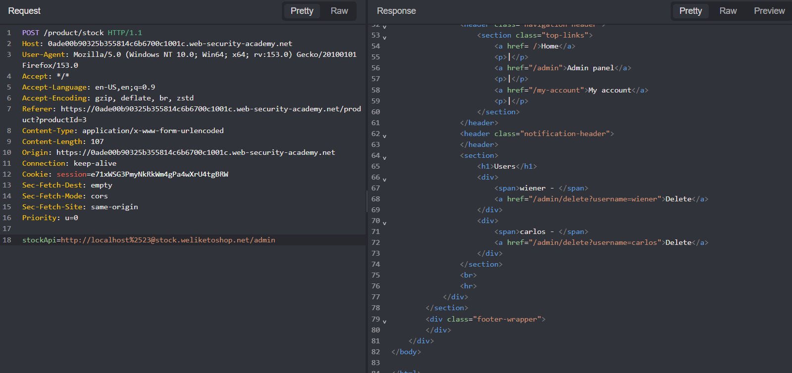

## Metadata

- **Difficulty:** Expert
- **Category:** SSRF
- **Lab URL:** [Lab: SSRF with whitelist-based input filter](https://portswigger.net/web-security/ssrf/lab-ssrf-with-whitelist-filter)
- **Date Solved:** 13/8/2026
## Vulnerability Summary

The app is vulnerable to Server-side Request Forgery (SSRF) in its stock checking functionality. Specifically, an attacker can supply a URL in the `stockApi` parameter in the request made by the server in the process of stock checking for the server to make a request to the `/admin` endpoint from the local machine, which the app implicitly trusts. Though there are some SSRF defenses implemented in the form of a whitelist through checking the external stock check host, this can be bypassed with several techniques used together.
## Reconnaissance

- Click on the "View details" button under any random item, then, at `url/product?productId=number`, intercept the `POST /product/stock` request where you click "Check stock" with Burp Suite/Caido. In the request (sent by the server), you should see something like:
```
http%3A%2F%2Fstock.weliketoshop.net%3A8080%2Fproduct%2Fstock%2Fcheck%3FproductId%3D2%26storeId%3D1
```
which is the URL encoded version of:
```
http://stock.weliketoshop.net:8080/product/stock/check?productId=2&storeId=1
```
- Try changing the value of this `stockApi` parameter directly to: `http://localhost/admin` will result in a `400 Bad Request` HTTP Response that reads: 
```
"External stock check host must be stock.weliketoshop.net"
```
This implies the existence of a whitelist, where the stock check host must be `stock.weliketoshop.net`.
- Try supplying the `stockApi` parameter to `http://username@stock.weliketoshop.net` results in a `500 Internal Server Error` that reads `Could not connect to external stock check service`. This implies that the URL parser supported credentials embedding. However, when tried `http://stock.weliketoshop.net@localhost/admin`, the server gave a `400 Bad Request` response `"External stock check host must be stock.weliketoshop.net"`. 
- Same thing happened when `http://localhost/admin#stock.weliketoshop.net` is tried. Plain URL fragmenting does not work.
- Combining both of the techniques above by trying `http://localhost#@stock.weliketoshop.net/admin`, we still get a `400 Bad Request`. We need the `#` to act as a fragment identifier only for the backend client. Single-encoding does not work - apparently it is decoded by the frontend filter, then the remaining of our payload behind the `#` character is treated as a fragment, failing to pass the whitelist. However, double-encoding does work! The frontend filter does not recursively decode, so double encoding (to `%2523`) allows our payload to be passed to the backend, which performs another decode that turns `%23` to `#`, which truncates the URL before the whitelisted domain, helping us reach the admin panel.

## Exploitation Steps

1. Click on the "View details" button under any random item. You will be taken to `url/product?productId=[number]`.
2. Intercept the request where you click "Check stock" with Burp Suite proxy, then send it to Burp Suite Repeater.
3. Modify the value of the `stockApi` field to `http://localhost%2523@stock.weliketoshop.net/admin/delete?username=carlos`, then send the request.
4. Observe that you receive a `302 Found` HTTP Response that signifies a redirection. Go on to the website. You should see that lab is solved.
## Payload Used

`http://localhost%2523@stock.weliketoshop.net/admin/delete?username=carlos`
I pretty much explained everything in the **Reconnaissance** section. Refer to it.
## Root Cause

The vulnerability stems from a URL parsing discrepancy between the app's anti-SSRF validation filter and the backend HTTP client used to fetch the resource.

When the validation filter processes the double-encoded payload (`http://localhost%2523@stock.weliketoshop.net/`), it does not fully decode the string. It decoded `%2523` once to `%23`, treat it as a literal string or standard credential delimiter and successfully finds the whitelisted domain (`stock.weliketoshop.net`) at the expected host position. However, the backend HTTP library performs deeper decoding. It decodes `%23` to `#`, and then interprets it as the fragment identifier. This truncates the URL logic, causing the backend client to ignore the whitelisted domain and route the request to `localhost`.
## Remediation

- If possible, do not allow users to submit full URLs. Instead, accept a simple identifier (like an ID) and map it to the target URL on the server side.
- If URL validation is strictly required, ensure that the validation logic uses the exact same URL parsing library and decoding sequence as the backend HTTP client that ultimately makes the request.
- Validate against a strict whitelist of permitted IP addresses or hostnames. Reject any input containing unexpected characters (like `@`, `#`, or `?`) in the host portion.
- Deploy the app in a segregated network environment where the backend cannot reach sensitive internal interfaces (like the loopback `/admin` endpoints in this case) by default.