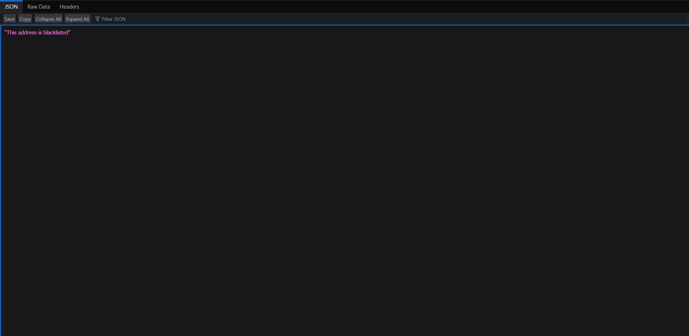
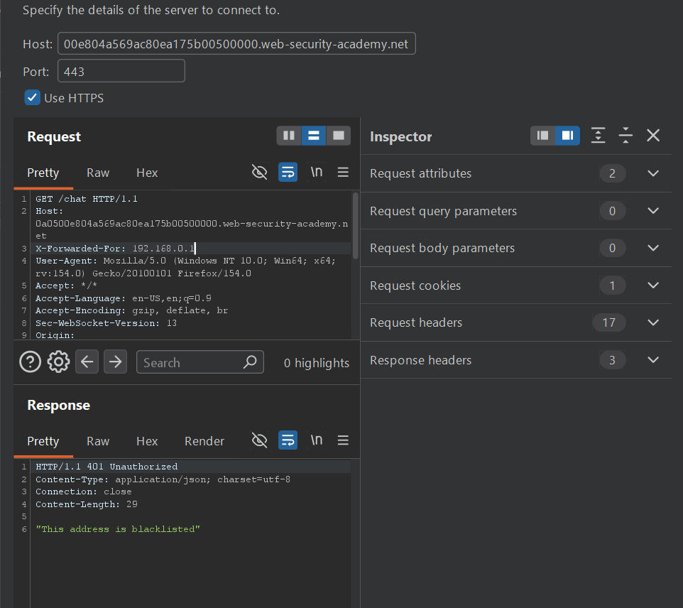

## Metadata

- **Difficulty:** Practitioner
- **Category:** WebSockets
- **Lab URL:** [Lab: Manipulating the WebSocket handshake to exploit vulnerabilities](https://portswigger.net/web-security/websockets/lab-manipulating-handshake-to-exploit-vulnerabilities)
- **Date Solved:** 9/9/2026
## Vulnerability Summary

The app has a live chat feature that is vulnerable to Cross-site Scripting (XSS), exploited through WebSockets. This feature is implemented using WebSockets, where user's message sent through a WebSocket is not sanitized or validated, and reflected in the response. Combined with the server's implicit trust in the `X-Forwarded-For` HTTP header, we can bypass the flawed blacklist-based CSRF defense to exploit XSS, executing arbitrary `JavaScript` in the victim's browser.
## Reconnaissance

- Navigate to the live chat feature at `/chat` and send a normal message via the chat interface (`aaa`). In Burp Suite > Proxy > WebSockets history, the messages are transmitted as JSON objects:
```json
{"message":"aaa"}
```
-  The server responds via the same WebSocket connection, echoing the message back. The process is handled by the client-side `JavaScript`'s `chat.js`, which contains 2 vulnerabilities: 
	- There is a `htmlEncode` function that encodes outgoing data, but only do so if the `chatForm` element contains an `encode` attribute. Since this is entirely client-side, we can bypass this by intercepting and modifying the traffic via a proxy.
	```js
	    function htmlEncode(str) {
	        if (chatForm.getAttribute("encode")) {
	            return String(str).replace(/['"<>&\r\n\\]/gi, function (c) {
	                var lookup = {'\\': '&#x5c;', '\r': '&#x0d;', '\n': '&#x0a;', '"': '&quot;', '<': '&lt;', '>': '&gt;', "'": '&#39;', '&': '&amp;'};
	                return lookup[c];
	            });
	        }
	        return str;
	    }
	```
	- The `writeMessage` function uses the insecure `innerHTML` property to dynamically renders the incoming echoed message content into the DOM:
		```js
		contentCell.innerHTML = (typeof window.renderChatMessage === "function") ?window.renderChatMessage(content) : content;
		```
- However, when received the standard XSS payload  ``, the server responds with:
```json
{"error":"Attack detected: Event handler"}
```
and our address is blacklisted from the server, rendering us unable to send any messages even if they were normal:

- Plainly trying to reconnect does not work, as we are still blacklisted. However, when adding the `X-Forwarded-For` header onto the reconnection request, we are no longer blacklisted and can send message. The server trusts this `X-Forwarded-For` header, and we can use this to enumerate through `JavaScript`'s tags and events to see what is blocked.
- Trying another event and payload, ``, still results in our address being blacklisted.
We will need to find a way to obfuscate the payload.
## Exploitation Steps

1. Go to the live chat tab (`/chat`). 
2. Type in a random message (`aaa`). In the WebSocket history, find the request and send it to the Repeater tab. 
3. If your IP address wasn't blacklisted (you can send messages), or if you started a new lab instance, proceed to step 4. Else, you'll need to supply the `X-Forwarded-For` header in the reconnection request to reconnect, like so:
   
4. Send the `JSON` block below: 
```
{"message":""}
```
5. Observe that the `alert()` function is triggered on the website. Lab is solved.
## Payload Used

```

```
We used:
- `oNeRrOr` instead of the standard `onerror` (since HTML is case-insensitive, they are treated the same way)
- Backticks instead of parentheses to call the `alert` function
This combination of obfuscating techniques was adequate to bypass the flawed XSS filter of the sever, which is probably blacklist-based.
## Root Cause

The app:
- blindly trusts user input transmitted over the WebSocket connection. The server fails to validate or sanitize the incoming JSON payload, and the client-side JavaScript uses insecure sinks (`innerHTML`) to append the reflected WebSocket message to the chat interface
- implements a flawed, blacklist-based XSS filter that can easily be bypassed with various obfuscation techniques
- implicitly trusts the `X-Forwarded-For` header, allowing an attacker to completely bypass the IP address blacklisting mechanism
## Remediation

- Do not rely on client-side functions (like `htmlEncode`) to sanitize data, as attackers can bypass them by interacting directly with the WebSocket endpoint. The server must strictly validate all incoming JSON messages against an whitelist of expected characters. Before broadcasting the message to other clients, the server must HTML-entity encode the data.
- Modify the `chat.js` file to prevent DOM-based XSS. Replace the insecure `innerHTML` assignment with `textContent` or `innerText`. This ensures the browser treats the incoming WebSocket data as static text rather than executable HTML or JavaScript.
- Stop implicitly trusting the `X-Forwarded-For` header for security decisions such as IP blacklisting. If the app is behind a trusted reverse proxy, configure the server to only accept the header if it originates from the proxy's verified IP address. Otherwise, rely on the underlying TCP connection's remote IP address (`REMOTE_ADDR`).
- Remove the flawed regex blacklist and rely entirely on proper server-side output encoding and secure client-side sinks to neutralize malicious input.